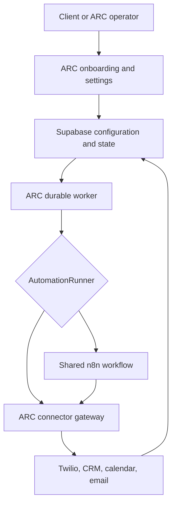

# ARC / n8n Integration — Canonical Implementation Handoff

**Roadmap revision date:** September 23, 2026  
**Project:** ARC / Arc Automations  
**Owner:** Bennett Church  
**Last reported application version:** `1.17.1`  
**Primary niche:** HVAC first; plumbing second  
**Current reported implementation state:** ARC-110 is complete locally  
**Immediate next implementation prompt:** `ARC-120 — Tenant Module Lifecycle and Activation State Machine`  
**New future product phase:** ARC Performance Intelligence and Continuous Improvement

---

# 0. Mandatory instructions for the next assistant

When Bennett supplies this handoff in a new chat:

1. Read this file completely before responding.
2. Do not restart niche selection, product research, or the ARC/n8n architecture discussion.
3. Treat ARC-110 as **reported complete locally**, while verifying its actual repository evidence before beginning dependent implementation work.
4. Confirm that the immediate next implementation prompt is:

   `ARC-120 — Tenant Module Lifecycle and Activation State Machine`

5. Do not replace, delay, or merge ARC-120 with the new optimization work.
6. Do not implement ARC Performance Intelligence yet. It belongs after `ARC-LR-450` and before `ARC-QA-500`.
7. Preserve the architectural rule:

   > **A client is configuration, not an n8n workflow.**

8. Preserve all ARC-015/ARC-015B configuration-snapshot pinning, immutable version history, and live safety protections.
9. Recommendations must never silently edit, publish, activate, reactivate, or roll back client configuration.
10. A historical version is immutable. Restoring one must create a new draft and, after authorization and validation, a new published version.
11. No current implementation prompt may commit, push, deploy, or contact real customers unless Bennett explicitly authorizes that operation.
12. Repository state is authoritative. Always run `git status --short`, read the relevant architecture documents, and verify prerequisite tests before editing.

---

# 1. Exact current execution position

The reported sequence through ARC-110 is:

1. `ARC-000` — complete
2. `ARC-010` — complete
3. `ARC-015` — completed except for the defect later isolated as ARC-015B
4. `ARC-015B` — reported complete
5. `ARC-100` — complete
6. `ARC-110` — reported complete locally
7. `ARC-120` — **next**

The prior ARC-110 blocker was production configuration-snapshot persistence:

- The runtime created a snapshot but the production Postgres `createRun` path dropped `config_snapshot_id`.
- Scheduled actions were not pinned to the same snapshot.
- Existing claim guards therefore failed closed and executed nothing.
- In-memory tests passed because the in-memory store retained fields the production adapter omitted.

ARC-015B was created to repair that gap by requiring:

- Production run snapshot persistence
- Scheduled-action snapshot persistence
- Tenant/run/action/snapshot equality enforcement
- Immutable pins
- Legacy fail-closed behavior
- Production-adapter contract tests
- Safe synthetic canary verification

ARC-110 was then completed locally according to the latest supplied project state. Before starting ARC-120, verify from the repository and completion report that ARC-110 actually provides:

- Tenant-wide configuration versions
- Tenant-module configuration versions
- Drafts
- Immutable published versions
- Operator publication
- Optimistic concurrency
- Rollback through a new version
- Deterministic effective-configuration resolution
- ARC-100 registry validation and field permissions
- Registry-driven change-impact analysis
- Legacy Lead Recovery configuration migration
- Generalized version provenance connected to ARC-015 snapshots, runs, and actions
- No regression of live consent, suppression, reply, safety, takeover, or send-once protections

Do not infer missing implementation details from this handoff. Verify them in code, migrations, tests, and current architecture documents.

---

# 2. Immediate next task: ARC-120

The immediate next prompt remains:

> `ARC-120 — Tenant Module Lifecycle and Activation State Machine`

ARC-120 should implement the lifecycle and authorization layer for tenant modules, including the repository-approved equivalents of:

- Module selection
- Configuration readiness
- Connection readiness
- Testing state
- Shadow mode
- Activation
- Pause and resume
- Health overlay
- Transition history
- Just-in-time authorization before module execution
- Change-impact handling that determines when a configuration change requires retesting, shadow mode, operator review, or reactivation

ARC-120 must consume ARC-100 change-impact classifications and ARC-110 configuration versions. It must not implement the future performance-diagnosis engine.

The new optimization roadmap does not interrupt or replace ARC-120.

---

# 3. Canonical ARC / n8n architecture

ARC remains the control plane and operational system of record.

## ARC owns

- Tenant identity and permissions
- Module selection
- Configuration schemas and versions
- Drafts and publication
- Operational state
- Durable scheduled actions
- Consent, suppression, and opt-outs
- Customer replies and human takeover
- Safety decisions
- Provider credentials
- Connector capabilities
- Audit history and event evidence
- Reporting and health
- Workflow-version assignments
- Future performance investigations and recommendations

## n8n may own

- Reusable module-level orchestration
- Approved stateless transformations
- Approved API-operation sequences
- Shared sub-workflows
- Returning signed execution results to ARC

## n8n must not own

- Tenant configuration
- Client permissions
- The only copy of scheduled actions
- Critical operational state
- Customer OAuth tokens
- Consent or suppression truth
- Per-client workflow copies
- The client-facing workflow editor
- Performance conclusions or recommendation authorization

## Execution implementations

ARC should eventually support:

- `DirectArcWorker`
- `N8nRunner`
- `FakeTestRunner`

Portal behavior and tenant configuration must not depend on which runner is used.

---

# 4. Revised canonical implementation sequence

The roadmap is now:

1. `ARC-000 — Repository Architecture Audit and Gap Map` — complete
2. `ARC-010 — ARC–n8n Execution Boundary ADR` — complete
3. `ARC-015 — Lead Recovery Safety and Configuration Pinning` — complete except for the extracted repair
4. `ARC-015B — Production Configuration Snapshot Pinning Repair` — reported complete
5. `ARC-100 — Module and Connector Registry Foundation` — complete
6. `ARC-110 — Versioned Tenant Configuration Engine` — reported complete locally
7. `ARC-120 — Tenant Module Lifecycle and Activation State Machine` — **next**
8. `ARC-130 — Secure Provider Connection and OAuth Framework`
9. `ARC-200 — Durable Actions, Runs, and Scheduling Engine`
10. `ARC-210 — AutomationRunner Interface and Fake Test Runner`
11. `ARC-220 — Secure n8n Runner Bridge`
12. `ARC-230 — n8n Workflow Manifest, Versioning, and Synchronization`
13. `ARC-240 — Shared n8n Core Workflows and Error Handler`
14. `ARC-300 — ARC Ops Tenant Creation and Module Selection`
15. `ARC-310 — Schema-Driven Client Workflow Settings UI`
16. `ARC-320 — Connections, Readiness, Testing, and Activation UI`
17. `ARC-LR-400` through `ARC-LR-450` — complete Lead Recovery production behavior, integrations, proof, and health monitoring
18. `ARC-OPT-460 — Version-Aware Outcome Attribution and Anomaly Detection`
19. `ARC-OPT-470 — Evidence-Based Performance Diagnosis and Recommendation Engine`
20. `ARC-OPT-480 — Client Recommendations, Reminders, and Guided Configuration Experiments`
21. `ARC-QA-500 — Security, RLS, Contract, and Idempotency Test Suite`
22. `ARC-QA-510 — Synthetic End-to-End and Failure-Scenario Validation`
23. `ARC-OPS-520 — Deployment, Monitoring, and Incident Readiness`
24. `ARC-PILOT-530 — First HVAC Design-Partner Pilot`

The identifiers `ARC-OPT-460`, `ARC-OPT-470`, and `ARC-OPT-480` do not conflict with the current roadmap and are canonical unless the repository contains a newer authoritative numbering decision.

Do not move optimization ahead of the data, lifecycle, execution, workflow-attribution, and Lead Recovery measurement prerequisites.

---

# 5. New major capability: ARC Performance Intelligence and Continuous Improvement

ARC should not merely automate Lead Recovery and report results. It should continuously monitor trustworthy outcomes, detect meaningful changes, investigate plausible explanations, recommend safe improvements, and measure whether those improvements helped.

The intended customer experience is:

> ARC noticed a meaningful performance change, investigated the available evidence, considered both internal and external explanations, and returned with a transparent recommendation, its reasoning, its confidence level, and a safe way to test the proposed improvement.

This is a prominent product capability and a meaningful differentiator—not a small analytics feature.

## Critical diagnostic framing

ARC must never automatically assume that a performance change was caused by:

- ARC
- A configuration version
- The client company
- The client’s employees
- Market conditions
- Any single outside variable

Every diagnosis must distinguish:

- Observed facts
- Correlations
- Inferences
- Unverified possibilities
- Causes supported by strong evidence

Temporal sequence alone is not causation. ARC must not say that a configuration version caused a decline merely because the decline followed publication.

ARC also must not hide verified ARC defects, workflow regressions, connector failures, provider outages, or scheduling failures. The objective is accurate diagnosis, not blame avoidance.

An acceptable explanation would resemble:

> Booking rate declined after version 6 was published. The strongest concurrent differences were a change in lead-source mix and longer human-handoff times. Current evidence does not establish that the configuration change caused the decline. ARC recommends reviewing those factors and testing the previous follow-up timing as a controlled new version.

“Insufficient evidence” must always be an acceptable conclusion.

---

# 6. ARC-OPT-460 — Version-Aware Outcome Attribution and Anomaly Detection

## Purpose

Build the trustworthy measurement and attribution foundation needed before ARC makes performance recommendations.

## Required capabilities

- Associate outcomes with the exact immutable configuration snapshot used.
- Attribute results to both tenant-wide and tenant-module configuration versions.
- Include workflow version, module lifecycle state, provider health, and relevant connector state when those prerequisites exist.
- Separate upstream lead supply from downstream Lead Recovery performance.
- Establish tenant-specific baselines rather than applying one universal benchmark.
- Compare equivalent cohorts and time periods where possible.
- Require minimum observation windows and sample sizes.
- Account for delayed or incomplete outcomes.
- Detect data-quality failures before diagnosing business performance.
- Detect meaningful changes without alerting on ordinary statistical noise.
- Preserve tenant isolation and minimize unnecessary PII.

## Potential trustworthy metrics

Only expose these when the underlying data proves them:

- Inbound lead volume
- Lead-source distribution
- Time to first response
- Customer reply rate
- Qualification rate
- Booking rate
- Human-handoff acceptance time
- Follow-up completion
- Opt-out and suppression rate
- Provider and connector failures
- Confirmed recovered revenue
- Other outcomes supported by reliable integrations

ARC must never display unprovable revenue, attribution, or performance conclusions.

## Completion boundary

ARC-OPT-460 detects and records evidence-backed changes. It does not diagnose causes, generate client recommendations, or edit configuration.

---

# 7. ARC-OPT-470 — Evidence-Based Performance Diagnosis and Recommendation Engine

## Purpose

Open a durable investigation when ARC-OPT-460 detects a meaningful change. Consider competing hypotheses before recommending action.

## Required hypothesis categories

### Data and measurement

- Missing or delayed CRM outcomes
- Tracking changes
- Duplicate or dropped events
- Integration failures
- Small sample size
- Changed attribution availability

### Lead supply

- Lower inbound lead volume
- Changed lead-source mix
- Lower-quality sources
- Advertising campaign or spend changes
- Website or form problems

ARC must distinguish “fewer leads entered the system” from “ARC handled available leads less effectively.”

### Company operations

- Staffing or scheduling changes
- Slow human handoffs
- Capacity constraints
- Changed business hours
- Pricing or offer changes
- Service-area changes
- Booking availability
- Missed routing contacts
- Internal process changes

### Configuration

- Message wording
- Follow-up timing
- Qualification questions
- Routing rules
- Booking behavior
- After-hours settings
- Recently published configuration versions

### ARC, workflow, connector, and provider

- ARC application regression
- Workflow-version change
- Connector failure
- Provider outage or degraded delivery
- Incorrect configuration resolution
- Scheduling or execution delay
- Failed callbacks
- Unexpected suppression or safety behavior

### External conditions

- Seasonality
- Weather
- Holidays
- Local demand changes
- Economic conditions
- Competitive changes
- Other relevant market events

External research must use authorized, appropriate, time-stamped sources. ARC must retain the evidence and sources used. Generic web results are not proof of causation.

## Durable investigation output

Each investigation should record:

- Detected change
- Affected time period
- Baseline and comparison period
- Data-quality status
- Hypotheses considered
- Evidence supporting or weakening each hypothesis
- Ranked likely explanations when supportable
- Confidence level
- Important unknowns
- Recommended action
- Expected benefit when supportable
- Risks
- Reversibility
- Testing or approval requirements
- Proposed observation period
- Success or failure criteria

Recommendations must become more conservative as evidence weakens.

## Completion boundary

ARC-OPT-470 produces durable investigations and recommendation candidates. It does not silently notify clients, create drafts, publish settings, or activate modules.

---

# 8. ARC-OPT-480 — Client Recommendations, Reminders, and Guided Configuration Experiments

## Purpose

Turn reviewed investigations into a safe, useful client experience.

## Recommendation center

The client-facing experience should eventually support:

- New recommendation alerts
- Evidence summaries
- Confidence and uncertainty
- Changed metrics
- Competing explanations considered
- Recommended next steps
- Estimated impact only when supportable
- Links to relevant settings
- `Create suggested draft`
- `Restore a previous version as a new draft`
- `Compare versions`
- `Snooze`
- `Dismiss`
- `Mark as handled`
- `Request ARC/operator review`
- Follow-up reporting after the observation period

## Reminder requirements

Notifications and reminders must be:

- Configurable
- Rate-limited
- Deduplicated
- Prioritized by severity and likely value
- Portal-first
- Extendable to explicitly approved channels
- Audited
- Easy to snooze or disable
- Designed to avoid alert fatigue

For early clients, novel or low-confidence recommendations require operator review before external delivery.

## Non-negotiable safety boundaries

A recommendation may prefill a draft only after authorization. It must never:

- Edit an immutable historical version
- Silently publish configuration
- Activate or reactivate a module
- Bypass schema validation
- Bypass required tests or lifecycle gates
- Override consent, suppression, STOP, safety escalation, or human takeover
- Promise unsupported leads, bookings, revenue, or causation

---

# 9. Version history and performance comparison requirements

The appropriate client-settings and portal phases must eventually support:

- Viewing previous published versions
- Seeing exact differences between versions
- Seeing who published each version and when
- Recording an optional reason for a change
- Connecting each version to measurable outcomes
- Comparing versions across appropriate observation windows
- Restoring previous settings as a new draft
- Validating and retesting restored settings
- Publishing a restoration as the next immutable version
- Tracking whether a recommendation improved the intended outcome

Historical versions must never be edited.

A strong historical period must not automatically be labeled the “best version.” Comparisons must account for meaningful differences such as:

- Lead volume
- Lead-source mix
- Seasonality
- Staffing
- Human response time
- Capacity
- Data completeness
- Provider and connector health
- Workflow version

---

# 10. Guided experiment sequence

ARC should use this safe sequence for configuration experiments:

1. Detect a meaningful opportunity or decline.
2. Confirm that data is sufficiently complete.
3. Investigate competing explanations.
4. Present evidence and uncertainty.
5. Recommend one bounded, reversible action.
6. Create a draft only after authorization.
7. Validate the draft.
8. Require lifecycle testing, shadow mode, or approval when applicable.
9. Publish a new immutable version after authorization.
10. Observe results for a defined period.
11. Compare appropriate metrics and cohorts.
12. Report improvement, decline, or an inconclusive result.

Do not implement automatic A/B testing by default. Any future randomized experiment system requires sufficient volume, explicit authorization, safety review, and predetermined success criteria.

---

# 11. Existing prompts whose scope or acceptance criteria changed

The following prompts retain their primary missions but must include these contracts:

| Prompt | Required roadmap addition |
| --- | --- |
| `ARC-110` | Supplies immutable configuration versions, restoration-as-new-version, snapshot provenance, and run-level attribution. It is already reported complete; verify these contracts rather than reopening unrelated work. |
| `ARC-120` | Uses change-impact classifications to decide whether a change requires testing, shadow mode, operator review, or reactivation. |
| `ARC-200` | Supports durable scheduling for future investigations, observation windows, and reminders without making optimization logic part of the core scheduler. |
| `ARC-230` | Records exact workflow-manifest/version attribution. |
| `ARC-240` | Emits trustworthy execution evidence needed to distinguish workflow behavior from other causes. |
| `ARC-310` | Lets authorized clients view, compare, and restore versions safely; restoration creates a draft and later a new version. |
| `ARC-LR-450` | Produces trustworthy outcome, proof, data-quality, and health information consumed by ARC-OPT-460. |
| `ARC-QA-500` | Tests tenant isolation, recommendation permissions, immutable history, audit evidence, and prevention of unauthorized publication. |
| `ARC-QA-510` | Validates investigations and causal-language safeguards with synthetic scenarios and no real customer contact. |
| `ARC-OPS-520` | Monitors recommendation infrastructure, data freshness, investigation queues, delivery failures, and incident procedures. |

No existing prompt is replaced by this addition.

---

# 12. Required future synthetic validation scenarios

The QA plan must test cases where:

- Lead volume falls while response and booking rates remain stable.
- Lead volume remains stable but lead-source quality changes.
- A configuration version genuinely performs worse.
- Performance changes because staff respond more slowly.
- A CRM or provider stops returning outcomes.
- Seasonality or weather plausibly changes demand.
- An ARC connector or workflow regression causes a decline.
- Sample size is insufficient.
- Multiple factors change simultaneously.
- A previous version appears stronger but periods are not comparable.
- A recommendation improves results.
- A recommendation produces no statistically meaningful change.
- A client restores old configuration as a new version.
- A client lacks permission to publish a recommended change.

Tests must confirm that ARC does not make unsupported causal claims in any of these scenarios.

---

# 13. Safety and product principles that remain binding

1. Build once and configure per company.
2. No copied workflows per client.
3. No n8n node editing during onboarding.
4. No manual per-client database setup.
5. No unsupported integration improvised to close a sale.
6. Only display provable results.
7. Stop automation after a relevant customer reply.
8. Apply opt-outs immediately.
9. Human takeover blocks automated messaging.
10. Safety and distress scenarios require human handling.
11. Current safety state overrides pinned behavioral configuration.
12. Pinned configuration controls deterministic run behavior.
13. Every external effect requires durable send-once protection.
14. Ambiguous provider outcomes must not be automatically resent.
15. Critical state lives in ARC/Postgres.
16. n8n history is not operational state.
17. n8n remains replaceable.
18. Historical configuration versions are immutable.
19. Rollback creates a new version.
20. Recommendations never silently change configuration.
21. Correlation must not be described as proven causation.
22. ARC must disclose verified faults in its own application, workflows, connectors, or providers.
23. “Insufficient evidence” is a valid and necessary conclusion.

Add this canonical product principle:

> **ARC should not merely report that performance changed. It should investigate why it may have changed, show the evidence and uncertainty, recommend a safe next action, and then measure whether that action helped.**

---

# 14. Deployment and repository boundary

The implementation prompts currently create and verify local repository changes. They do not automatically update the live site.

Keep these milestones separate:

1. **Code checkpoint:** review and commit completed work to a feature branch when Bennett explicitly authorizes it.
2. **Staging deployment:** apply migrations and deploy the integrated system in a non-production environment.
3. **Production deployment:** occur only after QA, synthetic validation, rollback preparation, monitoring readiness, and an explicit authorization gate.
4. **Pilot:** activate only the approved first HVAC design partner after production-safe canaries pass.

The deployment, monitoring, and incident-readiness work belongs in `ARC-OPS-520`, followed by the controlled first pilot in `ARC-PILOT-530`.

Pushing a branch is not the same as deploying production. No prompt should assume that distinction is handled automatically; it must inspect the repository and hosting configuration.

---

# 15. Current repository and verification caution

The last historical baseline before ARC-015B was 403 passing tests across 64 suites, but that number predates later implementation work and is not a permanent target.

The worktree previously contained user-owned changes. The current worktree may have changed substantially after ARC-015B and ARC-110.

Before every implementation prompt:

- Run `git status --short`.
- Identify pre-existing changes.
- Preserve unrelated work.
- Inspect the actual migration sequence.
- Use production-adapter or database contract tests for safety-critical persistence.
- Do not trust in-memory tests as the only proof of production behavior.
- Do not use destructive Git commands.
- Do not commit or push unless Bennett explicitly requests it.

---

# 16. How to continue

When Bennett sends:

> `ARC-120`

Provide the complete copy-and-paste Claude Code prompt for:

> `ARC-120 — Tenant Module Lifecycle and Activation State Machine`

The prompt must begin with a prerequisite gate that verifies ARC-015B, ARC-100, and ARC-110 in the actual repository.

Do not implement ARC-OPT-460, ARC-OPT-470, or ARC-OPT-480 yet.

After ARC-LR-450 completes and produces trustworthy outcome and health data, the next sequence becomes:

1. `ARC-OPT-460`
2. `ARC-OPT-470`
3. `ARC-OPT-480`
4. `ARC-QA-500`
5. `ARC-QA-510`
6. `ARC-OPS-520`
7. `ARC-PILOT-530`

---

# 17. Suggested first response in the next chat

> I have read the complete handoff. ARC-015B and ARC-110 are reported complete locally, and ARC-120 remains the immediate next implementation prompt. The roadmap now includes a dedicated Performance Intelligence and Continuous Improvement phase after ARC-LR-450 and before ARC-QA-500: ARC-OPT-460 for trustworthy attribution and anomaly detection, ARC-OPT-470 for evidence-based diagnosis, and ARC-OPT-480 for client recommendations and guided experiments. I will not implement those phases early, and I will preserve immutable history, run pinning, operator authorization, and the rule that recommendations cannot silently change settings.

---

# 18. Final summary

ARC’s configuration-driven, multi-tenant architecture remains settled. ARC is the control plane; Postgres is the operational system of record; shared runners remain replaceable; and each run remains pinned to the configuration under which it began. ARC-110 is reported complete locally, making ARC-120 the immediate next implementation prompt. The roadmap now adds three major optimization phases after Lead Recovery proof and health monitoring: ARC-OPT-460 builds trustworthy version-aware measurement and anomaly detection, ARC-OPT-470 performs evidence-based investigations across competing internal, external, data, configuration, workflow, connector, and provider explanations, and ARC-OPT-480 presents reviewed recommendations and safe guided experiments to clients. Historical versions remain immutable, restorations create new drafts and versions, weak evidence may produce no recommendation, and ARC must neither unfairly blame itself nor hide verified system faults. No optimization implementation should begin until the underlying lifecycle, execution, workflow attribution, and outcome data are trustworthy.
