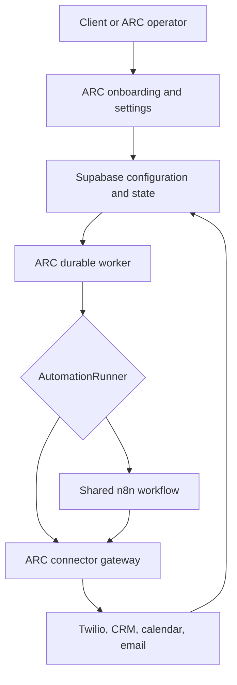

# ARC / n8n Integration — Canonical Implementation Handoff

**Roadmap revision date:** October 1, 2026  
**Project:** ARC / Arc Automations  
**Owner:** Bennett Church  
**Last reported application version:** `1.26.0`  
**Primary niche:** HVAC first; plumbing second  
**Current reported implementation state:** `ARC-120` is live on `main` (pushed and deployed). `ARC-110`, `ARC-130`, `ARC-200`, `ARC-210`, `ARC-220` and `ARC-230` are complete in the repository (commit `d7d32d8`, "Add ARC platform backend") but not yet pushed to `main` — held pending Bennett's explicit push authorization. `ARC-240` (shared n8n core workflows and error handler) is in progress in the working tree, uncommitted.  
**Immediate next implementation prompt:** Finish and commit the `ARC-240` work in progress, then push commit `d7d32d8` plus the `ARC-240` commit to `main` when Bennett authorizes it, before starting `ARC-300`.  
**New future product phase:** ARC Performance Intelligence and Continuous Improvement

---

# 0. Mandatory instructions for the next assistant

When Bennett supplies this handoff in a new chat:

1. Read this file completely before responding.
2. Do not restart niche selection, product research, or the ARC/n8n architecture discussion.
3. Treat ARC-110 through ARC-230 as **complete in the repository** (ARC-120 pushed to `main`; ARC-110, ARC-130, ARC-200, ARC-210, ARC-220 and ARC-230 committed locally in `d7d32d8` but not yet pushed) and ARC-240 as **in progress, uncommitted**, while verifying actual repository evidence (`git log origin/main..HEAD`, the migration sequence, the shared modules) before beginning dependent implementation work.
4. Confirm that the immediate next implementation prompt is:

   Finish and commit `ARC-240 — Shared n8n Core Workflows and Error Handler`, then push the pending commits to `main` when Bennett authorizes it, before starting `ARC-300 — ARC Ops Tenant Creation and Module Selection`.

5. Do not replace, delay, or merge ARC-240 or ARC-300 with the new optimization work.
6. Do not implement ARC Performance Intelligence yet. It belongs after `ARC-LR-450` and before `ARC-QA-500`.
7. Preserve the architectural rule:

   > **A client is configuration, not an n8n workflow.**

8. Preserve all ARC-015/ARC-015B configuration-snapshot pinning, immutable version history, and live safety protections.
9. Recommendations must never silently edit, publish, activate, reactivate, or roll back client configuration.
10. A historical version is immutable. Restoring one must create a new draft and, after authorization and validation, a new published version.
11. No current implementation prompt may commit, push, deploy, or contact real customers unless Bennett explicitly authorizes that operation.
12. Repository state is authoritative. Always run `git status --short`, read the relevant architecture documents, and verify prerequisite tests before editing.

---

# 1. Exact current execution position

The verified sequence, checked against `git log origin/main..HEAD`, the migration files under `supabase/migrations/`, and the shared modules under `supabase/functions/_shared/`, is:

1. `ARC-000` — complete, pushed
2. `ARC-010` — complete, pushed
3. `ARC-015` — completed except for the defect later isolated as ARC-015B, pushed
4. `ARC-015B` — complete, pushed
5. `ARC-100` — complete, pushed
6. `ARC-120` — complete, pushed (migration `0015_tenant_module_lifecycle.sql` is live on `main`)
7. `ARC-110` — complete in the repository (migration `0014_versioned_configuration.sql`, `_shared/config/`), committed locally in `d7d32d8`, **not yet pushed**
8. `ARC-130` — complete in the repository (migration `0016_provider_connections.sql`, `_shared/connections/`), committed locally in `d7d32d8`, **not yet pushed**
9. `ARC-200` — complete in the repository (migration `0017_durable_scheduler.sql`, `_shared/scheduler/`), committed locally in `d7d32d8`, **not yet pushed**
10. `ARC-210` — complete in the repository (`_shared/runner/`), committed locally in `d7d32d8`, **not yet pushed**
11. `ARC-220` — complete in the repository (migration `0018_runner_bridge.sql`, `_shared/n8n-runner/`, `runner-bridge` function; refuses production until the ADR §26 licensing gate closes), committed locally in `d7d32d8`, **not yet pushed**
12. `ARC-230` — complete in the repository (migration `0019_workflow_manifest.sql`, `n8n/manifest.json`), committed locally in `d7d32d8`, **not yet pushed**
13. `ARC-240` — **in progress**, uncommitted (migration `0020_runner_failure_reports.sql`, `_shared/n8n-runner/exports.ts` and `failures.ts`, `n8n/workflows/`, ADR §18 amendments)

Note the out-of-order landing: `ARC-120` reached `main` before `ARC-110` did. `ARC-110` was reported "complete locally" for several days before it was actually committed — that gap, plus this file not being revised in step with the repository, is why an operator asking the roadmap assistant "where are we" was told `ARC-110` when the repository had already moved past it. Keep this file current every time repository state changes; the roadmap assistant answers only from what is written here, never from the code directly.

`d7d32d8`'s own commit message records why ARC-110–230 have not been pushed: "Nothing reaches the database or Supabase until the `supabase db push` and function deploys in DEPLOYMENT.md. This stays under [Unreleased] until the hosted Vault checklist passes." That checklist is `docs/architecture/ARC_PROVIDER_CONNECTIONS_AND_OAUTH.md` §15. Do not push it or deploy it without Bennett's explicit authorization.

Before resuming work on ARC-240 or pushing the pending commits, verify from the repository — not from this summary — that ARC-110 through ARC-230 actually provide:

- Tenant-wide and tenant-module configuration versions, drafts, immutable published versions, operator publication, optimistic concurrency, rollback through a new version, deterministic effective-configuration resolution
- ARC-100 registry validation, field permissions, and registry-driven change-impact analysis
- Legacy Lead Recovery configuration migration
- Generalized version provenance connected to ARC-015 snapshots, runs, and actions
- Tenant module lifecycle, just-in-time authorization, and health overlay (ARC-120)
- Vault-only provider credentials, capability-scoped resolution, and connection readiness (ARC-130)
- The durable scheduler, claim/settle contract, and retry/dead-letter behavior (ARC-200)
- The runner contract and `FakeTestRunner` (ARC-210)
- The n8n bridge's production refusal gate and signed envelope handling (ARC-220)
- Workflow manifest registration, assignment, and sync-drift detection (ARC-230)
- No regression of live consent, suppression, reply, safety, takeover, or send-once protections

Do not infer missing implementation details from this handoff. Verify them in code, migrations, tests, and current architecture documents.

---

# 2. ARC-120 (delivered) and the actual immediate next task

`ARC-120` is complete and live on `main` (migration `0015_tenant_module_lifecycle.sql`, `_shared/lifecycle/`). The list below is kept as a record of its delivered scope, not as a pending task.

The actual immediate next task is finishing and committing `ARC-240`, then pushing the pending `d7d32d8` commit and the ARC-240 commit to `main` when Bennett authorizes it, before starting `ARC-300 — ARC Ops Tenant Creation and Module Selection`.

ARC-120 implemented the lifecycle and authorization layer for tenant modules, including the repository-approved equivalents of:

- Module selection
- Configuration readiness
- Connection readiness
- Testing state
- Shadow mode
- Activation
- Pause and resume
- Health overlay
- Transition history
- Just-in-time authorization before module execution
- Change-impact handling that determines when a configuration change requires retesting, shadow mode, operator review, or reactivation

ARC-120 consumes ARC-100 change-impact classifications and ARC-110 configuration versions. It does not implement the future performance-diagnosis engine.

The new optimization roadmap does not interrupt or replace ARC-240 or ARC-300.

---

# 3. Canonical ARC / n8n architecture

ARC remains the control plane and operational system of record.

```mermaid
flowchart TD
    U["Client or ARC operator"] --> A["ARC onboarding and settings"]
    A --> D["Supabase configuration and state"]
    D --> W["ARC durable worker"]
    W --> R{"AutomationRunner"}
    R --> N["Shared n8n workflow"]
    R --> C["ARC connector gateway"]
    N --> C
    C --> P["Twilio, CRM, calendar, email"]
    P --> D
```

## ARC owns

- Tenant identity and permissions
- Module selection
- Configuration schemas and versions
- Drafts and publication
- Operational state
- Durable scheduled actions
- Consent, suppression, and opt-outs
- Customer replies and human takeover
- Safety decisions
- Provider credentials
- Connector capabilities
- Audit history and event evidence
- Reporting and health
- Workflow-version assignments
- Future performance investigations and recommendations

## n8n may own

- Reusable module-level orchestration
- Approved stateless transformations
- Approved API-operation sequences
- Shared sub-workflows
- Returning signed execution results to ARC

## n8n must not own

- Tenant configuration
- Client permissions
- The only copy of scheduled actions
- Critical operational state
- Customer OAuth tokens
- Consent or suppression truth
- Per-client workflow copies
- The client-facing workflow editor
- Performance conclusions or recommendation authorization

## Execution implementations

ARC should eventually support:

- `DirectArcWorker`
- `N8nRunner`
- `FakeTestRunner`

Portal behavior and tenant configuration must not depend on which runner is used.

---

# 4. Revised canonical implementation sequence

The roadmap is now:

1. `ARC-000 — Repository Architecture Audit and Gap Map` — complete
2. `ARC-010 — ARC–n8n Execution Boundary ADR` — complete
3. `ARC-015 — Lead Recovery Safety and Configuration Pinning` — complete except for the extracted repair
4. `ARC-015B — Production Configuration Snapshot Pinning Repair` — reported complete
5. `ARC-100 — Module and Connector Registry Foundation` — complete
6. `ARC-110 — Versioned Tenant Configuration Engine` — complete in the repository, committed locally in `d7d32d8`, not yet pushed to `main`
7. `ARC-120 — Tenant Module Lifecycle and Activation State Machine` — complete, live on `main`
8. `ARC-130 — Secure Provider Connection and OAuth Framework` — complete in the repository, committed locally in `d7d32d8`, not yet pushed to `main`
9. `ARC-200 — Durable Actions, Runs, and Scheduling Engine` — complete in the repository, committed locally in `d7d32d8`, not yet pushed to `main`
10. `ARC-210 — AutomationRunner Interface and Fake Test Runner` — complete in the repository, committed locally in `d7d32d8`, not yet pushed to `main`
11. `ARC-220 — Secure n8n Runner Bridge` — complete in the repository, committed locally in `d7d32d8`, not yet pushed to `main`
12. `ARC-230 — n8n Workflow Manifest, Versioning, and Synchronization` — complete in the repository, committed locally in `d7d32d8`, not yet pushed to `main`
13. `ARC-240 — Shared n8n Core Workflows and Error Handler` — **next**, in progress and uncommitted
14. `ARC-300 — ARC Ops Tenant Creation and Module Selection`
15. `ARC-310 — Schema-Driven Client Workflow Settings UI`
16. `ARC-320 — Connections, Readiness, Testing, and Activation UI`
17. `ARC-330 — Company Route Model (native / hybrid / connected)` — complete in the repository per current `CLAUDE.md`; this file's sequence had not yet been revised to list it
18. `ARC-340 — Portal and Console UX Clarity Pass` — complete in the repository (2026-10-02). The same identifier also names `Universal CRM Core and Business Profile Foundation` in the root master roadmap (`ARC_MASTER_ROADMAP_EXPANDED_NATIVE_CRM_FROM_ARC_200.md`); that prompt is complete in the repository too (`0023_crm_core.sql`, `docs/architecture/ARC_CRM_CORE.md`). Both are closed under `ARC-340`.
19. `ARC-LR-400` through `ARC-LR-450` — complete Lead Recovery production behavior, integrations, proof, and health monitoring
20. `ARC-OPT-460 — Version-Aware Outcome Attribution and Anomaly Detection`
21. `ARC-OPT-470 — Evidence-Based Performance Diagnosis and Recommendation Engine`
22. `ARC-OPT-480 — Client Recommendations, Reminders, and Guided Configuration Experiments`
23. `ARC-QA-500 — Security, RLS, Contract, and Idempotency Test Suite`
24. `ARC-QA-510 — Synthetic End-to-End and Failure-Scenario Validation`
25. `ARC-OPS-520 — Deployment, Monitoring, and Incident Readiness`
26. `ARC-PILOT-530 — First HVAC Design-Partner Pilot`

The identifiers `ARC-OPT-460`, `ARC-OPT-470`, and `ARC-OPT-480` do not conflict with the current roadmap and are canonical unless the repository contains a newer authoritative numbering decision. `ARC-340` was added by an earlier revision as the UX clarity pass. It does collide with the root master roadmap, which uses `ARC-340` for the universal CRM core; both prompts were built and are complete, so the identifier is closed and neither meaning is pending.

Do not move optimization ahead of the data, lifecycle, execution, workflow-attribution, and Lead Recovery measurement prerequisites.

---

# 5. New major capability: ARC Performance Intelligence and Continuous Improvement

ARC should not merely automate Lead Recovery and report results. It should continuously monitor trustworthy outcomes, detect meaningful changes, investigate plausible explanations, recommend safe improvements, and measure whether those improvements helped.

The intended customer experience is:

> ARC noticed a meaningful performance change, investigated the available evidence, considered both internal and external explanations, and returned with a transparent recommendation, its reasoning, its confidence level, and a safe way to test the proposed improvement.

This is a prominent product capability and a meaningful differentiator—not a small analytics feature.

## Critical diagnostic framing

ARC must never automatically assume that a performance change was caused by:

- ARC
- A configuration version
- The client company
- The client’s employees
- Market conditions
- Any single outside variable

Every diagnosis must distinguish:

- Observed facts
- Correlations
- Inferences
- Unverified possibilities
- Causes supported by strong evidence

Temporal sequence alone is not causation. ARC must not say that a configuration version caused a decline merely because the decline followed publication.

ARC also must not hide verified ARC defects, workflow regressions, connector failures, provider outages, or scheduling failures. The objective is accurate diagnosis, not blame avoidance.

An acceptable explanation would resemble:

> Booking rate declined after version 6 was published. The strongest concurrent differences were a change in lead-source mix and longer human-handoff times. Current evidence does not establish that the configuration change caused the decline. ARC recommends reviewing those factors and testing the previous follow-up timing as a controlled new version.

“Insufficient evidence” must always be an acceptable conclusion.

---

# 6. ARC-OPT-460 — Version-Aware Outcome Attribution and Anomaly Detection

## Purpose

Build the trustworthy measurement and attribution foundation needed before ARC makes performance recommendations.

## Required capabilities

- Associate outcomes with the exact immutable configuration snapshot used.
- Attribute results to both tenant-wide and tenant-module configuration versions.
- Include workflow version, module lifecycle state, provider health, and relevant connector state when those prerequisites exist.
- Separate upstream lead supply from downstream Lead Recovery performance.
- Establish tenant-specific baselines rather than applying one universal benchmark.
- Compare equivalent cohorts and time periods where possible.
- Require minimum observation windows and sample sizes.
- Account for delayed or incomplete outcomes.
- Detect data-quality failures before diagnosing business performance.
- Detect meaningful changes without alerting on ordinary statistical noise.
- Preserve tenant isolation and minimize unnecessary PII.

## Potential trustworthy metrics

Only expose these when the underlying data proves them:

- Inbound lead volume
- Lead-source distribution
- Time to first response
- Customer reply rate
- Qualification rate
- Booking rate
- Human-handoff acceptance time
- Follow-up completion
- Opt-out and suppression rate
- Provider and connector failures
- Confirmed recovered revenue
- Other outcomes supported by reliable integrations

ARC must never display unprovable revenue, attribution, or performance conclusions.

## Completion boundary

ARC-OPT-460 detects and records evidence-backed changes. It does not diagnose causes, generate client recommendations, or edit configuration.

---

# 7. ARC-OPT-470 — Evidence-Based Performance Diagnosis and Recommendation Engine

## Purpose

Open a durable investigation when ARC-OPT-460 detects a meaningful change. Consider competing hypotheses before recommending action.

## Required hypothesis categories

### Data and measurement

- Missing or delayed CRM outcomes
- Tracking changes
- Duplicate or dropped events
- Integration failures
- Small sample size
- Changed attribution availability

### Lead supply

- Lower inbound lead volume
- Changed lead-source mix
- Lower-quality sources
- Advertising campaign or spend changes
- Website or form problems

ARC must distinguish “fewer leads entered the system” from “ARC handled available leads less effectively.”

### Company operations

- Staffing or scheduling changes
- Slow human handoffs
- Capacity constraints
- Changed business hours
- Pricing or offer changes
- Service-area changes
- Booking availability
- Missed routing contacts
- Internal process changes

### Configuration

- Message wording
- Follow-up timing
- Qualification questions
- Routing rules
- Booking behavior
- After-hours settings
- Recently published configuration versions

### ARC, workflow, connector, and provider

- ARC application regression
- Workflow-version change
- Connector failure
- Provider outage or degraded delivery
- Incorrect configuration resolution
- Scheduling or execution delay
- Failed callbacks
- Unexpected suppression or safety behavior

### External conditions

- Seasonality
- Weather
- Holidays
- Local demand changes
- Economic conditions
- Competitive changes
- Other relevant market events

External research must use authorized, appropriate, time-stamped sources. ARC must retain the evidence and sources used. Generic web results are not proof of causation.

## Durable investigation output

Each investigation should record:

- Detected change
- Affected time period
- Baseline and comparison period
- Data-quality status
- Hypotheses considered
- Evidence supporting or weakening each hypothesis
- Ranked likely explanations when supportable
- Confidence level
- Important unknowns
- Recommended action
- Expected benefit when supportable
- Risks
- Reversibility
- Testing or approval requirements
- Proposed observation period
- Success or failure criteria

Recommendations must become more conservative as evidence weakens.

## Completion boundary

ARC-OPT-470 produces durable investigations and recommendation candidates. It does not silently notify clients, create drafts, publish settings, or activate modules.

---

# 8. ARC-OPT-480 — Client Recommendations, Reminders, and Guided Configuration Experiments

## Purpose

Turn reviewed investigations into a safe, useful client experience.

## Recommendation center

The client-facing experience should eventually support:

- New recommendation alerts
- Evidence summaries
- Confidence and uncertainty
- Changed metrics
- Competing explanations considered
- Recommended next steps
- Estimated impact only when supportable
- Links to relevant settings
- `Create suggested draft`
- `Restore a previous version as a new draft`
- `Compare versions`
- `Snooze`
- `Dismiss`
- `Mark as handled`
- `Request ARC/operator review`
- Follow-up reporting after the observation period

## Reminder requirements

Notifications and reminders must be:

- Configurable
- Rate-limited
- Deduplicated
- Prioritized by severity and likely value
- Portal-first
- Extendable to explicitly approved channels
- Audited
- Easy to snooze or disable
- Designed to avoid alert fatigue

For early clients, novel or low-confidence recommendations require operator review before external delivery.

## Non-negotiable safety boundaries

A recommendation may prefill a draft only after authorization. It must never:

- Edit an immutable historical version
- Silently publish configuration
- Activate or reactivate a module
- Bypass schema validation
- Bypass required tests or lifecycle gates
- Override consent, suppression, STOP, safety escalation, or human takeover
- Promise unsupported leads, bookings, revenue, or causation

`ARC-340 — Portal and Console UX Clarity Pass` (Section 19) is sequenced after `ARC-330` and before `ARC-LR-400`, independent of this optimization phase.

---

# 9. Version history and performance comparison requirements

The appropriate client-settings and portal phases must eventually support:

- Viewing previous published versions
- Seeing exact differences between versions
- Seeing who published each version and when
- Recording an optional reason for a change
- Connecting each version to measurable outcomes
- Comparing versions across appropriate observation windows
- Restoring previous settings as a new draft
- Validating and retesting restored settings
- Publishing a restoration as the next immutable version
- Tracking whether a recommendation improved the intended outcome

Historical versions must never be edited.

A strong historical period must not automatically be labeled the “best version.” Comparisons must account for meaningful differences such as:

- Lead volume
- Lead-source mix
- Seasonality
- Staffing
- Human response time
- Capacity
- Data completeness
- Provider and connector health
- Workflow version

---

# 10. Guided experiment sequence

ARC should use this safe sequence for configuration experiments:

1. Detect a meaningful opportunity or decline.
2. Confirm that data is sufficiently complete.
3. Investigate competing explanations.
4. Present evidence and uncertainty.
5. Recommend one bounded, reversible action.
6. Create a draft only after authorization.
7. Validate the draft.
8. Require lifecycle testing, shadow mode, or approval when applicable.
9. Publish a new immutable version after authorization.
10. Observe results for a defined period.
11. Compare appropriate metrics and cohorts.
12. Report improvement, decline, or an inconclusive result.

Do not implement automatic A/B testing by default. Any future randomized experiment system requires sufficient volume, explicit authorization, safety review, and predetermined success criteria.

---

# 11. Existing prompts whose scope or acceptance criteria changed

The following prompts retain their primary missions but must include these contracts:

| Prompt | Required roadmap addition |
| --- | --- |
| `ARC-110` | Supplies immutable configuration versions, restoration-as-new-version, snapshot provenance, and run-level attribution. It is already reported complete; verify these contracts rather than reopening unrelated work. |
| `ARC-120` | Uses change-impact classifications to decide whether a change requires testing, shadow mode, operator review, or reactivation. |
| `ARC-200` | Supports durable scheduling for future investigations, observation windows, and reminders without making optimization logic part of the core scheduler. |
| `ARC-230` | Records exact workflow-manifest/version attribution. |
| `ARC-240` | Emits trustworthy execution evidence needed to distinguish workflow behavior from other causes. |
| `ARC-310` | Lets authorized clients view, compare, and restore versions safely; restoration creates a draft and later a new version. |
| `ARC-LR-450` | Produces trustworthy outcome, proof, data-quality, and health information consumed by ARC-OPT-460. |
| `ARC-QA-500` | Tests tenant isolation, recommendation permissions, immutable history, audit evidence, and prevention of unauthorized publication. |
| `ARC-QA-510` | Validates investigations and causal-language safeguards with synthetic scenarios and no real customer contact. |
| `ARC-OPS-520` | Monitors recommendation infrastructure, data freshness, investigation queues, delivery failures, and incident procedures. |

No existing prompt is replaced by this addition.

---

# 12. Required future synthetic validation scenarios

The QA plan must test cases where:

- Lead volume falls while response and booking rates remain stable.
- Lead volume remains stable but lead-source quality changes.
- A configuration version genuinely performs worse.
- Performance changes because staff respond more slowly.
- A CRM or provider stops returning outcomes.
- Seasonality or weather plausibly changes demand.
- An ARC connector or workflow regression causes a decline.
- Sample size is insufficient.
- Multiple factors change simultaneously.
- A previous version appears stronger but periods are not comparable.
- A recommendation improves results.
- A recommendation produces no statistically meaningful change.
- A client restores old configuration as a new version.
- A client lacks permission to publish a recommended change.

Tests must confirm that ARC does not make unsupported causal claims in any of these scenarios.

---

# 13. Safety and product principles that remain binding

1. Build once and configure per company.
2. No copied workflows per client.
3. No n8n node editing during onboarding.
4. No manual per-client database setup.
5. No unsupported integration improvised to close a sale.
6. Only display provable results.
7. Stop automation after a relevant customer reply.
8. Apply opt-outs immediately.
9. Human takeover blocks automated messaging.
10. Safety and distress scenarios require human handling.
11. Current safety state overrides pinned behavioral configuration.
12. Pinned configuration controls deterministic run behavior.
13. Every external effect requires durable send-once protection.
14. Ambiguous provider outcomes must not be automatically resent.
15. Critical state lives in ARC/Postgres.
16. n8n history is not operational state.
17. n8n remains replaceable.
18. Historical configuration versions are immutable.
19. Rollback creates a new version.
20. Recommendations never silently change configuration.
21. Correlation must not be described as proven causation.
22. ARC must disclose verified faults in its own application, workflows, connectors, or providers.
23. “Insufficient evidence” is a valid and necessary conclusion.

Add this canonical product principle:

> **ARC should not merely report that performance changed. It should investigate why it may have changed, show the evidence and uncertainty, recommend a safe next action, and then measure whether that action helped.**

---

# 14. Deployment and repository boundary

The implementation prompts currently create and verify local repository changes. They do not automatically update the live site.

Keep these milestones separate:

1. **Code checkpoint:** review and commit completed work to a feature branch when Bennett explicitly authorizes it.
2. **Staging deployment:** apply migrations and deploy the integrated system in a non-production environment.
3. **Production deployment:** occur only after QA, synthetic validation, rollback preparation, monitoring readiness, and an explicit authorization gate.
4. **Pilot:** activate only the approved first HVAC design partner after production-safe canaries pass.

The deployment, monitoring, and incident-readiness work belongs in `ARC-OPS-520`, followed by the controlled first pilot in `ARC-PILOT-530`.

Pushing a branch is not the same as deploying production. No prompt should assume that distinction is handled automatically; it must inspect the repository and hosting configuration.

---

# 15. Current repository and verification caution

The last historical baseline before ARC-015B was 403 passing tests across 64 suites, but that number predates later implementation work and is not a permanent target.

The worktree previously contained user-owned changes. The current worktree may have changed substantially after ARC-015B and ARC-110.

Before every implementation prompt:

- Run `git status --short`.
- Identify pre-existing changes.
- Preserve unrelated work.
- Inspect the actual migration sequence.
- Use production-adapter or database contract tests for safety-critical persistence.
- Do not trust in-memory tests as the only proof of production behavior.
- Do not use destructive Git commands.
- Do not commit or push unless Bennett explicitly requests it.

---

# 16. How to continue

When Bennett sends:

> `ARC-240`

Provide the complete copy-and-paste Claude Code prompt for:

> `ARC-240 — Shared n8n Core Workflows and Error Handler`

The prompt must begin with a prerequisite gate that verifies ARC-015B, ARC-100, ARC-110, ARC-120, ARC-130, ARC-200, ARC-210, ARC-220, and ARC-230 in the actual repository, and must note that ARC-110 through ARC-230 are committed locally (`d7d32d8`) but not yet pushed to `main`.

Do not implement ARC-OPT-460, ARC-OPT-470, or ARC-OPT-480 yet.

After ARC-LR-450 completes and produces trustworthy outcome and health data, the next sequence becomes:

1. `ARC-OPT-460`
2. `ARC-OPT-470`
3. `ARC-OPT-480`
4. `ARC-QA-500`
5. `ARC-QA-510`
6. `ARC-OPS-520`
7. `ARC-PILOT-530`

---

# 17. Suggested first response in the next chat

> I have read the complete handoff. ARC-120 is live on `main`. ARC-015B, ARC-100, ARC-110, ARC-130, ARC-200, ARC-210, ARC-220 and ARC-230 are complete in the repository (commit `d7d32d8`) but not yet pushed. ARC-240 is the immediate next implementation prompt, in progress and uncommitted; pushing the pending commits requires Bennett's explicit authorization. The roadmap now includes a dedicated Performance Intelligence and Continuous Improvement phase after ARC-LR-450 and before ARC-QA-500: ARC-OPT-460 for trustworthy attribution and anomaly detection, ARC-OPT-470 for evidence-based diagnosis, and ARC-OPT-480 for client recommendations and guided experiments. I will not implement those phases early, and I will preserve immutable history, run pinning, operator authorization, and the rule that recommendations cannot silently change settings.

---

# 18. Final summary

ARC’s configuration-driven, multi-tenant architecture remains settled. ARC is the control plane; Postgres is the operational system of record; shared runners remain replaceable; and each run remains pinned to the configuration under which it began. ARC-120 is live on `main`; ARC-110, ARC-130, ARC-200, ARC-210, ARC-220 and ARC-230 are complete in the repository but not yet pushed (commit `d7d32d8`), making ARC-240 the immediate next implementation prompt, followed by pushing the pending commits under Bennett's authorization and then ARC-300. The roadmap now adds three major optimization phases after Lead Recovery proof and health monitoring: ARC-OPT-460 builds trustworthy version-aware measurement and anomaly detection, ARC-OPT-470 performs evidence-based investigations across competing internal, external, data, configuration, workflow, connector, and provider explanations, and ARC-OPT-480 presents reviewed recommendations and safe guided experiments to clients. Historical versions remain immutable, restorations create new drafts and versions, weak evidence may produce no recommendation, and ARC must neither unfairly blame itself nor hide verified system faults. No optimization implementation should begin until the underlying lifecycle, execution, workflow attribution, and outcome data are trustworthy.

---

# 19. `ARC-340` — Portal and Console UX Clarity Pass

Status: complete in the repository (2026-10-02). What shipped: one glossary
(`src/portal/lib/glossary.js`) and a `Term` component that hangs a plain-language gloss from
each state name without renaming it; the consequence of every confirmed action printed on the
page before the confirmation; a skip link, named icon buttons and readable contrast in the
shared shell; a spoken "not available" beside every dash; and a label on each Roadmap
Assistant reply saying whether it is a written answer or quoted passages. Held by
`tests/ux-clarity.test.js`. No derivation, lifecycle, connection or publish logic changed.

## Purpose

Both workspaces (`/portal/dashboard/*`, `/demo/*`, and `/ops/console/*`) have grown one
page at a time, each wired correctly to the shared `events` derivation chain but never
reviewed together for whether a first-time client or operator can actually follow what
they're looking at. `ARC-340` is a dedicated usability pass across both sides of the
shared shell (`Sidebar`, `Topbar`, `CommandPalette`) to make the existing screens easier
to read, navigate, and act on correctly — **without removing, hiding, weakening, or
reinterpreting any existing feature, figure, control, or safety gate.**

This is a clarity and polish prompt, not a redesign and not a scope change. If a proposed
change would alter what a page shows, what a number means, or what a button is allowed to
do, it belongs to the owning prompt (`ARC-110`/`ARC-120`/`ARC-130`/`ARC-310`/`ARC-320`/
`ARC-330`), not to `ARC-340`.

## Required capabilities

- **Plain-language labeling.** Replace or annotate internal vocabulary that a client or a
  new operator would not recognize (e.g. "lifecycle", "shadow mode", "effective
  configuration", "canary") with a short plain-language gloss — in copy, a tooltip, or an
  inline help affordance. The underlying terminology in code, APIs, event types, and the
  roadmap itself does not change.
- **Consistent structure across both workspaces.** `/portal/dashboard/*` and
  `/ops/console/*` already share `Sidebar`/`Topbar`/`CommandPalette` over different nav
  declarations (per `CLAUDE.md`); this prompt may improve how those shared components lay
  out labels, grouping, and section headers, but must keep the two nav declarations
  distinct — `/portal` and `/ops` must still never look alike.
- **Progressive disclosure.** Surface the common case first; put advanced, destructive, or
  rarely-needed controls (module pause, client purge, connection disconnect, version
  restore) behind a clearly labeled secondary affordance rather than removing them or
  making them harder to find for someone who needs them.
- **Context before consequence.** Every control that triggers an irreversible or
  hard-to-reverse action (publish, activate/pause a module, restore a version, purge a
  client, disconnect a connection) gets inline explanatory copy stating what will happen
  *before* the existing confirmation step — the confirmation step itself is not removed,
  shortened, or auto-accepted.
- **Correct rendering of the existing "no data" states.** `lib/modules.js`'s rule that a
  module not part of the plan renders `—` with a reason, and `lib/health.js`'s
  `unverified` state, must remain visually and textually distinguishable from a real zero
  — this prompt may improve how clearly those states read, but must not change which state
  a given module is in or compute a new one.
- **Accessibility basics** across the shared shell: visible focus states, sufficient
  contrast, and keyboard reachability for every control already in the DOM today.
- **Copy-only changes to the Roadmap Assistant UI** (`RoadmapAssistant.jsx`,
  `RoadmapAssistant.css`) are in scope if they make the excerpts/answer distinction (see
  `docs/architecture/ARC_ROADMAP_ASSISTANT.md`) easier for an operator to read; the
  assistant's citation and withholding behavior does not change.

## Non-negotiable constraints

- Never remove a page, panel, button, column, or figure to make a screen feel simpler —
  reorganize, relabel, group, or add guidance instead.
- Never change what a figure means or where it is derived from. Every figure still comes
  from the same `events`-log derivation chain; `ARC-340` touches presentation, not
  `lib/lifecycle.js`, `lib/modules.js`, `lib/health.js`, `lib/attention.js`, `lib/ops.js`,
  or any of their call paths.
- Never collapse, shorten, or auto-accept a confirmation gate around an irreversible
  action. Clarity improvements sit *in front of* the existing gate, never in place of it.
- Never let `/portal` and `/ops` converge visually, and never merge their nav
  declarations into one.
- Never introduce an `ARC-nnn` identifier into `_shared/roadmap/` assistant code (the
  existing drift test must keep failing on that).
- Never change ARC-120 lifecycle transitions, ARC-130 connection/credential handling, or
  the publish/draft/preview flow in `ClientSettings.jsx` / `ActivationPanel.jsx` — only
  how those existing flows are explained and laid out.

## Completion boundary

`ARC-340` ships copy, grouping, tooltip/help-text, progressive-disclosure layout, and
accessibility fixes to existing portal and console pages. It does not add a new module,
page, metric, workflow, lifecycle state, or permission, and it does not change any
derivation, authorization, or persistence logic. A page that was correct and confusing
before `ARC-340` must be correct and clear after it — never correct and simplified at the
cost of a hidden feature.
