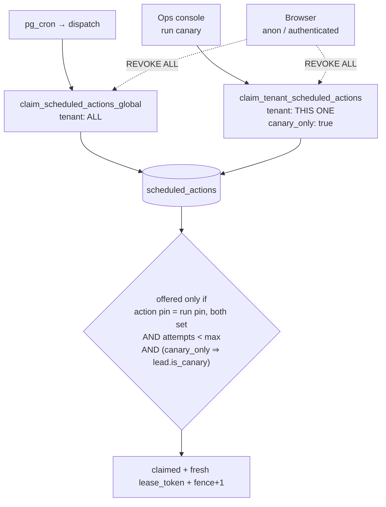
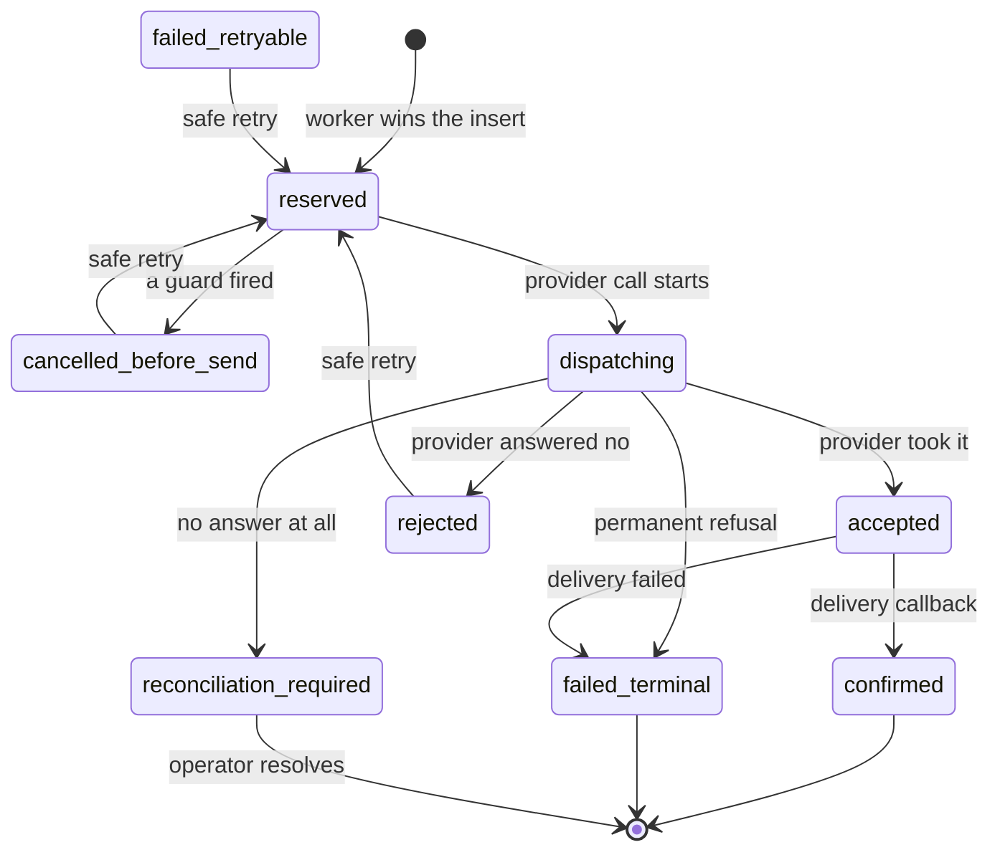
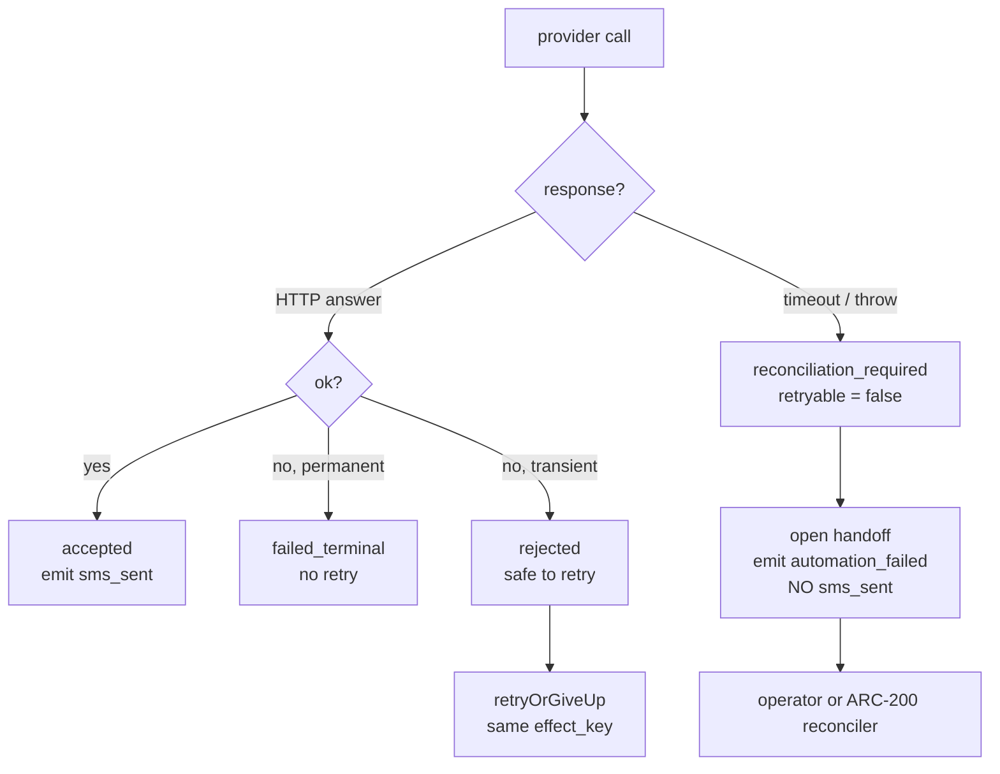
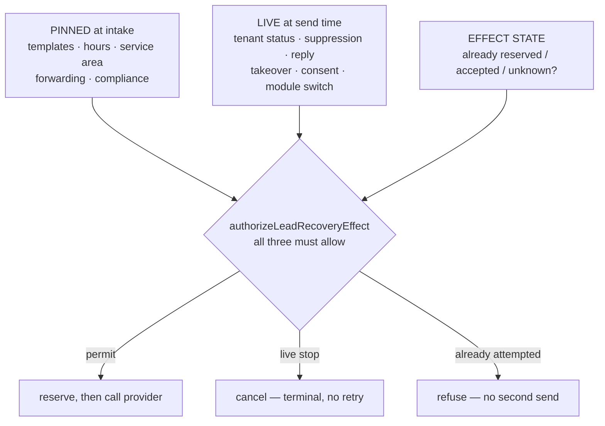

# ARC-015 — Lead Recovery execution safety and configuration pinning

> **Handling notice.** Like the audit and the boundary ADR, this document names
> defects in shipped code and the mechanisms that now contain them. `origin` is a
> **public** repository and `docs/architecture/` is **not** gitignored. Decide where
> these three documents live before any of them is committed.

## 1. Purpose

Close the four execution-safety defects the repository audit
(`ARC_N8N_REPOSITORY_AUDIT.md` §6.5, §12) and section 37 of
`ARC_N8N_EXECUTION_BOUNDARY_ADR.md` identified in the 0010 Lead Recovery engine,
before anything is layered on top of it.

The four, in one line each:

1. The operator canary drained **other tenants'** due work into a recording sender.
2. Completion was fenced on nothing, so a stale worker could close out a row another
   worker had reclaimed.
3. Nothing durable was written before the provider call, so a timeout, a crash or a
   lease race could text one customer twice.
4. `config_version` was a counter with no history, so "which configuration did this
   run actually use" had no answer.

The through-line: **a side effect must be reserved before it is performed, and only
the worker holding the current lease may reserve it.** Everything below exists to
make that sentence enforceable in Postgres rather than remembered in TypeScript.

This is deliberately *not* ARC-100's registry, ARC-110's configuration engine or
ARC-120's lifecycle. §20 says how each of those absorbs this work without discarding
it.

## 2. Original defects

| ID | Defect | Evidence (pre-ARC-015) | Consequence |
|---|---|---|---|
| **S-C1** | `claim_scheduled_actions` took no tenant argument; the canary called it | `0010:542–574`; `ops/lead-recovery.ts:437`, `:120–128`; `twilio.ts:344–366` | Another tenant's customer text claimed, never delivered, marked `done`, and recorded as a successful non-canary `sms_sent` on their dashboard |
| **S-C2a** | `completeAction` filtered on `id` alone — no tenant, no lease | `supabase-store.ts:568–582` | A stale worker closes out a row a live worker holds |
| **S-C2b** | No durable record before the provider call, and no check for an existing one | `runtime.ts:1004–1074` | Duplicate customer texts |
| **S-C2c** | A 10-second abort returned `permanent:false` and was retried | `twilio.ts:249, 316–327` | A Twilio-accepted-but-slow send retried into a duplicate |
| **S-L2** | An expired lease re-offered an action past its attempt cap | `0010:554–563` | Unbounded retries |
| **S-H1** | Neither routing nor the engine read `tenants.status` | `supabase-store.ts:213–226`; `0007:46–100` | A deboarded contractor's customers kept being messaged |
| **S-M4** | `config_version` written, never read; no history | `runtime.ts:280`, `:784`; `0010:108–110` | A mid-sequence edit silently changed what a running sequence did |
| **Evidence** | `sms_sent` keyed per *attempt*, and emitted on failure | `runtime.ts:1063` | Retries double-counted; failed sends counted as sends |

**A note on the fourth artifact.** The false send-once guarantee was asserted in the
migration comment (`0010:540–541`), in `PORTAL_CONTEXT.md` §3b and §10, and in the
title of `tests/lead-recovery.test.js:1255` — a test that only ever checked that
*re-queueing* was a no-op. That test has been renamed to what it actually verifies,
and the real guarantee is now asserted in
`tests/lead-recovery-safety.test.js` §3.

## 3. ADR section 37 checklist

| # | Item | Status | Where |
|---|---|---|---|
| 1 | Scope the canary's queue drain | **Done** | `0011` §5; `runDueActions({tenantId, canaryOnly})`; `ops/lead-recovery.ts` |
| 2 | Fence completion on lease holder **and** tenant | **Done** | `0011` §6; `completeAction` / `rescheduleAction` |
| 3 | Send-attempt record before the provider call; timeout as unknown | **Done** | `0011` §3, §7; `dispatchEffect`; `SendResult.ambiguous` |
| 4 | Archive and pause stop execution | **Done (engine side)** | `authorizeLeadRecoveryEffect`; `executeAction`. **`deboard_tenant` not yet extended** — §22 |
| 5 | Atomic or reconcilable intake | **Partial** | Snapshot-before-run narrows it; the sweeper is deferred — §22 |
| 6 | Version references on runs **and** actions | **Done — repaired in ARC-015B** | `0011` §2 added both columns, but until `0013` the production store wrote neither, so no real run was pinned and nothing could be claimed (§23). Now `automation_runs.config_snapshot_id` is persisted and required, and `scheduled_actions.config_snapshot_id` is derived from the run and structurally equal to it |
| 7 | Complete the live-recheck set | **Done** | `authorizeLeadRecoveryEffect` — §11 table |
| 8 | Attempt-cap enforcement at claim | **Done** | `0011` §5 `a.attempts < a.max_attempts` |
| 9 | Provider-result reconciliation | **Partial** | State and interface exist and block resend; the poller is deferred — §22 |
| 10 | Event-evidence correctness | **Done** | Effect-keyed `sms_sent`, emitted only on acceptance |

Where this prompt and §37 differ, the stricter reading was taken. Two cases:

- §37 item 3 asks for a "send-attempt record". The prompt asks for a full effect
  lifecycle with uniqueness. The prompt is stricter, and is what was built.
- §37 item 4 treats tenant status as a recheck. The prompt additionally requires that
  a stale action cannot send. Both are implemented; the claim function also refuses
  actions whose run cannot prove its configuration.

## 4. Tenant-scoped claiming

There are now **two** claim functions and no way to reach the global one by omission.

| Function | Caller | Scope |
|---|---|---|
| `claim_scheduled_actions_global(limit, worker, lease)` | `dispatch` only | Every tenant |
| `claim_tenant_scheduled_actions(tenant, limit, worker, lease, canary_only)` | Canary, diagnostics | One tenant; optionally synthetic leads only |
| `claim_actions_internal(...)` | The two above only | Shared body; revoked from every role |

`claim_scheduled_actions(integer, text, integer)` — the unscoped original — is
**dropped**. That is the one destructive act in `0011` and it is the point: leaving it
callable is the defect.

`claim_tenant_scheduled_actions` **raises** on a null tenant rather than widening.
The engine signature mirrors this: `runDueActions` takes a required `tenantId`, and
`null` has to be typed out. `dispatch/index.ts:134` does so with a comment saying why.

Both functions additionally refuse to offer:

- an action whose run has no configuration snapshot (§10);
- since `0013`, an action whose own pin is null or differs from its run's (§23);
- an action at or past `max_attempts` (closes S-L2);
- with `canary_only`, anything whose lead is not synthetic.

## 5. Global worker versus canary boundaries



A canary validates the system; it does not participate in customer processing. Both
guards are load-bearing and each is tested on its own: tenant scope stops it reaching
another client at all, `canary_only` stops it touching even *this* client's real
queue.

## 6. Lease and fencing model

`locked_by` is **not** a fence. The dispatcher's worker name is a constant, so the
same identifier reclaims the same row a minute later and a stale worker's late write
would still match. A fence has to be unique per claim.

| Column | Meaning |
|---|---|
| `lease_token uuid` | Fresh on every claim. What a worker must present to mutate |
| `fence bigint` | Monotonic per action. Makes "is this an older claim?" a `<` |
| `locked_at` | Lease clock; expiry re-offers the row |
| `locked_by` | Diagnostics and attribution only — never authorisation |

Every state-changing worker operation requires `(action_id, tenant_id, lease_token)`
and `status='claimed'`:

- `complete_scheduled_action(...)` → `done | failed | cancelled`
- `reschedule_scheduled_action(...)` → back to `pending`

Both return a boolean. The store turns `false` into a typed `lost_lease`, and
**no caller may read a zero-row update as success** — that is enforced by the return
type: `completeAction` used to return `void`.

### Lease-expiration behaviour

| Situation | Behaviour |
|---|---|
| Worker finishes before expiry | Fenced write succeeds |
| Lease expires before provider dispatch | Row re-offered; the new holder re-authorises from scratch |
| Stale worker attempts completion | `lost_lease`; the action is untouched |
| Another worker reclaimed it | Fence differs, so the stale write matches nothing |
| Provider call already attempted | The **effect reservation**, not the lease, refuses the second send (§7) |
| Lease extension | Not supported in ARC-015. A long action is re-offered and re-authorised, which is safe because the effect is reserved |
| Abandoned action | Returns to processing on lease expiry, up to `max_attempts` |
| Dead-letter | `attempts >= max_attempts` → never re-offered; `failed` + handoff + `task_opened` |

```mermaid
sequenceDiagram
    autonumber
    participant A as Worker A
    participant DB as Postgres
    participant B as Worker B

    A->>DB: claim → lease L1, fence 1
    Note over A: stalls (GC, network, slow provider)
    DB-->>DB: lease L1 expires
    B->>DB: claim → lease L2, fence 2
    B->>DB: reserve effect (owns it)
    B->>DB: complete(L2) ✓
    A->>DB: complete(L1)
    DB-->>A: lost_lease — nothing written
    Note over A: A reports the loss; it does not retry
```

## 7. External-effect attempt model

`lead_recovery_effect_attempts` holds one row per **logical** customer- or
employee-affecting side effect, created *before* the provider is called.

The send-once mechanism is `unique (tenant_id, effect_key)`. Reservation is an insert
that either succeeds — this worker owns the effect and may call the provider — or
collides, in which case the caller must not send.

**Effectively once, not exactly once.** No database makes an external provider call
atomic with a local commit. What this buys is that a second send never happens
*silently*: an ambiguous outcome is parked in a state that refuses automatic retry.

Key fields: `effect_key` (stable identity), `idempotency_key` (handed to the provider
where supported), `worker` / `lease_token` / `attempt_no`, `provider`,
`destination_ref` (**masked**), `state`, `provider_message_id`, `error_category`,
`retryable`, `is_canary`, and the four timestamps.

`destination_ref` is masked via `maskPhone`. The full number already lives on `leads`;
duplicating it here would widen the blast radius for no gain. **No credential is ever
written to this table.**

Effect keys, all derived from the action's own idempotency key so they are stable
across attempts:

| Effect | Key |
|---|---|
| First response / follow-up | `lr:effect:<action idempotency key>` |
| Staff alert | `lr:staff:<action idempotency key>:<recipient>` |
| Handoff acknowledgement | `lr:ack:<lead correlation id>` |

## 8. Effect-state transitions



The split that matters:

- **Provably not sent** — `rejected`, `failed_retryable`, `cancelled_before_send`.
  A fresh provider call is safe; the row is reused and `attempt_no` increments.
- **Everything else** — `reserved`, `dispatching`, `accepted`, `confirmed`,
  `outcome_unknown`, `reconciliation_required`, `failed_terminal`. Reservation is
  **refused**. We cannot prove the provider did not take it, so we do not send again.

## 9. Ambiguous outcome policy

> **Only retry automatically when ARC can prove the provider did not accept the
> request. Under-sending plus an operator task always beats a duplicate.**

`SendResult.ambiguous` is the adapter's own judgement, and it is the distinction that
stops duplicate texts:

| Adapter outcome | `ambiguous` | Why |
|---|---|---|
| HTTP response, any status | `false` | The provider answered. Whatever it said, it did not silently queue the message |
| Abort / timeout | **`true`** | No response came back; the request may well have reached Twilio |
| Network throw | **`true`** | Same |

On an ambiguous outcome the engine:

1. settles the attempt to `reconciliation_required` with `retryable: false`;
2. emits `automation_failed` — **never** `sms_sent`, because we do not know that it
   was;
3. opens a handoff so a person is told to check the provider;
4. finishes the action `failed` **without** entering `retryOrGiveUp`;
5. leaves the effect key and attempt history intact, so a later reconciler resolves
   the same row.

**Known provider limitation.** Twilio exposes no "did you receive a request bearing
this idempotency key" lookup for Messages, so reconciliation means listing recent
messages for the number and matching. ARC-015 implements the state and the interface
that make that possible and that block automatic resend; the poller itself is ARC-200
(§22). Until then an ambiguous send is resolved by a person.



## 10. Configuration-snapshot model

`lead_recovery_config_snapshots` freezes the validated, non-secret configuration a run
begins under. `automation_runs.config_snapshot_id` points at it.

- **Immutable**, enforced by a trigger that raises on UPDATE and DELETE — so the
  service role cannot rewrite history either, not merely a browser.
- **Identity is the hash**, not the counter: `unique (tenant_id, config_hash)`, so a
  thousand runs under one unchanged rule set share one row. The hash is SHA-256 over
  a canonical serialisation with sorted keys, so insertion order cannot fork it.
  *Since `0014` (ARC-110) this holds for legacy unversioned snapshots only; a versioned
  snapshot is one per (tenant settings version, module version) pair and records both —
  see ARC_VERSIONED_TENANT_CONFIGURATION_ENGINE.md §12.*
- **`config_version` is kept** for forensics and for ARC-110 to correlate against,
  never trusted alone as identity. *Since `0014` it is the published module version's
  number.*
- **No credentials**, enforced by the same check constraint 0010 put on
  `module_configs.config`.
- **Cannot cross tenants**: the composite FK `(config_snapshot_id, tenant_id)` makes
  it structurally impossible.

`loadPinnedConfig(store, run)` is the only way a running sequence reads its rules, and
it validates on read — configuration written by an older validator must not be able to
put the engine into a state today's validator would refuse.

**A run with no snapshot can never execute.** The claim functions do not offer it, and
`loadPinnedConfig` refuses it. That is the second line, not the first.

**Since `0013` (ARC-015B), a new run cannot exist without one either**, and every action
carries its run's snapshot. Where each part of that is enforced:

| Rule | Enforced by |
|---|---|
| A new run carries a snapshot | `automation_runs_guard_snapshot()` (0013); `MemoryStore.createRun` mirrors it |
| The snapshot is the run's own tenant's | 0011's composite FK `(config_snapshot_id, tenant_id)`, restated in words by the guard |
| The snapshot is for the run's module, at a schema the registry lists as selectable | the guard, reading `registry_module_versions` (0012) — no second list of module names |
| A run's pin, tenant, lead and module never change | the guard, on UPDATE |
| An action's pin is its run's | derived by `scheduled_actions_guard_snapshot()` when omitted, refused when different, and held by the composite FK `(run_id, tenant_id, config_snapshot_id)` → `automation_runs (id, tenant_id, config_snapshot_id)` even if the trigger were dropped |
| An action's pin, tenant and run never change | the action guard, on UPDATE |
| Only matched pins are claimable | `claim_actions_internal` (redefined in 0013) |

Pins are immutable because a pin is a claim about the past — *this run was authorised
under that configuration* — and a claim about the past that can be edited is not
evidence. That is also why a legacy run with no pin is never given one (§16).

Intake follows from the same rule: a tenant with no valid configuration has nothing to
pin, so the lead and its evidence are recorded and **no run is created**. The ending is
still written down as `automation_completed` with `stop_reason: not_permitted` and
`started: false`, keyed on the lead, so the thread says why nothing happened.

## 11. Pinned configuration versus live safety state

> **Pinned configuration decides *what* a message says. Live state decides *whether*
> it goes. Live state always wins, and a pin can only ever narrow what is sent.**



Every condition re-read immediately before the side effect, and the denial it raises:

| Live condition | Denial | Pre-ARC-015 |
|---|---|---|
| Action holds a current lease | `no_lease` | ✗ not checked |
| Tenant exists | `tenant_missing` | ✗ |
| Tenant not archived | `tenant_archived` | ✗ **S-H1** |
| Tenant not paused | `tenant_paused` | ✗ **S-H1** |
| Run not terminal | `run_terminal` | ✓ |
| Run may send | `run_not_sendable` | ✓ |
| Module switched on | `module_off` | ✓ |
| Lead not closed | `lead_closed` | ✗ |
| Lead not already booked | `lead_booked` | ✗ |
| Consent still recorded | `no_consent` | ✗ |
| No open handoff | `handoff_open` | ✓ |
| Customer has not replied | `customer_replied` | ⚠ follow-ups only |
| Compliance approved | `compliance_not_approved` | ✓ |
| Destination present | `no_destination` | ✓ |
| Not suppressed | `suppressed` | ✓ |
| Sender available | `no_sender` | ✓ |
| Effect not already attempted | `already_attempted` | ✗ **S-C2** |
| Effect not ambiguous | `ambiguous_outcome` | ✗ **S-C2** |

A denial **never reserves an effect**, so a refused send leaves no reservation behind
to block a later legitimate one.

## 12. Just-in-time authorization

`authorizeLeadRecoveryEffect(deps, { action, run, lead, config, effectType, effectKey,
destination, now, customerFacing })` is the single gate. It returns either a
`permit` — carrying the reserved attempt, the lease, the sender and the pinned config
— or a typed denial with `terminal: boolean`.

Order matters and is deliberate: **every live guard runs first, and only then is the
effect reserved.** Reserving first would leave abandoned reservations blocking
legitimate sends.

The permit *contains the sender*, so a provider adapter cannot be called with a bare
action. There is no code path that sends without having come through here — which is
the same structural trick `senderFor` already used to keep a canary off a handset.

`customerFacing: false` relaxes the customer-state guards for staff alerts, which are
still gated on tenant status, suppression and the effect reservation.

## 13. Retry ownership

ARC owns the durable retry decision. The relationship between the two counters:

- **`scheduled_actions.attempts`** — how many times this unit of *work* was claimed.
  Bounded by `max_attempts` (5), enforced at claim and at execution.
- **`lead_recovery_effect_attempts.attempt_no`** — how many times this *side effect*
  was reserved. Only increments from a provably-not-sent state.

An action may be retried many times while its effect is attempted once: every retry
re-authorises, and the reservation refuses if the effect already happened or might
have.

| Classification | Retry? |
|---|---|
| Guard denial before dispatch (`suppressed`, `handoff_open`, `customer_replied`, `lead_closed`, `no_consent`, `tenant_archived`, `tenant_paused`, `module_off`) | **Never.** Terminal by design |
| Provider rejected, transient | Yes — same effect key |
| Provider rejected, permanent | No — `failed_terminal` + handoff |
| Rate limited | Yes, via backoff |
| Ambiguous / unknown | **Never automatically** |
| Invalid pinned configuration | No — immediate handoff |
| Lost lease | No — the row belongs to another worker now |

Backoff is unchanged: 60 s doubling to a 1800 s ceiling, 5 attempts, then handoff plus
`task_opened`.

**Layered retries cannot duplicate.** If the provider client ever retries internally it
does so within one `send()` call under one reservation; ARC's retry re-enters through
`authorizeLeadRecoveryEffect` and hits the same `effect_key`.

## 14. Provider reconciliation

Acceptance, delivery and reply are three different facts and the schema keeps them
apart:

- `accepted` — Twilio took the request (`provider_message_id` set).
- `confirmed` — a delivery callback said it arrived.
- a customer reply is a `messages` row and a conversation timestamp, not a delivery
  state.

`record_lead_recovery_delivery(...)` handles callbacks. They carry no lease — a
provider is not a worker — so they are fenced on `provider_message_id`, which only the
provider knows, and on `unique (tenant_id, provider, provider_message_id)`.

| Callback case | Behaviour |
|---|---|
| Duplicate | `state <> p_state` makes it a no-op |
| Out of order | Cannot reopen `rejected` or `cancelled_before_send` |
| Before local completion | Accepted; the attempt row already exists from reservation |
| Unknown reference | No row matches → `not_found`, nothing created |
| Wrong tenant | `tenant_id` predicate → no row matches |
| Invalid signature | Rejected earlier, in `twilio/index.ts:121–130`, before the body is read |
| Late success after timeout | Resolves a `reconciliation_required` attempt |

## 15. Event semantics

Events record confirmed facts.

| Event | Emitted when | Changed? |
|---|---|---|
| `sms_sent` | **Only** on provider acceptance | **Yes.** Was also emitted with `status: failure` for sends that never happened |
| `sms_sent` key | `lr:sms:<action idempotency key>` | **Yes.** Was keyed per *attempt*, so retries double-counted |
| `automation_failed` | Retry exhaustion, and ambiguous outcomes | Extended |
| `message_delivered` / `message_failed` | Provider callback | Unchanged |
| `task_opened` | Retry exhaustion | Unchanged |

Nothing is emitted merely because an action was created, claimed, or a payload built.
No new event types were added, so **`EVENT_CONTRACT.md` needs no change** — verified
against `_shared/event-validation.ts`.

## 16. Legacy pending-action policy

Every action queued before `0011` belongs to a run with no snapshot. We cannot know
what configuration it was authorised under, and reconstructing one from today's
mutable row would be inventing history, not recovering it.

**Policy: block. Do not cancel, do not guess.**

`0011` §4 moves every `pending`/`claimed` action whose run has no snapshot to
`status='blocked'` and writes the reason into `last_error`. The work is preserved, an
operator can see it, and nothing sends on an unprovable authorisation. `blocked` is
excluded from both claim functions.

The migration is retry-safe: the update is idempotent, and `coalesce` preserves any
existing `last_error`.

**`0013` applies the same policy again**, because the defective adapter (§23) went on
creating unpinned runs after `0011`: their actions sit `pending`, unclaimable but looking
alive. They are moved to `blocked` with a reason naming `0013`. Three things are
deliberately *not* done:

- no unpinned run is given a pin, and nothing reads `module_configs` to guess one;
- no action is pinned to anything but its **own run's** pin — the one update that writes
  `scheduled_actions.config_snapshot_id` copies `automation_runs.config_snapshot_id`, which
  is derivation from an immutable fact rather than a reconstruction;
- no legacy action is cancelled on an operator's behalf.

What an operator may still do with a legacy row: cancel it, fail it, leave it blocked, or
resolve its lead by hand. What nobody may do: put it back on the queue. The action guard
refuses a move to `pending` or `claimed` for an unpinned row, and `retryAction` (both
stores) refuses to re-queue one — it could never be claimed, so `pending` would be a row
that looks alive and never runs.

## 17. RLS and privilege changes

Both new tables have RLS enabled and **operator-read-only** policies
(`is_arc_admin()`), with no insert, update or delete policy for any role — the same
"absence is the write protection" pattern 0004 and 0010 use.

Neither is client-readable, deliberately: a snapshot carries the tenant's whole rule
set including staff numbers, and an attempt carries a destination reference. 0010's
client-visible line stops at `leads` and `messages` and this migration does not move
it.

Every worker RPC is revoked from `public`, `anon` and `authenticated`:
`claim_actions_internal`, `claim_scheduled_actions_global`,
`claim_tenant_scheduled_actions`, `complete_scheduled_action`,
`reschedule_scheduled_action`, `reserve_lead_recovery_effect`,
`settle_lead_recovery_effect`, `record_lead_recovery_delivery`, and both trigger
functions. A browser cannot claim work, close an action, reserve a send, or forge a
delivery or a canary result.

All functions are `security definer` with `set search_path = public`.

`0013` adds two trigger functions, `automation_runs_guard_snapshot()` and
`scheduled_actions_guard_snapshot()`, and redefines `claim_actions_internal`; all three are
revoked from `public`, `anon` and `authenticated`. The guards are deliberately **not**
`security definer`: they run with the writer's rights and a fixed `search_path`. The only
writer is the service role, which can read every table they consult. No policy is added or
changed, so RLS still refuses every browser insert — verified against real Postgres for a
signed-in operator, whose reads pass the guard and whose insert RLS still refuses (§23).

## 18. Tests

`tests/lead-recovery-safety.test.js` — 64 tests across nine groups: tenant-scoped
claiming, lease fencing, send-once, ambiguous outcomes, the adapter's own
classification, configuration pinning, live-state precedence, provider results,
evidence, and textual assertions on the migration.

`npm test`: **316 pass, 0 fail** (252 pre-existing, unchanged in behaviour).

**Mutation-tested.** Each original defect was mechanically reintroduced and the suite
re-run. All eight are caught:

| Reintroduced defect | Caught by |
|---|---|
| Canary ignores tenant scope | `a tenant-scoped claim takes only that tenant's work` |
| Canary ignores synthetic-only | `a canary claim ignores this tenant's own real work too` |
| Completion not lease-fenced | `a stale worker cannot complete an action that was reclaimed` |
| No send-once reservation | `two workers cannot both reserve one effect` |
| Timeout treated as retryable | `an adapter timeout reaches the engine as reconciliation, not retry` |
| Pinned config ignored | `a run whose snapshot is unreadable refuses rather than guessing` |
| Tenant status unchecked | `an archived client stops sending` |
| Legacy unpinned action claimable | `a legacy action with no snapshot can never be claimed` |

Two existing tests were corrected rather than deleted: the positional
`store.claimActions(...)` calls now pass the options object, and the test formerly
titled *"an expired lease is re-offered, and the idempotency key is what stops a
second send"* is renamed to *"…and re-queueing the same action is a no-op"*, which is
what it always actually asserted.

**Still absent from the suite: real-Postgres tests.** Every test runs against
`MemoryStore`, so no test in `npm test` proves an RLS policy or a SQL function denies
anything, and the migrations are covered textually. This is G-P8 and remains open — see
§22. ARC-015B narrowed it in two ways, described in §23: the production adapter now has
tests of its own, and `0001`–`0013` were run against real Postgres outside the suite.

## 19. Operational recovery procedure

**A message stuck in `reconciliation_required`:**

1. `select * from lead_recovery_effect_attempts where state = 'reconciliation_required'`
   — or the ops handoff queue, which already surfaces one task per occurrence.
2. Check the provider for a message to `destination_ref` around `dispatch_started_at`.
3. If it went: settle to `accepted`/`confirmed`. If it did not: settle to `rejected`,
   which makes the effect retryable, then release the action.
4. Never resolve by deleting the attempt row — that re-arms the duplicate.

**A blocked legacy action:** confirm with the client what should have been sent. Either
cancel it, or let the customer's next inbound message start a fresh, properly pinned
run. Do not hand-write a `config_snapshot_id`.

**A tenant archived mid-sequence:** nothing to do. Queued actions cancel themselves on
the next claim with a recorded reason.

## 20. Forward compatibility

| Prompt | How this work is absorbed |
|---|---|
| **ARC-100** registry | `effect_type` and the claim functions are module-agnostic in shape; the `module_key` check constraints remain 0010's to widen |
| **ARC-110** configuration | **Done (`0014`).** Snapshots now record the tenant settings version and module version they were composed from; a run and its actions reach them through the pin, which is unchanged. Existing pins and legacy snapshots are left exactly as they are, with null provenance. See ARC_VERSIONED_TENANT_CONFIGURATION_ENGINE.md |
| **ARC-120** lifecycle | **Done (`0015`).** `authorizeLeadRecoveryEffect` calls `authorizeModuleExecution` in place of the module switch, and so do `intakeLead` (new runs), `executeAction` (every claimed action), the staff alert and the acknowledgement. `reserve_lead_recovery_effect` re-reads the lifecycle under a row lock; a run is inserted with its `run_mode` and refused unless the lifecycle allows it. Pins are untouched. See ARC_TENANT_MODULE_LIFECYCLE.md |
| **ARC-200** durable actions | Lease, fence, attempt cap and dead-letter generalise directly. The reconciler and DLQ view slot onto `listOpenEffects` |
| **ARC-210** runner | `EffectPermit` is the unit a runner would carry; the gateway in ADR §20 is `dispatchEffect` with a provider adapter behind it |

## 21. Known limitations

1. **No real-Postgres test in the suite.** `MemoryStore` mirrors the SQL by hand. The two
   *did* drift — the production store never wrote the run's pin — and that is what §23
   repairs. The production adapter now has its own tests; the SQL is still asserted only
   textually inside `npm test`.
2. **Reconciliation is manual.** State and interface exist; the poller does not.
3. **Intake is still not atomic.** Snapshot-before-run narrows S-H2's window but does
   not close it. A crash between `createLead` and `scheduleAction` still strands a lead,
   and no sweeper looks for it.
4. **`deboard_tenant` is unchanged.** The engine now refuses to act for an archived
   tenant, which closes the customer-facing half of G-C3. Revoking intake keys and
   cancelling actions inside the transaction is still to do.
5. **Staff alerts and acks reserve with `'unleased'`** when raised outside a claimed
   action. Uniqueness still applies, so they cannot duplicate, but they are not fenced.
6. **Lease extension is unsupported.** A very slow action is re-offered; safe, but it
   burns attempts.
7. **`0011`–`0013` have not been applied to a live database.** Since ARC-015B they have
   been run, in order, against real Postgres (PGlite 0.5.8, Postgres 18.3) — but not
   against the Supabase project, and not by `npm test`.

## 22. Deferred work

| Item | Prompt |
|---|---|
| Atomic intake RPC or stale-run sweeper (S-H2) | ARC-200 |
| Provider reconciliation poller (G-P9) | ARC-200 |
| Extend `deboard_tenant`: revoke intake keys, cancel actions | **Partly done in ARC-120**: deboarding deselects every module through the lifecycle, which cancels queued live contact with a history row; the engine refuses archived tenants throughout. Revoking intake keys inside `deboard_tenant` remains open (ARC-200) |
| Operator DLQ view and replay UI | ARC-200 |
| Real-Postgres RLS and function tests for `0010`–`0013` (G-P8) | ARC-QA-500 — the harness now exists (`tests/pglite-harness.js`, ARC-110) |
| Web-form anti-abuse (G-C5) | Human decision, then ARC-LR-4xx |
| Operator MFA (G-C6) | ARC-020/130 |
| ~~Twilio number uniqueness (G-P5)~~ | **Done in ARC-110** — refused at publication (`0014`) |
| ~~Generalised config history~~ | **Done in ARC-110** (`0014`) |
| `pg_cron` as a migration | ARC-020 |
| ~~Real-Postgres migration tests inside the repository~~ | **Done in ARC-110** — `tests/config-db.test.js` applies `0001`–`0014`, when PGlite is provided |

## 23. ARC-015B — the production pinning repair

### What was wrong

`intakeLead` built a snapshot and passed its id to `createRun`. `supabaseStore.createRun`
inserted `id, tenant_id, lead_id, module_key, state, config_version` and **not**
`config_snapshot_id`; the column was read back as `null`. `scheduled_actions.config_snapshot_id`
existed and nothing wrote it. So in production:

- every run was unpinned, and `claim_actions_internal` refused all of its work — no first
  response, follow-up, classification, routing, handoff alert or close ever ran;
- the operator canary stopped at `response_queued`, never reached `awaiting_reply`, and so
  never ticked `canary_passed` — which activation requires, so no client could go live.

It failed closed: nothing unsafe was sent. It was invisible to the suite because
`MemoryStore.createRun` stores `{ ...row }` and no test imported `supabase-store.ts`.

Reproduced before the fix, against real Postgres through the real `ops` canary action and
the real `supabaseStore`: one snapshot written, the run's `config_snapshot_id` null, the
first response `pending` and unpinned, zero actions claimed, the canary `passed: false`.

### What changed

| Where | Change |
|---|---|
| `supabase-store.ts` | `createRun` persists `config_snapshot_id`; `scheduleAction` sends it; `toAction` reads it back; `retryAction` never re-queues an unpinned action |
| `engine/store.ts` | `ActionRow.configSnapshotId`; `MemoryStore` refuses what `0013` refuses — unpinned, foreign-tenant, wrong-module and unregistered-schema runs, pin changes, mismatched or orphaned actions — and claims only matched pins |
| `engine/runtime.ts` | the snapshot's schema version comes from the registry; a tenant with no valid configuration gets its lead recorded and **no run**; `queue()` hands every action its run's pin |
| `ops/lead-recovery.ts` | the retry refusal says why a legacy action cannot run |
| `0013_lead_recovery_snapshot_pinning.sql` | the guards, the composite key, the tightened claim and the legacy block described in §10 and §16 |

Every action type inherits the pin through the one `queue()` call and is re-derived by the
database: first response, follow-up, close, classification, routing, handoff, and a retry
(a reschedule keeps the row, and so keeps its pin). The canary uses the same path.

### How it is tested

`tests/lead-recovery-pinning.test.js`, 35 tests:

- **the production adapter**, through `tests/supabase-double.js` — a client double that
  stores only the snake_case payload it is sent, so a dropped column reads back missing.
  Includes a field-for-field check that a run read back through either store is the run
  the engine created, and a missed call and a canary run through `supabaseStore` end to end;
- **the store contract** both stores keep, each refusal named after its promise;
- **the engine**, proving every action a full lifecycle queues carries its run's pin, that a
  follow-up fires under its pinned snapshot after the configuration changes, and that the
  canary is pinned end to end without touching the live sender;
- **`0013` itself**, textually, in the style of the 0010/0011 tests.

**Mutation-tested: 7/7.** Each change was reverted mechanically and the Lead Recovery
suites re-run: dropping the run's pin from the insert (the original defect — 4 tests fail),
dropping the action's pin from the insert or the read-back, the engine no longer passing
the pin, the claim ignoring the action's pin, an unpinned run accepted, and the retry
re-queueing an unpinned action. All caught.

**Against real Postgres, outside the suite.** `0001`–`0013` were applied in order to PGlite
(Postgres 18.3 in WASM, no Docker) with Supabase's `auth` schema, roles and realtime
publication stubbed, and 38 checks were run: every refusal above, the immutability rules,
the composite key holding with the trigger switched off, claims, browser roles (a
signed-in operator passes the guard and RLS still refuses the insert), the legacy migration
from the defective adapter's state, re-running `0013`, and a missed call, a dispatch, a
configuration change and a pinned follow-up through the real `supabaseStore`. The real `ops`
canary action then passed: run pinned, first response claimed and recorded by the
recording sender, follow-up and close queued under the same pin, `canary_passed` ticked, one
`sms_sent` with `is_canary: true`. That harness is not in the repository.

### What is still open

- `0013` has not been applied to the Supabase project. After it is, an operator should
  press **run a synthetic canary** once per tenant and confirm `passed: true` and state
  `awaiting_reply`.
- Leads that arrived while the adapter was broken have unpinned runs and, after `0013`,
  blocked actions. They are listed by
  `select * from scheduled_actions where status = 'blocked'` and need a person, not a replay.
- Real-Postgres tests are part of `npm test` since ARC-110 when PGlite is provided
  (`ARC_PGLITE_DIR`), and reported skipped otherwise; they cover `0014` and the
  production adapter end to end, not yet every `0010`–`0013` RLS policy (G-P8).
