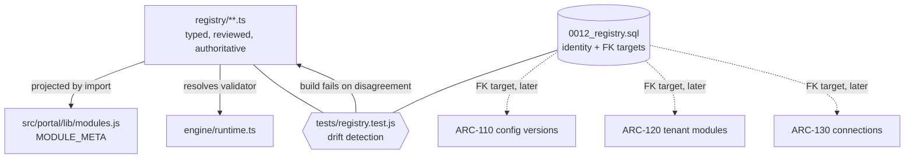
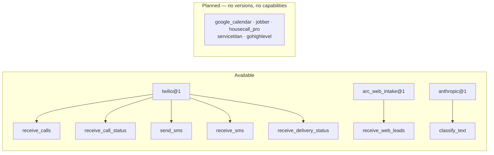
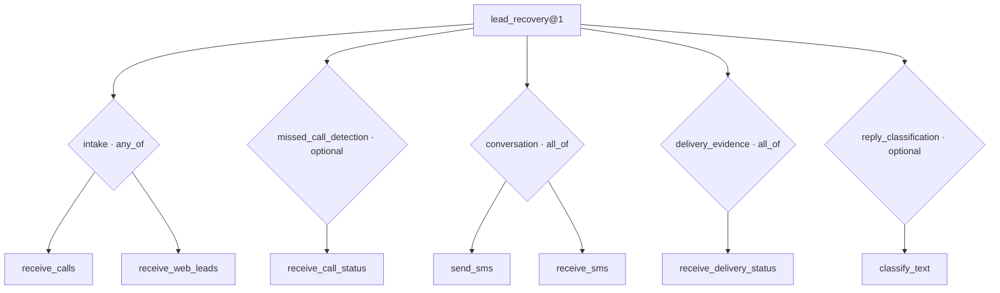

# ARC-100 — Module and connector registries

> **Handling notice.** `origin` is a **public** repository and `docs/architecture/` is
> not gitignored. This document is less sensitive than the audit or the ARC-015
> write-up — it describes product vocabulary, not unfixed defects — but decide where
> the set of them lives before any is committed.

## 1. Purpose

Give ARC one trusted vocabulary for what it sells, what it can connect to, and what a
module needs in order to run — replacing two conflicting hard-coded lists and
providing the definitions ARC-110, ARC-120, ARC-130, ARC-200 and ARC-220 will build on.

The problem, as the audit found it (§3, §9, G-O3): the portal knew five modules
(`lead_capture`, `estimates`, `reviews`, `memberships`, `installs`) as display buckets
for derived figures, hard-coded in `MODULE_META`. The execution engine knew exactly
one (`lead_recovery`), enforced by check constraints in three places. Nothing
reconciled them, and a tenant could have `lead_recovery` switched on without
`lead_capture` declared.

## 2. Architectural authority

**The typed registry is authoritative. The database catalog provides identity.**

| Concern | Authority | Why |
|---|---|---|
| Validators, defaults, field permissions, behavioural contracts | `supabase/functions/_shared/registry/**` | Executable, reviewed, testable. Loading executable code from a database row is a thing this repository will not do; keeping a second weaker copy in SQL would be worse |
| Relational identity, immutable versions, FK targets, compatibility rows | `supabase/migrations/0012_registry.sql` | ARC-120 needs a foreign key to hang a tenant's module selection on, and ARC-130 needs one for a connection |
| Portal display metadata | Derived from the typed registry by import | One source. `MODULE_META` is now a projection, not a list |
| Preventing the two from disagreeing | `tests/registry.test.js` | The build fails on drift |

**The portal-safe / server-side split.** `modules.ts` and `capabilities.ts` carry only
metadata and are imported by the browser bundle. `schemas.ts` imports the Lead
Recovery validator and is server-side. Verified: the built bundle contains the
registry metadata and **not** `validateLeadRecoveryConfig`.

## 3. Canonical module vocabulary

| Canonical key | Status | Runs? |
|---|---|---|
| `lead_recovery` | `available` | Yes — v1 published |
| `estimate_recovery` | `planned` | No |
| `review_recovery` | `planned` | No |
| `membership_retention` | `planned` | No |
| `install_warranty` | `planned` | No |

These names were checked against `CLAUDE.md` and the execution-boundary ADR, which use
"Unsold Estimate Recovery" and "Reviews and Service Recovery" in prose. No conflict:
the ADR names products, the registry names keys, and `displayName` carries the prose.

## 4. Portal and historical aliases

**Nothing stored was renamed.** `tenants.modules` still stores `lead_capture`; events
still derive their module from `event_type` (`CLAUDE.md`: never stored); portal routes
are unchanged. Renaming stored values to tidy a vocabulary would rewrite history.

| Canonical | Event-module bucket | Portal route | Also accepted |
|---|---|---|---|
| `lead_recovery` | `lead_capture` | `leads` | `lead_capture`, `leads` |
| `estimate_recovery` | `estimates` | `estimates` | `estimates` |
| `review_recovery` | `reviews` | `reviews` | `reviews` |
| `membership_retention` | `memberships` | `memberships` | `memberships` |
| `install_warranty` | `installs` | `installs` | `installs` |

`canonicalModuleKey(alias)` is the one compatibility boundary. Call it at the edge — a
route param, a `tenants.modules` value, a derived event bucket — and work in canonical
keys thereafter. It returns `null` for anything unrecognised, so callers fail closed.
An alias claimed by two modules throws at import.

## 5–7. Module definition, version and availability

A definition carries identity, the event bucket, aliases, portal projection and
versions. A version carries the configuration schema reference, capability
requirements, the runtime contract and the safety contract.

States: `planned` → `internal` → `pilot` → `available` → `deprecated` → `retired`.
Only `pilot` and `available` are **selectable**.

Three invariants, all enforced by `validateModuleRegistry()` and all mutation-tested:

- A `planned` definition may not have a selectable version. This is what stops the
  four reporting buckets being switched on.
- A selectable version must name a schema that resolves, and declare activation tests.
- A version that can neither run directly nor use n8n is refused.

`deprecated` versions stay resolvable for historical runs; `retired` cannot return to
service (trigger-enforced).

## 8–9. Configuration schema and field metadata

`lead_recovery_config@1` wraps `validateLeadRecoveryConfig` **unchanged** — same
whitelist, same closed placeholder list, same credential refusal, same cross-field
checks. Registration adds identity and field metadata around it. The existing
Lead Recovery tests are the proof that nothing was weakened.

Fifteen fields, each carrying the metadata ARC-110 and ARC-310 need. The three
consequence flags are **trusted registry metadata, never inferred from a field name**:

| Field | Retest | Shadow | Reactivate |
|---|---|---|---|
| `company_name` | — | — | — |
| `templates` | ✅ | — | — |
| `safety` | ✅ | ✅ | ✅ |
| `compliance` | ✅ | — | ✅ |
| `twilio` | ✅ | — | ✅ |

A template edit requires retesting but **not** reactivation, because ARC-015 pins each
run to a configuration snapshot — an in-flight sequence keeps its approved words, so
the change affects new runs only (ADR-010 §16). A compliance change must block a live
module until somebody re-approves.

`changeImpact()` answers "what does changing these fields cost?" and treats an
**unrecognised** field as maximally consequential rather than ignoring it — a typo
must not slip a change past every gate.

`clientEditable` is `false` on every field today. There is no client write path by
design (`0010:589–593`); ARC-310 decides what opens up, and a test will notice.

## 10–12. Connector and capability model

A connector definition is a **supported adapter type**, not a tenant's account and not
a claim that any connection is healthy.

**A capability means ARC's adapter does it and a test proves it**, not that the
provider's API offers it. Twilio's API can do a great deal; `twilio@1` declares the
five ARC implements.

Planned connectors publish **no versions and no capabilities**, enforced by
`validateConnectorRegistry()`. A planned connector that claimed capabilities would let
a module version resolve as satisfiable when no adapter exists to serve it.

Each capability carries category, direction, risk, and three flags ARC-120 will gate
on: `externalSideEffect`, `consentRelevant`, `reconciliationRequired`. `send_sms` is
the only `high` risk capability, and the only one requiring reconciliation — which is
exactly what ARC-015 built for it.

## 13. Capability requirement expressions

Modules depend on capabilities, never on provider brands — asserted by a test that
greps the requirements for provider names.

`any_of` is how Lead Recovery says "some way of taking a lead in" without naming
Twilio — a web-form-only shop is a valid configuration. `optional` never blocks:
without a classifier every reply goes to a person, which is the safe default rather
than a failure.

`evaluateCapabilities(version, available, config?)` is pure and deterministic. It
reports which groups are satisfied, what is missing, why, and which connector versions
*could* close the gap. **It never claims a tenant is connected** — it takes the
capabilities the caller vouches for. ARC-120 will pass those of a tenant's healthy,
authorised connections; a design-time caller passes `availableCapabilities()`.

## 14–16. Compatibility, execution mode, runner keys

Compatibility is per-capability, not all-or-nothing: Twilio is compatible with Lead
Recovery without satisfying every group on its own.

`lead_recovery@1` is `executionMode: 'direct'`, `n8n: 'prohibited'`, per ADR-010 §11 —
n8n appears in none of its 29 operations, so the §26 licensing gate cannot block this
module. A test asserts **no module version may declare `n8n: 'required'`** while that
gate is open.

`runnerKey` is `arc-direct-worker`; `workflowKey` is null. Only ARC-controlled keys
appear here. Environment-specific n8n IDs belong to the later deployment registry
(ADR-010 §21), and a test greps for `.app.n8n.cloud` and webhook paths to keep them out.

## 17–18. Immutability and database-versus-code

A published version's contract is frozen. Only `status` and `deprecated_by` may
change, and a retired version cannot return to service. Enforced by trigger, so the
service role is bound too — the same reasoning as ARC-015's snapshot immutability.
Capability links are fixed at publication: `UPDATE` and `DELETE` both raise.

Registry definitions change through reviewed code and a migration, never portal CRUD.
No insert, update or delete policy exists on any registry table for any role — not
even an operator. An operator who could mark a planned module `available` from the
console could switch on a module with no validator behind it.

## 19. Drift detection

`tests/registry.test.js` parses `0012_registry.sql` and compares every seeded row to
the typed registry: modules and their metadata, capabilities, connectors and statuses,
aliases, the single published module version, connector capability links, and
requirement capability links.

**Mutation-tested: 11/11.** Each realistic mistake was mechanically introduced and the
suite re-run:

| Mutation | Caught by |
|---|---|
| Code adds a capability, SQL not updated | `no capability is dead vocabulary` |
| Code renames a portal route | `existing routes are unchanged` |
| Code changes a module status | `estimate_recovery is planned and cannot be selected` |
| Code changes portal ordering | `every module in code is seeded in SQL` |
| Code drops a Twilio capability | `no capability is dead vocabulary` |
| Code changes a requirement capability | `all_of requires every capability` |
| SQL adds a module the code lacks | `every module in code is seeded in SQL` |
| SQL marks Lead Recovery n8n-required | `the only seeded module version matches lead recovery v1` |
| Planned module publishes a selectable version | `it validates` |
| Planned connector claims a capability | `it validates` |
| Portal stops deriving from the registry | portal health regression |

One finding from that exercise worth recording: the first version of the module-seed
regex was anchored to line start, so a row written with a leading comma was invisible
to it. A drift test with a blind spot is worse than none, because it reports
confidence it has not earned. The regexes are now scoped to their own `INSERT` block
and compare sets rather than counts.

## 20. RLS and security

| Table | Client read | Operator read | Any write |
|---|---|---|---|
| `registry_capabilities`, `registry_modules`, `registry_module_aliases`, `registry_module_versions` | ✅ | ✅ | ❌ |
| `registry_connectors` | ✅ | ✅ | ❌ |
| `registry_connector_versions`, `registry_connector_capabilities`, `registry_module_requirements`, `registry_module_requirement_capabilities` | ❌ | ✅ | ❌ |

Module-level rows are global product facts with nothing tenant-scoped to leak.
Connector *operational* detail — auth type, health-check strategy, known limitations —
is operator-only: a client has no use for it and an attacker would enjoy it.

No registry table or response contains a token, key, secret, password, private key,
provider credential, tenant PII or environment-specific URL. Enforced by a check
constraint on the free-text columns and asserted by tests.

## 21. Lead Recovery integration

The engine no longer imports `validateLeadRecoveryConfig` by name. It asks the
registry which validator belongs to `lead_recovery`, and the registry answers with
that same function — so nothing about what is accepted or rejected changes, and the
registry is load-bearing rather than decorative. A module with no registered validator
resolves to `null` and its configuration is refused; there is deliberately no
permissive fallback.

**ARC-015 protections are untouched.** Re-ran that mutation battery after this work:
8/8 still caught — tenant-scoped claiming, canary synthetic-only, lease fencing,
send-once reservation, timeout-as-ambiguous, pinned configuration, tenant status,
legacy unpinned actions.

### Existing `module_key` constraints: reviewed, all retained

| Constraint | Verdict |
|---|---|
| `module_configs` (`0010:88`) | **Retained.** `config` is validated by the Lead Recovery validator specifically. ARC-110 generalises this table with schema-per-module dispatch; widening now would allow a row nothing can validate |
| `automation_runs` (`0010:336`) | **Retained.** Its state machine is Lead Recovery's |
| `module_onboarding` (`0010:509`) | **Retained.** Its `step_key` values are the eleven-step Lead Recovery gate; ARC-120 replaces the table |
| `lead_recovery_config_snapshots` (`0011:82`) | **Retained.** Named for the module; ARC-110 supersedes it |

Nothing was widened and nothing was weakened. Each of these tables is genuinely
Lead Recovery-shaped, and the prompts that own them do the widening alongside the
validator dispatch that makes a wider constraint safe. A test asserts no `module_key`
constraint is dropped here.

## 22. Planned-module handling

The four planned modules render in the portal exactly as before — clients whose CRM
posts estimate events still see estimate figures, which is reporting, not a module ARC
runs. They have no version, no validator, no capabilities, no execution path, and
`MODULE_META[...].selectable` is `false` so nothing offers to switch one on.

## 23–25. How later prompts consume this

**ARC-110** (done, `0014`) resolves `configSchemaKey` + `configSchemaVersion` to a
validator, uses `editableFields()` to reject a patch touching anything outside an actor's
permissions, and uses `changeImpact()` to report whether a published version triggers
retest, shadow or reactivation. It added one schema, `tenant_settings@1` (scope
`tenant`), an optional `ownerScope: 'tenant'` on field metadata, the `scope` of every
`ConfigSchema`, and `registry_config_schemas` as their SQL identity — drift-tested like
the rest. See ARC_VERSIONED_TENANT_CONFIGURATION_ENGINE.md.

**ARC-120** (done, `0015`) calls `evaluateCapabilities()` with the capabilities ARC
holds evidence for today (`lifecycle/readiness.ts` `capabilityEvidence` — the seam
ARC-130 replaces with real connections), gates activation on `activationTestKeys` and
`requiresShadowMode`, and maps every `changeImpact()` classification to a lifecycle
consequence (`CHANGE_IMPACT_POLICY`). `tenant_modules.module_key` carries a foreign key
to `registry_modules(key)`. See ARC_TENANT_MODULE_LIFECYCLE.md.

**ARC-130** uses connector definitions as the types a tenant connection instantiates:
`auth.type` drives the OAuth or key flow, `connection_owner` decides who is asked to
reconnect, `behaviour.webhookSignature` says how to verify inbound calls. Tokens live
in ARC's connector boundary, never in the registry.

## 26. Work deferred

| Item | Prompt |
|---|---|
| ~~Tenant module selection and lifecycle~~ | **Done in ARC-120** (`0015`) — `module_configs.enabled` is now a mirror of `tenant_modules.state`; `tenants.modules` stays the portal's reporting declaration, deliberately |
| ~~Versioned tenant configuration, history, drafts~~ | **Done in ARC-110** (`0014`) |
| Configuration beyond one module | ARC-110 made the version tables module-generic (keyed on `registry_modules`, schema dispatched through the registry); `module_configs` stays the Lead Recovery switch until ARC-120 replaces it |
| OAuth, tenant connections, credential storage | ARC-130 |
| Real connection health checks | ARC-130 |
| Workflow deployment registry, environment-specific n8n IDs | ARC-220 |
| Configuration UI driven by field metadata | ARC-310 |
| Real-Postgres tests for registry RLS and triggers | ARC-QA-500 |

### Known limitations

1. **The migration has never been applied to a live database.** `0012` is written and
   asserted against textually, never run. Its triggers, constraints and RLS policies
   are unproven against real Postgres — the same gap ARC-015 carries (G-P8).
2. **Drift detection is textual.** The tests parse SQL rather than querying a
   database. A syntactically valid migration that Postgres rejects would pass.
3. **`tenants.modules` still stores event-bucket keys.** Correct for now — nothing is
   renamed — but ARC-120 replaces that column with lifecycle rows referencing
   `registry_modules(key)`, and the alias mapping is what makes that migration
   mechanical.
4. **Field metadata is hand-maintained against the validator.** A test asserts the two
   describe the same field set, but not that the constraints agree in detail.
