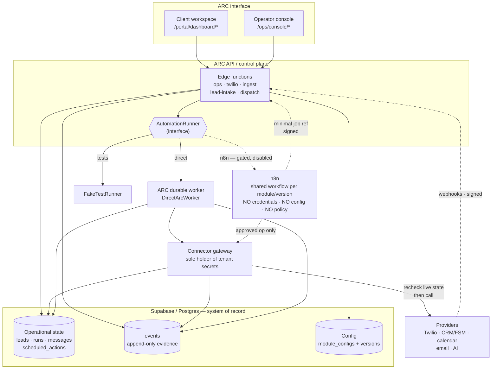
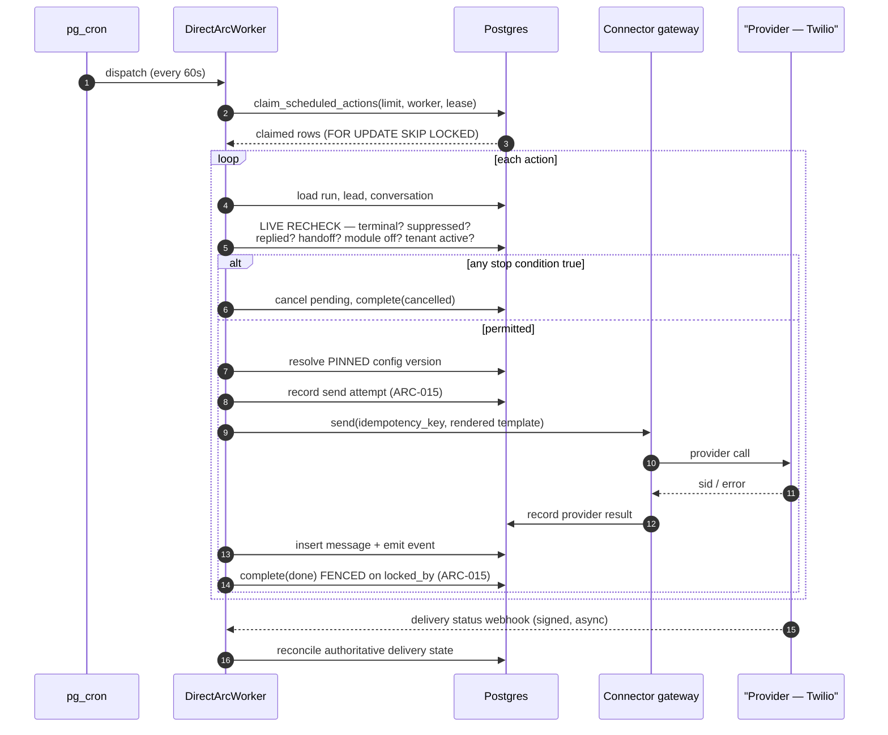
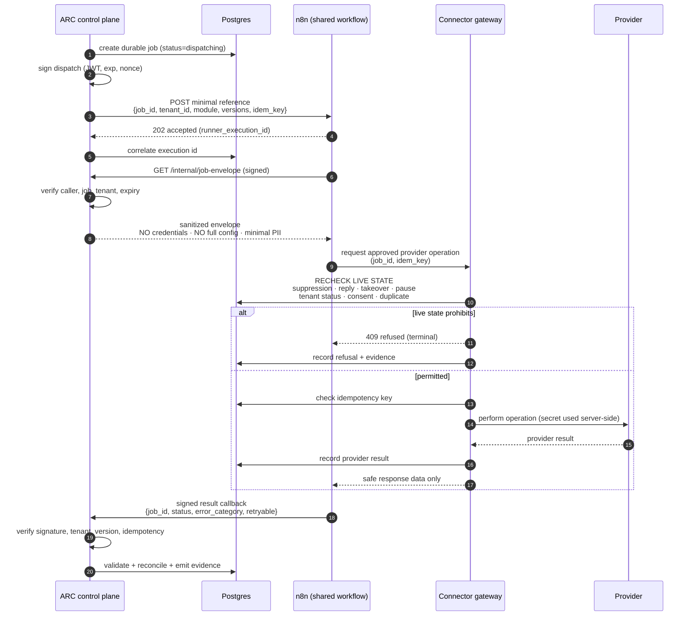
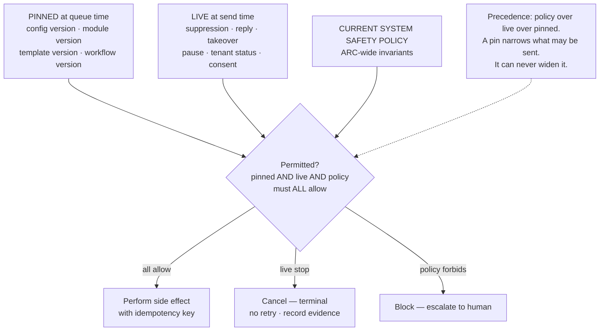

# ARC-010 — ARC–n8n Execution Boundary

> **Handling notice.** Like `ARC_N8N_REPOSITORY_AUDIT.md`, this document names
> unfixed defects in shipped code. `origin` is a **public** GitHub repository
> (`github.com/bennettc1213/Arc-Automations`), and `.gitignore` keeps
> `PORTAL_CONTEXT.md` and `ARC_FIX_CHECKLIST.md` out of git for that reason.
> `docs/architecture/` is **not** ignored — verified with `git check-ignore -v`.
> Decide where both documents live before either is committed.

---

## 1. Title

**ARC-010 — The execution boundary between ARC's control plane, ARC's durable
worker, the `AutomationRunner` abstraction, n8n, ARC's connector gateway, and
external providers.**

## 2. Status

**Accepted for implementation, with production use of n8n blocked by explicit
licensing, security, and readiness gates.**

The `AutomationRunner` abstraction, ARC's ownership of the control plane, the
connector-gateway boundary, and the replaceability test are **accepted now** and
do not depend on any outstanding n8n decision.

The production `N8nRunner` is **accepted in design and disabled in fact**. It
stays disabled until §26's licensing gate and §24's security requirements are
satisfied. `DirectArcWorker` must remain a functional replacement for it
permanently, not transitionally.

Explicitly **not** decided here, and explicitly **not blocking** the above:
n8n Cloud versus self-hosted; a commercial agreement; a production plan tier;
capacity and availability targets. §35 carries them as production gates.

One decision this ADR *does* make, which the audit left open as §15 decision 1:
**n8n is not in Lead Recovery v1's execution path at all.** See §11 and §30.

## 3. Date

2026-09-22. Repository state at authoring: branch `main`, version `1.17.0`
(`package.json`), newest commit `cab92eb` ("Build ARC Lead Recovery, the first
execution layer"), migrations through `0010_lead_recovery.sql`.

## 4. Decision owners

| Role | Owner | Accountable for |
|---|---|---|
| Architecture decision record | Ben Chu (Arc Automations) | This ADR; ARC-015 scope; sequencing |
| Licensing gate (§26) | Ben Chu | Written confirmation from n8n before any production `N8nRunner` |
| Security boundary (§24) | Ben Chu | Dispatch/callback signing, secret custody, rotation |
| Lead Recovery safety (§37) | Ben Chu | ARC-015 landing before a design partner |

Arc Automations is currently a single-operator business. "Owner" above names the
one person accountable; it does not imply separate teams. Where this ADR says a
gate needs an owner, it means the gate must not be closed implicitly by writing
code — it needs a recorded decision.

## 5. Repository evidence reviewed

Read in full: `CLAUDE.md`; `docs/architecture/ARC_N8N_REPOSITORY_AUDIT.md`;
`EVENT_CONTRACT.md`; `DEPLOYMENT.md`; `PORTAL_CONTEXT.md` (local, gitignored);
`supabase/migrations/0007`, `0009`, `0010`; `supabase/functions/_shared/engine/runtime.ts`;
`supabase/functions/_shared/supabase-store.ts`; `supabase/functions/_shared/lead-recovery-config.ts`;
`supabase/functions/_shared/twilio.ts`; `supabase/functions/_shared/event-validation.ts`;
`supabase/functions/twilio/index.ts`; `supabase/functions/dispatch/index.ts`;
`supabase/functions/ops/lead-recovery.ts`; `supabase/functions/ops/index.ts`;
`src/portal/lib/integrations.js`; `src/portal/lib/modules.js`; `src/portal/lib/types.js`.

There is **no** `AGENTS.md` and no contributing guide — confirmed by directory
listing. `CLAUDE.md` is the only repository operating instruction.

Commands run (all read-only; see §38 for the verification pass):

```text
git status --short
git grep -n -i "n8n" -- src/ supabase/ scripts/ tests/
git check-ignore -v PORTAL_CONTEXT.md docs/architecture/ARC_N8N_REPOSITORY_AUDIT.md
npm test                       → 252 tests, 44 suites, 252 pass, 0 fail
```

**Audit claims independently verified as true.** Version `1.17.0`; commit
`cab92eb`; migrations through `0010`; `MODULE_META` hard-coded with five modules
(`src/portal/lib/modules.js:31`); Lead Recovery-specific validator
(`supabase/functions/_shared/lead-recovery-config.ts:401`, `MODULE_KEY` at `:36`);
`module_key` restricted to `lead_recovery` by check constraint in **three**
places (`0010:88`, `0010:336`, `0010:509`); no module registry; no connector
registry; two module vocabularies; the audit document is untracked and not
gitignored. `npm test` reproduces 252/252 exactly.

**Where this ADR adds precision the audit summary did not carry.** See §7.5 and
§39 — none of it contradicts the audit's conclusions, and two items make the
audit's case stronger.

## 6. Context

ARC is becoming a managed, modular, multi-tenant SaaS for HVAC contractors
first and plumbing contractors second. The central rule, from `CLAUDE.md`, is:

> One shared system: one module, one prompt, one set of templates, one
> deployment. A tenant differs only in `module_configs.config` — validated JSON
> with no executable logic. Never a per-client workflow, schema, branch or deploy.

**A client is configuration, not an n8n workflow.**

As of `cab92eb`, ARC already runs one module natively, without n8n: ARC Lead
Recovery. It has operational tables, a durable Postgres queue with
`for update skip locked` claiming, signed Twilio webhooks, a public form intake,
a dispatcher, deterministic safety rules, template-only outbound text, and an
eleven-step fail-closed activation gate (`0010`; `_shared/engine/runtime.ts`;
`_shared/lead-recovery-config.ts:818`).

The repository's *older* integration model points the other way. `src/portal/lib/integrations.js`
tells operators that provider credentials live in **`keyStore: 'n8n credentials'`**
— on nearly every provider entry — and hints the endpoint is a per-client
instance (`endpointHint: 'https://client.app.n8n.cloud'`, `integrations.js:30–31`).
`src/portal/components/ConnectionForm.jsx` makes a per-client `workflow_id` the
field that matters. `src/portal/lib/service-catalog.js` contains per-client n8n
workflow build steps.

That older model and the `CLAUDE.md` rule cannot both hold. This ADR settles it
in favour of the rule, and defines what n8n may and may not do under it.

Today's actual n8n surface is small and read-only: a `/healthz` probe and
`GET /api/v1/workflows` from the `ops` function (`supabase/functions/ops/index.ts:116–117`,
`:519–546`), plus n8n posting evidence events into `/ingest` with a per-tenant
bearer token. **Nothing in the repository dispatches work to n8n or receives a
result from it.** Verified by `git grep`.

## 7. Problem statement

Five questions must be answered before ARC-015, ARC-100, ARC-110, ARC-200 or
ARC-220 can be specified without guesswork.

1. **Who owns policy?** If n8n can decide whether a text is sent, then safety,
   consent and suppression live in a workflow graph that ARC cannot test, version
   with its own migrations, or prove correct. Policy must be provably ARC's.
2. **Who owns durability?** ARC already has a durable queue. n8n has its own
   execution store. If both retry, the customer gets two texts.
3. **Who holds customer credentials?** The shipped `integrations.js` model says
   n8n does. That is simultaneously a security boundary problem, a tenant
   isolation problem, and — per §26 — the sharpest edge of the licensing
   question.
4. **Is n8n in Lead Recovery's path?** The audit explicitly deferred this to
   ARC-010 (audit §15 decision 1, §18 item 8). The module already runs without it.
5. **Can n8n be removed later?** If module selection, tenant configuration, the
   portal, or operational records ever reference an n8n workflow ID, n8n stops
   being replaceable and ARC inherits its licensing and availability risk
   permanently.

### 7.5 Evidence that refines the audit

Everything below was verified directly. Nothing contradicts the audit's
findings; two items strengthen them, and two are new facts the audit's summary
did not state.

| # | Refinement | Evidence | Effect on the audit |
|---|---|---|---|
| 1 | `scheduled_actions` has **no** configuration-version column at all — not merely an unenforced one | `0010:379–418` full column list | **Strengthens S-M4 / G-P6.** The audit says the pin is "recorded but not enforced". For `automation_runs` that is exact (`runtime.ts:280`). For the queue there is nothing to enforce: a scheduled follow-up carries no version reference whatsoever. ARC-015 must *add* the reference, not merely read it. |
| 2 | `completeAction` and `rescheduleAction` filter on `id` **only** — no `locked_by` **and no `tenant_id`** | `supabase-store.ts:568–582` | **Strengthens S-C2.** The audit notes the missing lease fence. The missing tenant predicate means these two writes are the only engine store calls that do not carry `tenantId`, breaking the "every store call carries tenantId" property the audit credits at §6.4. |
| 3 | `claim_scheduled_actions` takes **no tenant parameter** — global claiming is structural, not incidental | `0010:542–574` signature | Confirms S-C1's mechanism precisely: the canary cannot be fixed by changing the caller alone; the function signature must change. |
| 4 | The SQL comment above the claim function **asserts the false safety property in the schema itself** | `0010:540–541`: "the action's own idempotency key is what stops the re-offer from sending twice" | Audit conflict #3 lists this claim in `PORTAL_CONTEXT.md` and a test title. It is also written into the migration. Three artifacts assert a guarantee the code does not provide. |
| 5 | n8n's Webhook node supports Basic / Header / JWT auth and has **no built-in HMAC verification** | docs.n8n.io, §39 | New. Shapes §18: prefer JWT for dispatch auth rather than assuming HMAC-in-header is natively checkable. |
| 6 | n8n API key **scoping is Enterprise-only**; other plans' keys are unrestricted | docs.n8n.io, §39 | New. The `N8N_API_KEY` already held by `ops` (`ops/index.ts:117`) is, unless Enterprise, a full-access key. The code comment at `ops/index.ts:113–114` already says as much. |

## 8. Decision drivers

1. **Safety before capability.** ARC sends text messages to real customers on
   behalf of a contractor. A duplicate, a message after STOP, or a message for a
   deboarded client is a compliance incident, not a bug report.
2. **`CLAUDE.md`'s rule is load-bearing**, not aspirational: a client is
   configuration.
3. **One derivation chain.** Every figure derives from `events`. A runner must
   not become a second source of numbers.
4. **The evidence/operational split must survive.** `events` is append-only
   evidence; operational tables hold current state. No figure reads an
   operational table.
5. **Licensing exposure must be bounded before it is load-bearing**, not after.
6. **Latency is the product.** The module is sold as speed-to-lead. An extra
   network hop and an extra availability dependency on the first response is a
   direct cost to the thing being sold.
7. **Replaceability is cheaper now than later.** The abstraction costs little
   today and is the only thing that keeps decisions 2 and 5 reversible.
8. **The existing engine is an asset.** ARC already has a working direct
   executor; the audit correctly identifies `runtime.ts` + `dispatch` as a
   `DirectArcWorker` in all but name (audit §10).

## 9. Final decision

1. **ARC is the control plane.** Every item in §10's "ARC owns" column is ARC's,
   permanently. n8n never becomes the control plane.
2. **Supabase/Postgres is the system of record.** n8n execution history is
   diagnostic, never authoritative operational state.
3. **`events` stays evidence and must never become the durable action queue.**
   Durable work lives in operational tables.
4. **An `AutomationRunner` interface is introduced** (ARC-210) with three
   implementations: `DirectArcWorker`, `N8nRunner`, `FakeTestRunner`.
5. **Execution modes are `direct`, `n8n`, `hybrid`**, bound to a module version
   by ARC operators. Clients never see or select a mode.
6. **Lead Recovery v1 is `direct`. n8n is not in its path.** No exceptions,
   including the first response. See §11.
7. **Runs and scheduled actions pin their configuration versions**, and **live
   safety state overrides any pin** immediately before every external side
   effect. See §16, §17.
8. **Dispatch to n8n uses the minimal-reference pattern**: identifiers and
   authorization context, retrieved server-side by n8n from ARC. Never full
   configuration, never credentials. See §18.
9. **Customer provider credentials never reach n8n.** All provider calls that
   use tenant credentials go through ARC's connector gateway. See §20.
10. **One shared workflow per module per version.** Never per tenant. No
    client-editable graph, no embedded editor. See §21, §22.
11. **ARC owns durable retry, status and dead-lettering.** n8n's internal retries
    are permitted only for bounded node-level transient failures. See §23.
12. **`N8nRunner` stays disabled in production until §26's gate is satisfied**,
    and `DirectArcWorker` remains a functional replacement permanently (§29).
13. **ARC-015 lands before ARC-100 and ARC-110.** The shipped queue is not
    send-once or tenant-contained; generalizing it first would multiply the
    defects across modules. See §37.

## 10. Component ownership matrix

| Concern | ARC control plane | Supabase/Postgres | ARC durable worker | `AutomationRunner` | n8n | Connector gateway | Providers |
|---|---|---|---|---|---|---|---|
| Tenant accounts | **Owns** | Stores | — | — | Never | — | — |
| Tenant membership, permissions | **Owns** | Stores + RLS | — | — | Never | — | — |
| Module selection | **Owns** | Stores | — | — | Never | — | — |
| Configuration schemas | **Owns** | — | — | — | Never | — | — |
| Tenant configuration | **Owns** | Stores | Reads | Never receives in full | Never | Reads server-side | — |
| Configuration versions | **Owns** | Stores | Pins | Carries reference only | Never | Resolves | — |
| Activation state | **Owns** | Stores | Reads | — | Never | Rechecks | — |
| Consent state | **Owns** | Stores | Reads | — | Never | Rechecks | Source of some facts |
| Suppressions, opt-outs | **Owns** | Stores | Reads | — | Never | **Rechecks — hard gate** | Reports STOP |
| Human-takeover state | **Owns** | Stores | Reads | — | Never | Rechecks | — |
| Operational lead state | **Owns** | Stores | Mutates | — | Never | — | — |
| Conversation, message state | **Owns** | Stores | Mutates | — | Never | Records result | Authoritative on delivery |
| Scheduled actions | **Owns** | Stores | Claims, executes | Dispatched from | Never creates | — | — |
| Automation-run state | **Owns** | Stores | Mutates | Correlates | Never mutates | — | — |
| Retry state, policy | **Owns** | Stores | Applies | Reports retryability | Bounded node-level only | — | — |
| Audit history | **Owns** | Stores (append-only) | Writes | — | Never | Writes | — |
| Event evidence | **Owns** | Stores | Emits via validator | — | Posts via `/ingest` only | Emits | — |
| Reporting, health, readiness | **Owns** | Source rows | — | — | Never | — | — |
| Provider-connection metadata | **Owns** | Stores | — | — | Never | **Owns secrets** | — |
| Connector capabilities | **Owns** | Stores | — | — | Never | Declares | — |
| Workflow-version assignment | **Owns** | Stores | — | Resolves to runner key | Never self-assigns | — | — |
| Workflow graph, node logic | Never | — | — | — | **Owns** | — | — |
| Orchestration of authorized work | Delegates | — | Alternative | **Selects** | **May own** | — | — |
| Provider credentials (tenant) | Policy | Encrypted at rest | — | **Never receives** | **Never receives** | **Sole holder** | Issuer |
| Final delivery status | Reconciles | Stores reconciled | Reconciles | — | Never asserts | Relays | **Authoritative** |
| CRM/FSM job status | Reconciles | Stores reconciled | Reconciles | — | Never asserts | Relays | **Authoritative** |

## 11. Lead Recovery execution-boundary table

**The decision: Lead Recovery v1 runs entirely in `direct` mode.** n8n appears
in no row below. This is not a deferral — it is the recommendation the audit
asked ARC-010 to make (audit §15 decision 1), and the evidence supports it:

- The module **already runs end to end without n8n** (`runtime.ts`;
  `twilio/index.ts`; `lead-intake/index.ts`; `dispatch/index.ts`). n8n would add
  capability to nothing in the table.
- Every row marked "safety-critical" below is a *policy* decision. Policy in a
  workflow graph cannot be covered by the existing zero-dependency test suite,
  which is ARC's only current correctness evidence (252 tests).
- The first response is the product's selling point. Adding a network hop and an
  availability dependency to it costs latency and uptime for no gain.
- n8n in this path would make §26's licensing gate block the **first pilot**
  rather than block a later, optional capability.

Default rule applied throughout, per the task's own formulation: *inbound
provider webhooks, signature verification, deduplication, durable state
transitions, consent, suppression, replies, human takeover, safety enforcement,
scheduling, and configuration resolution belong directly in ARC.*

Legend — **Current owner**: what the repository does today. **Target owner**:
this ADR's decision. "ARC-015" in *Failure behavior* means the correct behavior
is specified here but **not yet implemented**; §37 scopes the work.

| # | Operation | Current owner | Target owner | Execution mode | Reason | Safety requirement | Failure behavior |
|---|---|---|---|---|---|---|---|
| 1 | Twilio voice webhook receipt | ARC `twilio/index.ts:141` | **ARC** | `direct` | Inbound provider webhook | Must answer with valid TwiML fast | 5xx → Twilio redelivers; idempotent on `CallSid` |
| 2 | Twilio signature verification | ARC `twilio/index.ts:121–130` | **ARC** | `direct` | Runs **before** the body is used; a forged body must never reach logic | Reject with 403; never parse first | Fail closed, log route only |
| 3 | Dial-status callback | ARC `twilio/index.ts:175` | **ARC** | `direct` | Inbound provider webhook | Signature verified | Empty TwiML; redelivery safe |
| 4 | Missed-call determination | ARC `shouldRecoverCall(dialStatus)`, `twilio/index.ts:187` | **ARC** | `direct` | The branch the module hangs off; deterministic rule | Answered call produces nothing | Unknown status → no lead, no send |
| 5 | Website-form intake | ARC `lead-intake/index.ts` | **ARC** | `direct` | Same `intakeLead` as calls — `CLAUDE.md`: "there is no second engine" | Origin allowlist, honeypot, dwell, rate limit — **all client-controlled today (S-H3)** | Server-verifiable anti-abuse required before the form goes live (G-C5) |
| 6 | Request normalization | ARC `normalisePhone`, `_shared/phone.ts` | **ARC** | `direct` | Normalization decides identity; must be one implementation | Deterministic, shared by both intakes | Unparseable → no lead |
| 7 | Deduplication | ARC `deterministicUuid(tenant, module, source, externalRef)`, `runtime.ts:227` | **ARC** | `direct` | Dedup is a durable-state decision | Same `CallSid` → one lead, always | Existing lead → "already recorded"; **but `queued: []` (S-H2)** — ARC-015 must reconcile |
| 8 | Lead creation | ARC `runtime.ts:249` | **ARC** | `direct` | Durable state transition | Recorded even when module off/misconfigured | **Non-atomic across ~6 writes (S-H2)** → ARC-015 atomic RPC or sweeper |
| 9 | Conversation creation | ARC `getOrCreateConversation` | **ARC** | `direct` | Durable state | Tenant-scoped | Idempotent get-or-create |
| 10 | Consent evaluation | ARC (`consentSms`/`consentSource` at intake, `twilio/index.ts:200–203`) | **ARC** | `direct` | Legal basis to message | Implied consent recorded **with source**, never assumed | No consent → no send |
| 11 | Suppression evaluation | ARC `store.isSuppressed`, `runtime.ts:766` | **ARC** | `direct` | Hard legal gate | Re-read immediately before send (§17) | Suppressed → cancel pending, no send |
| 12 | STOP handling | ARC `addSuppression`, `runtime.ts:511, 659, 1469` | **ARC** | `direct` | Carrier-level opt-out must bind instantly | Both inbound STOP and carrier callback create suppression | Cancels pending actions for the run |
| 13 | Reply handling | ARC `twilio/index.ts:211` | **ARC** | `direct` | Stop-on-reply is a core promise | Cancels queued follow-ups | Redelivery idempotent on `MessageSid` |
| 14 | Human takeover | ARC `getOpenHandoff`, `runtime.ts:779`, `1335` | **ARC** | `direct` | A person holding the lead outranks automation | Cancel, then transition | Open handoff → automation stays quiet |
| 15 | Safety classification | ARC `assessSafety`, `rules.ts:134` | **ARC** | `direct` | **Deterministic rules first; a model may only add flags** | No path lets a classifier clear a rule-set flag; no AI key → handoff | `classifierFor` → `UnavailableClassifier` → human |
| 16 | Eligibility determination | ARC `inServiceArea`, hours, `rules.ts:295`, `hours.ts` | **ARC** | `direct` | Deterministic tenant policy | Evaluated from pinned config | Ineligible → no send, recorded |
| 17 | Configuration resolution | ARC `loadConfig`, `runtime.ts:143` | **ARC** | `direct` | Validated on read, every time | Rejects unknown keys and credential shapes | Invalid → immediate handoff, **no retry** (`runtime.ts:784–795`) |
| 18 | Configuration-version pinning | **Partial**: `automation_runs.config_version` written (`runtime.ts:280`), never read; `scheduled_actions` has **no** version column (`0010:379–418`) | **ARC** | `direct` | A running sequence must not silently change mid-flight | Pin on run **and** action; load by version | **ARC-015 + ARC-110.** Today `loadConfig` always loads current (`runtime.ts:784`) |
| 19 | Scheduled-action creation | ARC `scheduleAction`, unique `(tenant_id, idempotency_key)` (`0010:415`) | **ARC** | `direct` | ARC owns the queue | Re-queue is a no-op | Verified: duplicate key → `created: false` |
| 20 | Initial response | ARC `send_first_response` → `sendMessage`, `runtime.ts:1004` | **ARC** | `direct` | **Latency- and safety-critical.** Must not depend on n8n availability | Template only; engine appends opt-out; live recheck before send | **Not send-once today (S-C2)** → ARC-015 |
| 21 | Follow-up execution | ARC `send_followup`, durable future row | **ARC** | `direct` | The gap between queueing and sending is where STOP arrives | Full live recheck (§17) | Reply/suppression/handoff → cancelled |
| 22 | Staff handoff | ARC `openHandoffFor`, `notify_staff` | **ARC** | `direct` | Escalation must not depend on a runner | Staff who texted STOP stop getting alerts (`runtime.ts:1140`) | Retry exhaustion → handoff + `task_opened` |
| 23 | Booking-link delivery | ARC (template placeholder) | **ARC** | `direct` | Outbound customer text | Closed placeholder list | Same send path as 20/21 |
| 24 | Connected-calendar booking | **Not implemented** | **Connector gateway**, callable by either runner | `direct` now; `n8n` permitted later | Provider call with tenant credentials | Credentials never leave ARC (§20) | Idempotency key required; ARC-130 |
| 25 | Provider writeback (CRM/FSM) | **Not implemented** | **Connector gateway**; orchestration **may** be `n8n` later | `hybrid` later | Latency-tolerant, adapter-shaped, many providers — the one place n8n earns its keep | Gateway rechecks tenant, capability, live state, idempotency key | Retry owned by ARC; DLQ on exhaustion |
| 26 | Delivery callback | ARC `twilio/message-status`, `twilio/index.ts:108` | **ARC** | `direct` | Inbound provider webhook | Signature verified; routed via `messages` row, never a URL param | Redelivery idempotent on provider SID |
| 27 | Failure alert | **Partial** — `alerts` table, manual raise only; **no detector** | **ARC** | `direct` | Operator safety net | Must not depend on the failing runner | ARC-200/240; G-P3 |
| 28 | Event evidence | ARC `emit` → `_shared/event-validation.ts` | **ARC** | `direct` | **One door into `events`** (`CLAUDE.md`) | Validator shared by ingest and engine; idempotent on `(tenant_id, event_key)` | Emit throws on DB error (`supabase-store.ts:736`) — a send-path hazard today (S-C2) |
| 29 | Reconciliation | **Missing** (G-P9) | **ARC** | `direct` | Providers are authoritative; lost callbacks must not strand state | Poll provider for unknown/stale sends | ARC-200 |

**If n8n is ever added to Lead Recovery** — it is not in v1 — the only rows
eligible are **25** (provider writeback) and **24** (calendar booking), both
strictly as orchestration of work ARC has already authorized, with every
provider call still routed through the connector gateway. Rows 1–23 and 26–29
are permanently ARC's.

## 12. Runtime architecture



Reading the diagram: every solid line exists or is the direct-mode target. Every
dotted line to or from n8n is gated by §26 and disabled today. **No line runs
from n8n to a provider**, and no line carries configuration or credentials into
n8n.

## 13. Control-plane flow

The control plane decides; it does not execute. Its sequence for any tenant
change:

1. **Authenticate and authorize.** Operator: password + `arc_admins`
   (`is_arc_admin()`, `0003:110`). Client: magic link after client-ID lookup
   (`client-login/index.ts:143–189`). Clients have no write path.
2. **Validate against the module's schema.** Today: `validateLeadRecoveryConfig`
   (`lead-recovery-config.ts:401`) — whitelist keys, closed placeholder list,
   credential-shape refusal, plus a DB check constraint (`0010:123–125`).
   *Future (ARC-100/110):* schema-per-module from a registry.
3. **Write a new configuration version.** *Future (ARC-110):* append to history.
   Today a trigger bumps a counter with no history (`0010:133–154`).
4. **Decide what the change affects** — §16's new-runs-only vs cancel-or-block
   rule.
5. **Record audit evidence.** Today only `ops`-routed writes are audited;
   operator browser writes are not (S-M1, `lib/ops.js:365–580`). ARC-300.
6. **Never dispatch synchronously from a configuration write.** Configuration
   changes enqueue or cancel durable work; they never call a provider.

Activation is fail-closed with no override: `canActivate`
(`lead-recovery-config.ts:849`) requires **9 of 11** steps
(`REQUIRED_STEPS`, `:832`). *Note:* `DEPLOYMENT.md` §7 and `PORTAL_CONTEXT.md`
§3b say **eight** — verified by counting `required: true` at `:818–830`; the
code is authoritative and the docs are stale (audit conflict #1).

## 14. Direct execution flow



Steps marked **(ARC-015)** are the target, not current behavior. Today
`sendMessage` calls the provider with no prior durable attempt record
(`runtime.ts:1004–1074`), and `completeAction` fences on `id` alone
(`supabase-store.ts:568–575`).

## 15. n8n execution flow

Gated and disabled. Shown so that ARC-220 has an exact contract to build against.



Note step 9: **n8n asks the gateway; the gateway rechecks and decides.** n8n
never learns why it was refused beyond an error category, and cannot override
the refusal.

## 16. Configuration-version pinning

**Pinned execution inputs.** Every run and every scheduled action must carry
immutable references to the versions it began under:

| Pinned reference | Today | Target |
|---|---|---|
| Tenant-wide settings version | — | Required on run + action |
| Module configuration version | `automation_runs.config_version` written (`runtime.ts:280`), **never read** | Required on run + action, **loaded by version** |
| Module-definition version | — (no registry) | Required — ARC-100 |
| Workflow version | — | Required when mode ≠ `direct` |
| Approved template version | — (templates inline in config) | Required — the exact approved words |

**Current state, stated plainly.** `0010:108–110` claims "a config edited
mid-sequence cannot retroactively change what a running sequence was allowed to
do." That is **not true of the implementation**: `loadConfig` takes only a
tenant id and returns the current row (`runtime.ts:143–160`), and every action
calls it fresh (`runtime.ts:784`). `scheduled_actions` carries no version column
at all (`0010:379–418`). ARC-015 adds the reference; ARC-110 adds history and
load-by-version.

**Which changes affect only new runs, and which must cancel or block existing work:**

| Change | New runs only | Cancels / blocks scheduled work | Why |
|---|---|---|---|
| Template wording edit | ✅ | — | In-flight sequence keeps its approved words |
| Business-hours change | ✅ | — | Timing policy, not a safety gate |
| Service-area change | ✅ | — | Eligibility was decided at intake |
| Follow-up delay change | ✅ | — | Already-queued row keeps its `run_at` |
| **Module disabled / paused** | — | **Blocks** (recheck at send) | Currently honored: `runtime.ts:797–799` |
| **Tenant archived / suspended** | — | **Must cancel** | **Not honored today (S-H1/G-C3)** — `deboard_tenant` (`0007:46`) leaves `module_configs.enabled`, `intake_keys` and `scheduled_actions` untouched |
| **Compliance status ≠ approved** | — | **Blocks** | Currently honored: `runtime.ts:1014` |
| Twilio number / messaging service change | — | **Blocks** pending sends | Pinned sender may no longer be authorized |
| Consent policy tightened | — | **Blocks** | Live safety state (§17) |
| **Suppression added** | — | **Cancels** | Hard legal gate |
| Config becomes invalid | — | **Blocks → handoff, no retry** | Currently honored: `runtime.ts:784–795` |
| Provider authorization lost | — | **Blocks** | Gateway refuses |

## 17. Live safety-state precedence

**The precedence rule:**

> **Current system safety policy and live stop state override pinned tenant
> configuration. A pinned historical configuration must never permit an action
> that current live suppression or safety state prohibits. The pin can only ever
> make ARC send *less* than current configuration would allow, never more.**

Immediately before **every** external side effect — not at claim time, not at
queue time — ARC re-reads:

| Live condition | Today | Evidence |
|---|---|---|
| Opt-out / suppression | ✅ checked | `runtime.ts:766–772` |
| Customer reply | ⚠️ follow-ups only | `runtime.ts:775–777` |
| Human takeover | ✅ checked | `runtime.ts:779–782` |
| Lead closure / terminal run | ✅ checked | `runtime.ts:755–757` |
| Booking completion | ✅ via state machine | `maySend(run.state)` |
| Module pause | ✅ checked | `runtime.ts:797–799` |
| **Tenant suspension / archive** | ❌ **never checked** | `supabase-store.ts:213–226`; `runtime.ts` `loadConfig` |
| **Lost provider authorization** | ❌ not modelled | — |
| **Consent invalidation** | ❌ not rechecked | Recorded at intake only |
| Safety escalation | ✅ via handoff | `rules.ts:134`; `runtime.ts:779` |
| **Duplicate-action state** | ❌ **no check** | `runtime.ts:1004–1074` |
| Cancellation | ✅ pending rows | `runtime.ts:521, 548, 1187, 1345, 1424` |
| **Current system-level safety policy** | ❌ not modelled | — |



## 18. Dispatch contract

**Pattern chosen: minimal job reference plus ARC retrieval** (task option 2).

Rejected: sending a sanitized complete payload. Reasons — a complete payload
duplicates configuration outside the system of record, so it can be stale by the
time the workflow runs; it puts tenant policy into n8n execution data, which is
retained and visible in n8n's own UI; and it widens the blast radius of an n8n
compromise from "job identifiers" to "every tenant's configuration". The minimal
reference also keeps the envelope re-fetchable, so ARC can refuse at retrieval
time if state changed between dispatch and pickup.

**Dispatch envelope — identifiers and authorization context only:**

| Field | Purpose |
|---|---|
| `contract_version` | Envelope schema version; mismatch is terminal |
| `job_id` | ARC's durable job identity |
| `action_id` | The scheduled action being executed |
| `tenant_id` | Verified against the job by ARC on every callback |
| `module_key` | Which module |
| `module_version` | Module-definition version (ARC-100) |
| `runner_key` | Stable ARC-side runner identity, e.g. `arc-lead-recovery-v1` |
| `workflow_version` | Immutable version binding — **never a raw n8n workflow ID** |
| `attempt` | ARC's attempt number — **ARC's, not n8n's** |
| `config_refs` | Pinned version references (§16) — references, never values |
| `idempotency_key` | Shared by ARC and the gateway; the single dedup key |
| `issued_at` | Signing time |
| `expires_at` | Short — minutes, not hours |
| `correlation_id` | Trace id spanning the whole chain (§25) |
| `nonce` | Single-use replay guard |

**It never contains:** tenant configuration values, templates, credentials,
tokens, customer PII beyond the identifiers needed to fetch the envelope, or any
policy decision.

**Authentication.** n8n's Webhook node supports Basic, Header and JWT auth and
has **no built-in HMAC verification** (§39). Therefore: **ARC→n8n uses JWT auth**
— natively verified by n8n, carries `exp`, and needs no in-workflow verification
code that could be edited away. ARC→n8n also carries the nonce as a claim.
**n8n→ARC (envelope retrieval and callbacks) uses HMAC over the raw body plus a
timestamp header**, verified by ARC before the body is parsed — the same
discipline already proven in `twilio/index.ts:121–130`.

**Replay protection.** `nonce` stored with a TTL exceeding `expires_at`; a second
presentation is rejected. **Expiration:** minutes; an expired dispatch is
terminal-for-that-attempt, and ARC re-dispatches under a new nonce if the action
is still permitted. **Payload and PII minimization:** identifiers only; phone
numbers and message bodies never appear in a dispatch. **Log redaction:** log
`job_id`, `tenant_id`, `correlation_id` and error category only — never bodies,
numbers or tokens; the repository already has this instinct (`activity.js:35`
strips credential-shaped keys; `runtime.ts:872` emits classifier metadata only).
**Idempotency:** one key per action, shared across every attempt and both
directions. **Schema validation:** reject unknown fields, as
`validateLeadRecoveryConfig` already does for config. **Tenant verification:**
ARC re-derives `tenant_id` from `job_id` server-side and compares; a mismatch is
a security event, never a warning.

## 19. Result callback contract

Signed by n8n, verified by ARC before parsing. Fields: `contract_version`,
`job_id`, `action_id`, `arc_attempt`, `n8n_execution_id`, `runner_key`,
`workflow_version`, `status`, `provider_refs[]`, `safe_output_meta`,
`error_category`, `retryable`, `completed_at`, `correlation_id`,
`idempotency_key`.

**n8n must not directly mark business outcomes as confirmed.** A callback
proposes; ARC validates and reconciles. A callback claiming "message delivered"
updates nothing authoritative — delivery is the provider's fact, arriving via the
signed provider webhook and reconciled by ARC (§11 rows 26, 29).

| Situation | ARC's handling |
|---|---|
| Duplicate callback | Idempotent on `idempotency_key` + `arc_attempt`; second is a no-op, `200` |
| Late callback (after timeout) | Accepted as evidence; applied **only** if it does not contradict a terminal state ARC already reconciled |
| Callback before dispatch ack | Accepted if `job_id` and signature verify — ARC's job row already exists before dispatch is sent |
| Timeout then success | ARC's timeout marks the attempt unknown, **never "failed"**; the shared idempotency key at the gateway is what prevents a second side effect |
| Conflicting callbacks | First terminal status wins; conflict recorded as evidence and raises an operator alert |
| Unknown `job_id` | Reject `404`, log, rate-limit the caller; never create state from a callback |
| Wrong-tenant callback | Reject `403`; **security event** — tenant is re-derived from `job_id`, never trusted from the body |
| Invalid signature | Reject `401` before parsing; log route only |
| Version mismatch | `contract_version` unknown → reject terminal; `workflow_version` unexpected → reject and alert (a rolled-back workflow is still calling back) |
| Retryable failure | ARC's backoff owns it (§23). n8n does not reschedule |
| Terminal failure | Job dead-lettered; handoff opened where a customer is waiting |

## 20. Connector-gateway boundary

**Decision: customer provider credentials remain behind an ARC-controlled,
server-side connector boundary, permanently.**

n8n never receives: customer OAuth refresh tokens, customer API keys, private
keys, CRM passwords, raw credential objects, secrets in workflow payloads, or
secrets as ordinary execution data.

This **reverses** the model shipped in `src/portal/lib/integrations.js`, where
nearly every provider carries `keyStore: 'n8n credentials'` and the n8n entry
hints at a per-client instance (`integrations.js:30–31`). That model is
incompatible with "a client is configuration" and with §26's licensing position.
ARC-130 replaces it. Until then, `connections` remains a **declarative record of
where a credential lives** — it holds only a 4-character hint (`0006`), never a
secret, which is why the change is a migration of practice rather than a
credential leak to remediate.

**The gateway sequence, in order, with no step skippable:**

1. Caller presents an authorized action/job reference — **never a credential**.
2. ARC authenticates the calling service (`DirectArcWorker` or `N8nRunner`) and
   rejects unknown callers before parsing the body.
3. ARC reloads tenant, connection, capability, **pinned** configuration and
   **live** safety state (§17).
4. ARC checks the action's idempotency key. A key already spent returns the
   prior result — **it does not call the provider again**.
5. ARC accesses the secret server-side. The secret never enters a response, a
   log, or an event payload.
6. ARC performs the approved provider operation — and only that operation. The
   caller names a capability, not a URL.
7. ARC records the provider result in operational state and emits evidence
   through the one validated event door (`_shared/event-validation.ts`).
8. ARC returns only safe response data — identifiers and status, never the raw
   provider response.

**May `DirectArcWorker` also execute provider operations directly?** **Yes — it
must.** It is the fallback that makes n8n replaceable (§29) and it is how Lead
Recovery v1 runs. But it takes the *same* path: `DirectArcWorker` calls the
gateway rather than reading secrets itself, so steps 3–7 — especially the live
recheck and the idempotency check — execute exactly once per side effect
regardless of which runner asked. Today `sendMessage` calls `TwilioRestSender`
directly with platform credentials from function env (`twilio.ts:249`), which is
acceptable for a single hard-wired platform provider and becomes the gateway's
first adapter in ARC-130.

### 20a. Credential storage — ARC-130 decision

| Field | Decision |
|---|---|
| **Decision** | Supabase Vault |
| **Status** | Accepted |
| **Decision date** | September 25, 2026 |
| **Owner** | Bennett Church |
| **Production mechanism** | Supabase Vault (`supabase_vault`, schema `vault`) — for tenant OAuth access and refresh tokens, API keys, provider credentials, PKCE verifiers in flight, and every other tenant-scoped secret |
| **Local-test mechanism** | A contract-compatible test double that cannot run in production: `TestCredentialStore` in memory, and the PGlite harness's `vault` double for SQL. Both refuse production and staging, and treat an unset environment as production |
| **Root-key custody** | The Supabase-managed per-project root key, held by Supabase separately from database data. ARC never reads, exports or rotates it |
| **Application access** | Narrow server-side credential services only. `withProviderCredential` is the single path, one named operation at a time. Vault is reached only by SQL in the non-exposed `arc_private` schema, through service-role-only `public.connection_*` wrappers |
| **Browser access** | Forbidden: no Vault object, no `arc_private` object, no secret reference, no secret value |
| **n8n access** | Forbidden. n8n asks the connector gateway for an operation by run and capability, and never receives a credential (§20) |
| **Configuration storage** | No credentials. A module's configuration names capabilities, and the tenant's connection for the provider is resolved at use. No token, key or Vault reference in drafts, versions, diffs or snapshots |
| **Run/action storage** | No copied credentials. A pinned run resolves the *current* connection's credential at the moment of use, and is refused if that connection is not usable now |
| **Direct Vault access** | Revoked from `PUBLIC`, `anon`, `authenticated` and `service_role`. 0016 asserts the revocation and fails to apply if any API role can still reach `vault` or `arc_private` |
| **Rotation** | Provider credentials rotate through ARC: new credential stored first, old retired atomically, retired secrets purged. Vault root-key rotation is a separate, controlled infrastructure procedure (ARC_PROVIDER_CONNECTIONS_AND_OAUTH.md §9) |
| **Production gate** | The hosted Vault permission and lifecycle canary (ARC_PROVIDER_CONNECTIONS_AND_OAUTH.md §15) must pass in a non-production Supabase project before production deployment |

**Why not an external KMS now:**

- ARC already uses Supabase/Postgres as its operational system of record, so Vault keeps credentials and their metadata under the same transactional control.
- There are currently no customer credentials to migrate.
- Vault adds the least new infrastructure before the first controlled pilot.
- The credential store is an interface (`CredentialStore`) with one production implementation, so it stays replaceable if an external KMS becomes necessary.

**Why not `pgcrypto`, or `pgsodium` directly:** either would make ARC design and manage its own encryption-key arrangement, with a key living beside the ciphertext or in function environment. `pgsodium` is also pending deprecation for direct application use. Neither may become an alternate production credential path, and 0016 contains no such path (a test asserts it).

## 21. Workflow versioning and deployment

**One shared workflow per module per version. Never per tenant.**

- Stable ARC runner keys: `arc-lead-recovery-v1`, `arc-estimate-recovery-v1`,
  `arc-review-recovery-v1`, `arc-runner-error-handler-v1`. ARC stores the **key
  and version**; the n8n workflow ID is a per-environment lookup, never a
  business record.
- Optional reusable shared sub-workflows, versioned as part of the parent's
  manifest.
- Separate n8n workflow IDs per environment (§27).
- **No** client identifiers, client credentials, per-client webhooks, per-client
  clones, client-editable graph, or embedded editor.

**Selecting a module checkbox in ARC creates tenant module state and
configuration rows. It does not create, clone, or modify an n8n workflow.** This
is the operational restatement of `CLAUDE.md`'s rule and the single test for
whether onboarding has drifted.

**Lifecycle:** develop in an isolated dev environment → validate inputs/outputs
against the §18/§19 contracts → export the definition → strip environment IDs and
credentials → version the artifact/manifest → deploy to staging → run contract
and failure tests → register the staging workflow ID → promote the **immutable**
version to production → register the production workflow ID → controlled rollout
by tenant cohort → monitor → **roll back by changing ARC's version binding**, never
by editing a live workflow.

**n8n API usage.** The API authenticates via `X-N8N-API-KEY`; **scoped keys are
Enterprise-only, so on other plans the key is unrestricted** (§39) — it must live
only in a server-side secret, as it already does (`ops/index.ts:113–117`).

| Purpose | Appropriate? | Notes |
|---|---|---|
| Workflow deployment (promotion) | ✅ | Idempotent import of a versioned artifact |
| Activation | ✅ | Activate the promoted version |
| Execution inspection | ✅ | Diagnostics only — **never authoritative state** |
| Health checks | ✅ | Already implemented read-only (`ops/index.ts:519–546`) |
| Workflow synchronization | ✅ | Verify deployed == expected version; alert on drift |
| **One workflow per tenant** | ❌ **Forbidden** | Violates `CLAUDE.md`; recreates per-client snowflakes |

## 22. Tenant isolation

Preserve what exists: `tenant_id` on every row; composite `(id, tenant_id)`
foreign keys making cross-tenant links structurally impossible (`0010:282, 312,
365, 417, 462–463`); RLS on every table; clients read-only; operational tables
with no client write policies (`0010:650–653`); `tenant_id` derived from the
token row at ingest and from the called number at the Twilio boundary, **never
from a request body or URL**.

Extend it:

- **`claim_scheduled_actions` must become tenant-scopable.** It currently takes
  no tenant parameter (`0010:542–574`), so the operator canary drains other
  tenants' due work with recording senders (S-C1). This is the single
  cross-tenant defect in the system and it is structural — the function
  signature must change (§37, ARC-015-1).
- **`completeAction` and `rescheduleAction` must carry `tenant_id`** in addition
  to a lease fence. They are the only store calls that do not
  (`supabase-store.ts:568–582`).
- Dispatch and callback envelopes carry `tenant_id`, and ARC **re-derives** it
  from `job_id` rather than trusting it (§18, §19).
- A runner may never enumerate tenants. Job-scoped access only.

## 23. Failure and retry ownership

**ARC owns durable retry policy and job status.** n8n's internal retries are
permitted **only** for bounded, node-level transient failures within a single
provider request — never for whole jobs, never across the dispatch boundary.

**ARC and n8n must never independently retry the same side effect.** The
mechanism: one idempotency key per action, shared by ARC's queue, the dispatch
envelope, the callback and the gateway. The gateway is the choke point — a spent
key returns the prior result without calling the provider (§20 step 4).

| Failure | Owner | Retryable | Behavior |
|---|---|---|---|
| Dispatch failure (n8n unreachable) | ARC | ✅ | Backoff; job stays durable; fall back to `direct` where defined (§28) |
| Runner timeout | ARC | ⚠️ **Unknown, not failed** | Never blind-retry a side effect; reconcile first |
| Provider timeout | ARC | ⚠️ **Unknown, not failed** | **Today's defect**: a 10 s abort returns `permanent: false` (`twilio.ts:326–327`) and is retried — a Twilio-accepted-but-slow send becomes a duplicate text (ARC-015-3) |
| Rate limit | ARC | ✅ | Backoff with jitter; respect `Retry-After` |
| Provider 4xx | ARC | ❌ terminal | Record; handoff if a customer waits |
| Provider 5xx | ARC | ✅ | Backoff |
| Invalid configuration | ARC | ❌ terminal | **Immediate handoff, no retry** — already correct (`runtime.ts:784–795`) |
| Invalid credentials | ARC | ❌ terminal | Alert operator; mark connection unauthorized; block dependent work |
| Revoked OAuth | ARC | ❌ terminal | As above; module → degraded |
| Workflow bug | ARC | ❌ terminal | Dead-letter; roll back version binding (§21) |
| Malformed callback | ARC | ❌ | Reject; alert; never mutate state |
| Duplicate provider result | ARC | n/a | Idempotent no-op |
| Dead-letter | ARC | n/a | `status='failed'` + handoff today; needs an operator-visible DLQ (ARC-200) |
| Manual replay | ARC (operator) | n/a | Resets attempts (`supabase-store.ts:606`); must re-run **all** live rechecks |
| Cancellation | ARC | n/a | Cancel pending rows; request runner cancellation best-effort |
| Reconciliation | ARC | n/a | **Missing today (G-P9)** — ARC-200 |

Existing backoff to preserve: 60 s doubling to a 1800 s ceiling, max 5 attempts,
then handoff plus `task_opened` (`runtime.ts:69–74, 955–1000`). One correction
needed: `claim_scheduled_actions` re-offers leased rows **without checking
`attempts < max_attempts`** (`0010:554–563`), and `executeAction` does not check
either (S-L2).

## 24. Security requirements

| Requirement | Decision | Current state |
|---|---|---|
| TLS | Required on every hop; no plaintext internal calls | ✅ Supabase + n8n Cloud are HTTPS |
| Signed dispatch | JWT (n8n-native verification) + nonce + `exp` | ❌ Not built |
| Signed callbacks | HMAC over raw body + timestamp, verified **before parsing** | ❌ Not built; pattern proven at `twilio/index.ts:121–130` |
| Short-lived service tokens | Minutes for dispatch; rotate service creds on a schedule | ❌ Not built |
| Secret rotation | Documented owner + cadence per secret | ⚠️ Secrets exist; no documented rotation |
| Replay protection | Single-use nonce, TTL > `exp` | ❌ Not built |
| IP / network restriction | Allowlist ARC↔n8n where the plan supports it | ❌ Not evaluated |
| Environment isolation | Separate n8n instances/projects, Supabase projects, credentials (§27) | ❌ One project today |
| Least privilege | n8n holds **no** tenant credentials; ARC's n8n API key is server-side only. **Scoped keys are Enterprise-only (§39)** | ⚠️ Key is server-side (`ops/index.ts:113–117`) but unrestricted unless Enterprise |
| Log redaction | IDs and error categories only; never bodies, numbers, tokens | ⚠️ Partial — `activity.js:35`, `runtime.ts:872` good; function logs are plain `console.log` |
| PII minimization | Dispatch carries no phone number or message body | ❌ Not built |
| Correlation IDs | End-to-end (§25) | ⚠️ `correlation_id` exists in the event contract (`event-validation.ts:130`) |
| Rate limiting | Per-tenant and per-caller, **shared not in-process** | ⚠️ All limits in-process per instance (S-L5) |
| Service authentication | Mutual: ARC verifies n8n, n8n verifies ARC | ❌ Not built |
| Webhook verification | Twilio HMAC-SHA1 before body use | ✅ `_shared/twilio.ts:77`; published test vector covered |
| Tenant reauthorization | Re-derive `tenant_id` from `job_id`; never trust the body | ❌ Not built |
| Incident revocation | One action kills dispatch, rotates secrets, pauses modules | ❌ Not built |
| Audit evidence | Every operator and runner action audited | ⚠️ Only `ops`-routed writes (S-M1) |
| **Operator MFA** | **Required before a design partner** | ❌ Not implemented (G-C6) — one phished password is full control of customer messaging |

**An obscured webhook URL is never a control.** Every n8n webhook that ARC
dispatches to must carry JWT auth in addition to being unguessable.

## 25. Observability

**Minimum correlation chain**, one `correlation_id` threaded end to end:

```
tenant → module → lead/conversation → automation_run → scheduled_action
      → runner job → [n8n execution] → provider request → provider result
      → event evidence → alert
```

`correlation_id` already exists in the event contract
(`event-validation.ts:130, 208–213`) and `buildThreads` already folds records by
it — the chain extends an existing idea rather than inventing one.

**Operators must see, without opening n8n:** job status and attempt history; the
pinned config versions a job ran under; which runner and workflow version
executed it; the live-state recheck outcome that permitted or refused the side
effect; provider request/result identifiers; dead-lettered jobs and a replay
control; dispatcher heartbeat and queue depth; module health with the evidence
behind it.

Requiring an operator to open n8n to answer "did this customer get a text?" is a
failure of this ADR, not a workaround.

**Clients see** module health (`live` / `awaiting` / `unavailable`, never `0`),
business outcomes, and the needs-attention queue. Clients **never** see runner
keys, workflow versions, execution IDs, or n8n's existence. ARC's existing
honesty rules hold: `—` rather than `0` (`modules.js:108`), `unverified` rather
than `healthy` (`health.js:41`), "recovered" needs all four links
(`lifecycle.js:402`).

Gap to close: **there is no automated detector.** `alerts` is raised manually
(audit §4; `Alerts.jsx` says so) — ARC-200/240.

## 26. Licensing decision and production gate

**Not legal advice.** This section records what official n8n documentation said
on **2026-09-22** and what ARC will do about it. It does not assert that ARC's
architecture is legally approved.

**What the official pages say** (URLs and access date in §39):

| Use | n8n's stated position |
|---|---|
| Internal business purposes | Sustainable Use License permits use "only for your own internal business purposes or for non-commercial or personal use" |
| Providing n8n to customers to "connect their accounts and build workflows" | **Outside** the Sustainable Use License; requires a commercial agreement |
| **Backend use where "workflows execute behind the scenes and end users never see n8n"** | **"available on all paid plans without a separate agreement"** |
| Embedding/surfacing the n8n **interface** inside your product (OEM) | Requires a **separate commercial agreement**; `license@n8n.io`; **n8n branding is required** — full white-labeling is not permitted |
| Public API | Not available on free trial; requires a paid subscription |

**ARC's position.** ARC intends hidden backend use: n8n as an invisible
orchestrator of work ARC has already authorized, with no editor, no client
access, and no tenant credentials. On the OEM page's wording that is backend
integration, covered by a paid plan without a separate agreement.

**The unresolved ambiguity, stated rather than argued away.** The Sustainable
Use License page frames the excluded case as customers "connect their accounts
**and** build workflows". ARC's clients *do* connect their own accounts (Twilio,
CRM, calendar) — but they connect them **to ARC**, the credentials live in ARC's
connector gateway (§20), and clients never build or see a workflow. Whether "connect
their accounts" is read conjunctively with "build workflows" or as an independent
trigger is **not resolvable from the public pages**. This is precisely why §20's
connector-gateway decision is a licensing decision as much as a security one:
keeping credentials in ARC keeps ARC on the defensible side of the ambiguity.
Written confirmation resolves it; reasoning does not.

**The decision:**

1. ARC will **not** expose or embed the n8n editor.
2. ARC will **not** allow clients to build n8n workflows.
3. ARC will keep customer credentials in ARC's connector boundary.
4. ARC will seek **written confirmation or commercial terms** before production
   reliance on n8n.
5. The production `N8nRunner` **remains disabled** until the gate is satisfied.
6. `DirectArcWorker` **must remain a functional replacement**, permanently.

**Production licensing gate.**

| Item | Value |
|---|---|
| **Owner** | Ben Chu |
| **Trigger** | Before any production traffic reaches an `N8nRunner` |
| **Required evidence** | (a) Written confirmation from n8n (`license@n8n.io`) that ARC's described backend use — hidden orchestration, no editor exposure, no client workflow authoring, tenant credentials held by ARC, clients connecting their own provider accounts to ARC — is permitted on ARC's chosen plan; (b) the chosen plan on record; (c) the exchange archived with the date and the exact description sent |
| **Failure response** | `N8nRunner` stays disabled. Ship on `DirectArcWorker`. **No pilot, launch date or customer commitment may depend on the gate closing** |
| **Re-check** | On plan change, on any move toward surfacing workflow settings, and on n8n licensing updates |

Because Lead Recovery v1 is `direct` (§11), **this gate blocks no current
roadmap item.** That is a deliberate consequence of the §11 decision, not a
coincidence.

## 27. Environment strategy

| Concern | Development | Staging | Production |
|---|---|---|---|
| ARC app | Local Vite | Preview build | GitHub Pages |
| Supabase | Local CLI / separate project | Separate project | Production project |
| n8n | Separate instance or project | Separate instance | Separate instance |
| Provider credentials | Sandbox/test only | Test/sandbox | Live, gateway-held |
| Webhooks | Local tunnel | Staging endpoints | Production endpoints |
| Workflow IDs | Dev IDs | Staging IDs | Production IDs |
| Test tenants | Synthetic only | Synthetic only | **Canary tenant only** |
| Recipients | Reserved synthetic numbers | Reserved synthetic numbers | Real — canaries excluded |
| Callback endpoints | Per-environment secret | Per-environment secret | Per-environment secret |
| Logs | Verbose | Verbose | Redacted (§24) |

**Hard rules.** Production workflow IDs and credentials are never reused in local
development. **A canary must never contact a real customer or a real
technician.** ARC already gets the second rule structurally right at lead level —
`senderFor` gives a canary lead a `RecordingSender` and cannot fall back to the
live one (`runtime.ts:163–165`), and synthetic deps put a recording sender in
*both* slots (`ops/lead-recovery.ts:120–128`). **That protection is defeated
today** not by the sender choice but by the canary draining *other* tenants' real
actions into those recording senders (S-C1). The fix must preserve `senderFor`,
not replace it (audit §13).

Today there is one Supabase project and no staging. That is acceptable **only**
while Lead Recovery has no live client; it must be resolved before a design
partner and certainly before any n8n dispatch.

## 28. n8n outage behavior

Because Lead Recovery v1 is `direct`, **an n8n outage has no effect on it
whatsoever** — no intake, no first response, no follow-up, no reply handling.
This is the main practical dividend of the §11 decision.

For modules that later use `n8n` or `hybrid` mode:

| Question | Answer |
|---|---|
| Does intake continue? | **Yes.** Intake is always ARC's (§11 rows 1–9) |
| Is state still recorded? | **Yes.** Postgres is the system of record; jobs persist |
| Can critical first responses fall back to direct? | **Yes**, for any action with a `direct` implementation. Required for anything latency- or safety-critical — which is why those actions are `direct` by default |
| Do jobs stay durably queued? | **Yes.** `scheduled_actions` rows survive; dispatch failure is a retryable job state, not a lost job |
| Retry and backoff | ARC's: 60 s doubling to 1800 s (`runtime.ts:69–74`) |
| Max attempts | 5, then handoff plus `task_opened` (`runtime.ts:955–1000`) |
| Degraded module status | Module → `degraded` with the reason; **never silently `healthy`**, never `0` |
| Operator alerting | Dispatch-failure rate and runner heartbeat raise an alert (ARC-200/240 — no detector exists today) |
| Recovery and reconciliation | On restoration, reconcile before re-dispatching: query provider and runner status for in-flight jobs |
| **Duplicate prevention after recovery** | The shared idempotency key at the gateway (§20 step 4). A job dispatched before the outage whose side effect already happened returns the prior result and is **not** re-executed |

## 29. Replaceability test

> **ARC must be able to replace `N8nRunner` with `DirectArcWorker` without
> changing tenant configuration, portal UI, module selection, provider
> connections, or operational records.**

This is a standing architectural test, not a one-time check. It is satisfied only
while **all** of the following hold:

1. No n8n workflow ID appears in any table that is not an environment-scoped
   lookup. Operational and configuration tables reference `runner_key` +
   `workflow_version` only.
2. No portal or console component imports an n8n concept. Today's `ops` n8n probe
   is diagnostic and must stay diagnostic.
3. `module_configs.config` contains no runner-specific keys — the validator's
   unknown-key rejection (`lead-recovery-config.ts:401`) enforces this already.
4. Module selection creates tenant rows only, never an n8n object (§21).
5. Every provider call goes through the connector gateway, so credentials and
   live rechecks are runner-independent (§20).
6. ARC owns the queue, retry, status and dead-lettering (§23).
7. `AutomationRunner` exposes only the nine operations in §30 — nothing
   n8n-shaped leaks through the interface.
8. `FakeTestRunner` passes the same contract tests as the other two.
9. Execution mode is operator-controlled config, changeable without a migration
   or a client-visible change (§30).
10. Evidence stays one derivation chain: a runner emits through
    `_shared/event-validation.ts` like everything else, so swapping runners
    cannot move a number.

**How it is verified:** a contract test suite run against all three runners, plus
a test that flips a module version's mode from `n8n` to `direct` and asserts that
no tenant configuration row, no portal render, and no operational record changes
shape. Until ARC-210 exists, the test is satisfied trivially — Lead Recovery is
`direct` and has no n8n dependency to remove.

## 30. Runtime architecture: the `AutomationRunner` abstraction

**Responsibilities.** Dispatch authorized work to an execution backend; correlate
an execution; report completion, failure and retryability; support status query,
timeout and best-effort cancellation.

**Non-responsibilities — the interface must never be the place where these
happen.** Deciding whether an action is permitted; reading or resolving tenant
configuration; holding credentials; writing operational state; choosing retry
timing; emitting business evidence; knowing what a lead, estimate or review *is*.
A runner moves authorized work; it does not know why the work was authorized.

**Conceptual operations:**

| Operation | Contract |
|---|---|
| `dispatch(job)` | Accepts an authorized job reference (§18). Returns accepted + runner execution reference, or a dispatch failure. **Never decides permission** |
| `correlate(job, execution_ref)` | Binds ARC's job to the backend execution for the chain in §25 |
| `onCompletion(result)` | Validated, idempotent result intake (§19). Proposes; ARC disposes |
| `onFailure(error)` | Error category + retryability. ARC decides what to do with it |
| `queryStatus(job)` | Reconciliation for unknown/timed-out jobs. Diagnostic, never authoritative over ARC state |
| `handleTimeout(job)` | Marks the attempt **unknown, never failed**; triggers reconciliation before any re-dispatch |
| `requestCancellation(job)` | **Best-effort.** ARC's own cancellation of pending work is authoritative and must not depend on the runner honoring this |
| `classifyFailure(error)` | Retryable vs terminal, per §23's table |
| `describeCapabilities()` | Which action types this runner can execute — how ARC knows a `direct` fallback exists |

**Implementations.** `DirectArcWorker` — today's `runtime.ts` + `dispatch`
extracted behind the interface (the audit correctly identifies it as one already,
§10). `N8nRunner` — §15's flow; **disabled in production** pending §26.
`FakeTestRunner` — today's `MemoryStore` + `RecordingSender` + `FakeClassifier`,
already a real second implementation.

**Execution modes.**

| Mode | Meaning |
|---|---|
| `direct` | Every action executes in `DirectArcWorker` |
| `n8n` | Actions execute via `N8nRunner`, provider calls still through the gateway |
| `hybrid` | Per-action-type binding; safety- and latency-critical actions stay `direct` |

**Who selects the mode:** ARC operators, per module version. **Clients cannot see
or modify it** — it is not in `module_configs.config`, and the validator's
unknown-key rejection would refuse it if it were. **How a module version binds to
a runner:** the module registry (ARC-100) declares the default mode and the
per-action-type overrides for `hybrid`. **How a workflow version is assigned:**
the manifest binds `runner_key` + `workflow_version`; environment lookup resolves
the n8n ID (§21). **How ARC replaces n8n without touching tenant configuration:**
mode lives in the module version, not the tenant row — §29. **Controlled
rollout:** by tenant cohort, with a canary tenant first. **Rollback:** change the
version binding; in-flight jobs finish under their pinned `workflow_version`
(§16).

## 31. Alternatives considered and rejected

| # | Alternative | Verdict | Reason |
|---|---|---|---|
| 1 | One n8n workflow per tenant | **Rejected** | Directly violates `CLAUDE.md`. N tenants = N graphs to test, version and fix; a safety fix would need N deploys. It is the model `integrations.js` and `ConnectionForm.jsx` currently imply, and the reason this ADR exists |
| 2 | One shared workflow per module/version | **Accepted** | One artifact to test and version; a fix ships once; matches "a client is configuration" |
| 3 | Embedding the n8n editor in ARC | **Rejected** | Requires an OEM commercial agreement and mandatory n8n branding (§39); exposes the graph to clients; makes policy client-editable. Contradicts `0010:589–593` |
| 4 | Storing tenant configuration in n8n | **Rejected** | Splits the system of record; breaks version pinning (§16); puts policy where RLS, migrations and the test suite cannot reach it |
| 5 | Storing customer OAuth credentials in n8n | **Rejected** | Security: widens blast radius to every tenant. Licensing: lands ARC in the ambiguous "customers connect their accounts" reading (§26). Isolation: no RLS over n8n credential storage |
| 6 | Sending complete configuration and credentials in every job | **Rejected** | Credentials in execution data; config stale by execution time; every job a potential leak; retained in n8n's execution history |
| 7 | Minimal job reference + ARC retrieval | **Accepted** | Smallest payload, freshest data, re-checkable at retrieval, smallest blast radius |
| 8 | n8n as the durable queue | **Rejected** | Operational truth would leave Postgres; no RLS; no composite-FK tenancy; ARC could not cancel, reconcile or dead-letter authoritatively; and an n8n outage would become data loss rather than delay |
| 9 | ARC as the durable queue | **Accepted** | Already built and load-bearing (`scheduled_actions`, `claim_scheduled_actions`, `0010:379–578`). Needs hardening (ARC-015), not replacement |
| 10 | n8n for every Lead Recovery operation | **Rejected** | Puts signature verification, consent, suppression, STOP and safety classification in an untestable graph; adds an availability dependency to the product's selling point; makes §26's gate block the first pilot |
| 11 | Direct ARC execution for every operation | **Accepted for Lead Recovery v1**; not adopted as a permanent global rule | The module already runs this way end to end. Rejecting n8n *everywhere forever* would discard real leverage for the many-provider, latency-tolerant CRM/FSM adapter problem |
| 12 | Hybrid direct/runner execution | **Accepted as the general model**, not used in Lead Recovery v1 | Lets safety- and latency-critical actions stay `direct` while later modules use n8n where it helps. §11 defines the split rather than gesturing at one |
| 13 | Calling providers directly from n8n | **Rejected** | Requires credentials in n8n (see 5); bypasses the live-safety recheck (§17), which is the one thing standing between a pinned config and a message sent after STOP |
| 14 | Calling providers through the ARC connector gateway | **Accepted** | Single choke point for credentials, live rechecks and idempotency — identical for every runner (§20) |
| 15 | Ignoring n8n licensing until launch | **Rejected** | Would let a launch date depend on a gate ARC does not control. §26 makes the gate explicit and — via §11 — non-blocking |
| 16 | Designing for n8n replacement from the beginning | **Accepted** | Cheap now, expensive later; it is what keeps decisions 2, 5 and 8 reversible (§29) |

## 32. Positive consequences

- Lead Recovery's pilot depends on **no** external orchestrator, no licensing
  gate and no new network hop. The path to a design partner shortens.
- Safety and policy stay in tested TypeScript covered by 252 zero-dependency
  tests, not in a workflow graph.
- Credentials have exactly one home, which is simultaneously the security answer
  and the strongest licensing position (§26).
- n8n stays replaceable, so §35's open production decisions stay genuinely open.
- ARC-015's scope is defined by evidence rather than by architecture preference.
- The `CLAUDE.md` rule becomes testable: "does selecting a module create an n8n
  object?" is a yes/no question with a concrete answer (§21).
- One derivation chain survives — a runner swap cannot move a client-facing
  number.

## 33. Negative consequences

- ARC builds durable execution, retry, reconciliation and connector plumbing
  itself that n8n offers off the shelf. This is real, ongoing cost.
- The connector gateway means every new provider needs an ARC-side adapter; ARC
  cannot use n8n's large node library as a shortcut for tenant-credentialed calls.
- The `AutomationRunner` interface is indirection with one production
  implementation for the foreseeable future — it earns its keep only if n8n (or a
  successor) is eventually adopted, or if `FakeTestRunner` materially improves
  testing. Both are likely; neither is certain.
- `integrations.js`, `ConnectionForm.jsx` and `service-catalog.js` now carry a
  model this ADR contradicts. Until ARC-130, operator-facing copy will say
  credentials live in n8n while the architecture says otherwise. That gap is
  itself a risk (R5).
- Deciding `direct` for Lead Recovery means no production experience with the
  dispatch/callback contracts before a later module depends on them.

## 34. Risks and mitigations

| # | Risk | Likelihood | Impact | Mitigation |
|---|---|---|---|---|
| R1 | ARC-015 is skipped or partially done, and ARC-100/110 generalize the defects across modules | Medium | **Severe** — duplicate or cross-tenant messages, multiplied per module | §37 blocks ARC-100/110 on ARC-015; acceptance criteria (§38) are tests, not assertions |
| R2 | The contracts in §18/§19 are never exercised and prove wrong when first used | Medium | Moderate | Build `FakeTestRunner` against them in ARC-210; contract tests run in CI before any n8n work |
| R3 | Licensing confirmation never arrives or is unfavourable | Medium | Low — **by design** | §11 keeps n8n off the critical path; `DirectArcWorker` is permanent (§26 item 6) |
| R4 | A per-tenant workflow is created "just for one client" under delivery pressure | **Medium–High** | Severe — the exact failure this ADR exists to prevent | §21's rule is a checkable invariant; onboarding must not have a step that opens n8n |
| R5 | Operator-facing copy keeps teaching the old credential model | **High** (it ships today) | Moderate — credentials land in n8n by habit | ARC-130 replaces `integrations.js`; until then the gap is documented here and in the audit |
| R6 | The canary drain (S-C1) fires during a real client's due action | Medium once live | **Severe** — silent cross-tenant message loss + false `sms_sent` evidence | ARC-015-1, first item |
| R7 | `events` is pressed into service as a queue for a new module | Low | Severe | §9 item 3; audit §7 lists why it is unsafe (caller-chosen keys, caller-supplied `occurred_at`, no lease) |
| R8 | The audit and this ADR are committed to a public repository | **High** if unaddressed | Moderate — a map of unfixed defects | Handling notice at the top of both; `docs/architecture/` is **not** gitignored — verified |
| R9 | n8n API key is unrestricted on a non-Enterprise plan | High | Moderate | Already server-side only (`ops/index.ts:113–117`); treat as a full-access secret; rotate on any n8n access change |
| R10 | Direct-mode success makes the runner abstraction feel like dead weight and it is dropped | Medium | Moderate — replaceability lost quietly | §29 is a standing test with explicit criteria, not a one-time review |

## 35. Open production decisions

### Accepted now — not revisitable without a new ADR

ARC owns the control plane (§10). Postgres is the system of record (§10, §22).
`events` stays evidence, never a queue (§9.3). `AutomationRunner` with three
implementations (§30). Execution modes are operator-owned, never client-visible
(§30). **Lead Recovery v1 is `direct`** (§11). Pinned config + live-state
precedence (§16, §17). Minimal-reference dispatch (§18). ARC-validated callbacks
(§19). Credentials never in n8n (§20). One shared workflow per module/version
(§21). ARC owns retry and status (§23). No editor, no client graph access (§21,
§26). Replaceability is a standing test (§29). **ARC-015 precedes ARC-100 and
ARC-110** (§37).

### Production gates — must close before production n8n or a design partner

| Gate | Owner | Blocks |
|---|---|---|
| Written n8n licensing confirmation (§26) | Ben Chu | Any production `N8nRunner` — **not** Lead Recovery v1 |
| n8n Cloud vs self-hosted | Ben Chu | ARC-020 |
| Production n8n plan (API needs a paid subscription; scoped keys need Enterprise) | Ben Chu | ARC-020 |
| ~~Credential-vault choice (Supabase Vault / external KMS)~~ **Decided 2026-09-25: Supabase Vault (§20a).** Remaining gate: the hosted Vault canary | Bennett Church | Production deployment of ARC-130 |
| Network topology and IP allowlisting | Ben Chu | ARC-020 |
| Final first-response execution mode — **this ADR recommends `direct`; deviation requires re-deciding §11** | Ben Chu | ARC-LR-4xx |
| Capacity and availability requirements | Ben Chu | ARC-200 |
| **Operator MFA** (G-C6) | Ben Chu | **A real design partner** |
| Staging environment exists (§27) | Ben Chu | A real design partner |
| Web-form anti-abuse posture (G-C5) | Ben Chu | The public form going live |

### Later decisions

First CRM/FSM connector (ServiceTitan, Jobber, Housecall Pro, GoHighLevel — all
four already in `SOURCE_SYSTEMS`). First calendar connector. Estimate Recovery's
source system. Client-owned vs ARC-owned messaging resources, including whether
numbers live in Twilio subaccounts (S-M5: `twilio.subaccount_sid` is validated
and stored but **never used** — sends always post to the platform account,
`twilio.ts:276`). Retention policy for message bodies and phone numbers in
`events`. Whether clients ever edit approved settings (ARC-310).

**No fundamental ownership decision is deferred.** Every row in §10 is decided.

## 36. Implementation constraints for later prompts

**ARC-015 — Lead Recovery safety and configuration pinning.** Scope is §37, and
only §37. No new abstractions, no registry, no runner interface. Every fix needs
a test named after the promise it keeps, matching the existing convention.

**ARC-100 — module and connector registry.** Must unify the two vocabularies —
`MODULE_META`'s five (`modules.js:31`) and the engine's `lead_recovery`
(`0010:88, 336, 509`). Module membership stays derived from `event_type`, never
stored (`CLAUDE.md`). The registry declares module versions, capabilities,
required connections, default execution mode and per-action-type overrides.
**Must not start before ARC-015 lands.**

**ARC-110 — versioned configuration.** Generalize `module_configs` beyond one
`module_key`; schema-per-module validation preserving unknown-key and
credential-shape rejection; a config **history** table; load-by-version at
execution (§16). Add the number-uniqueness constraint (G-P5). **Must not start
before ARC-015 lands.**

**ARC-200 — durable actions.** Generalize and harden `scheduled_actions`; do not
replace it. Per-module action types; operator-visible DLQ; dispatcher heartbeat;
provider reconciliation (G-P9); attempt-cap check on lease re-offer (S-L2).

**ARC-220 — n8n bridge.** Only after §26's gate. Implements §18 and §19 exactly.
Ships with `FakeTestRunner` contract tests. **Disabled in production on merge.**

**All prompts.** Preserve: the single event door; `(tenant_id, event_key)`
idempotency; composite `(id, tenant_id)` FKs; deterministic-rules-before-model;
templates-only outbound; `for update skip locked`; canary sender isolation
(`senderFor`); fail-closed activation; honest derivations (`—` not `0`,
`unverified` not `healthy`). Never let a client write path appear. Never let a
figure read an operational table.

## 37. ARC-015 — Lead Recovery Safety and Configuration-Pinning Fixes

**Not to be implemented in this task.** This section defines scope only.

**Why it precedes everything.** The defects below are in shipped code and depend
on no architecture decision. ARC-100 and ARC-110 generalize the module and
configuration model across modules; doing that first would copy a non-send-once,
non-tenant-contained queue into every future module.

Legend: **B-100** / **B-110** = blocks that prompt. **B-DP** = blocks a real
design partner.

---

### ARC-015-1 — Scope the canary's queue drain (G-C1 / S-C1)

**Evidence.** `ops/lead-recovery.ts:437` calls `runDueActions(deps, {limit:10})`
with `depsFor(context, {synthetic:true})` (`:112–128`), which installs a
`RecordingSender` in **both** sender slots and a `FakeClassifier`.
`claim_scheduled_actions` takes **no tenant parameter** (`0010:542–574`) and
claims any due row across all tenants. `RecordingSender.send` returns `ok:true`
with a synthetic SID (`twilio.ts:344–366`).

**Risk.** Any tenant's due first response or follow-up claimed during a canary
press is never delivered, marked `done`, advanced to `awaiting_reply`, and
recorded as a successful `sms_sent` with `is_canary:false` — which then counts in
that client's dashboard. Real replies are classified by `FakeClassifier`. Silent,
cross-tenant, and it manufactures false evidence. **This is the most serious
finding in the repository.**

**Required behavior.** Claiming must be scopable to a tenant and a run. The
canary claims only actions belonging to its own synthetic run. `senderFor`
(`runtime.ts:163`) must be preserved — it is correct; the drain is what is wrong.

**Test.** A canary press, with another tenant's action due at that moment, leaves
that action `pending`, unclaimed, untouched, and emits no event for it.

| B-100 | B-110 | B-DP |
|---|---|---|
| ✅ | — | ✅ |

---

### ARC-015-2 — Fence completion on the lease holder and the tenant (G-C2 / S-C2)

**Evidence.** `completeAction` and `rescheduleAction` filter on `id` **only** —
no `locked_by`, **and no `tenant_id`** (`supabase-store.ts:568–582`). Lease is
120 s (`0010:558–560`); cron fires every 60 s; batches run sequentially up to 100
with up to 10 s per send and 8 s per classification (`dispatch/index.ts`).

**Risk.** A slow worker's completion overwrites a second worker's claim; the row
is marked done while the second worker is mid-send. The missing tenant predicate
also breaks the "every store call carries `tenantId`" property the audit credits
at §6.4.

**Required behavior.** Both writes fence on `locked_by = <this worker>` **and**
`tenant_id`. A lost fence is a recorded, non-fatal outcome — the worker abandons
the action rather than completing it.

**Test.** Two workers, one expired lease: exactly one completes, and the loser's
completion is refused rather than silently applied.

| B-100 | B-110 | B-DP |
|---|---|---|
| — | — | ✅ |

---

### ARC-015-3 — Record the send attempt before the provider call, and treat timeout as unknown (G-C2 / S-C2)

**Evidence.** `sendMessage` (`runtime.ts:1004–1074`) calls `sender.send` **before
writing anything durable** and never checks for an existing outbound message for
the action. A 10 s client-side abort returns `permanent:false`
(`twilio.ts:249, 316–327`), so a request Twilio **accepted but answered slowly**
is retried. Any exception after the send — the message insert, `emit` (which
throws on DB error, `supabase-store.ts:736`), or queueing the follow-up — reaches
`retryOrGiveUp` (`runtime.ts:943–945`) and re-sends. The sent event's key embeds
the attempt number (`eventKey('lr','sms',idempotencyKey,String(attempts))`), so
**the evidence does not deduplicate either**.

**The test that names this promise does not test it.**
`tests/lead-recovery.test.js:1255` is titled *"an expired lease is re-offered,
and the idempotency key is what stops a second send"* — it asserts only that
**re-queueing** is a no-op (`again.created === false`). It never asserts that the
second worker does not send. The same false guarantee is written into
`0010:540–541`, into `PORTAL_CONTEXT.md` §3b and §10, and into the test's title:
**four artifacts assert a send-once property the code does not provide.**

**Risk.** Duplicate customer texts — the most likely compliance incident in the
system, and the one ARC currently believes it has already prevented.

**Required behavior.** Write a durable send-attempt record **before** the
provider call. Before sending, check for an existing attempt or outbound message
for this action and refuse a second. A timeout is **unknown**, never "failed":
reconcile with the provider before any further attempt. Event keys for a send
must not vary by attempt.

**Test.** (a) A send succeeds and the subsequent event write fails — no second
provider call. (b) A provider timeout followed by a retry produces exactly one
provider call. (c) The test at `:1255` is rewritten to assert what its title
claims, or renamed to what it actually checks.

| B-100 | B-110 | B-DP |
|---|---|---|
| — | — | ✅ |

---

### ARC-015-4 — Archive and pause must stop execution (G-C3 / S-H1)

**Evidence.** `deboard_tenant` (`0007:46–100`) predates 0010: it revokes ingest
tokens, deletes members, retires connections and sets `status='archived'` — and
**does not** set `module_configs.enabled=false`, revoke `intake_keys`, or cancel
`scheduled_actions`. Neither routing nor the engine ever reads `tenants.status`
(`supabase-store.ts:213–226`; `runtime.ts` `loadConfig`). Activation does not
check tenant status (`ops/lead-recovery.ts:291–330`). The console hides the Lead
Recovery panel for archived clients (`ClientDetail.jsx:394`), **so the pause
control disappears exactly when it is needed**. `status='paused'` likewise does
not pause the module.

**Risk.** Arc keeps texting customers on behalf of a client that has been
deboarded — including after the commercial relationship ended.

**Required behavior.** Tenant status is a live stop condition rechecked before
every side effect (§17). `deboard_tenant` — extended, not bypassed (audit §13) —
disables module configs, revokes intake keys and cancels pending actions in the
same transaction. Archived or suspended tenants cannot be activated.

**Test.** Deboarding sets `enabled=false`, revokes intake keys, cancels pending
actions; an action due for an archived tenant is cancelled, not sent.

| B-100 | B-110 | B-DP |
|---|---|---|
| — | — | ✅ |

---

### ARC-015-5 — Make intake atomic or reconcilable (G-C4 / S-H2)

**Evidence.** `intakeLead` performs roughly six sequential writes — lead,
conversation, run, events, state, queue (`runtime.ts:220–402`). If anything fails
after `createLead` (`:249`), a Twilio redelivery finds the existing lead and
returns *"already recorded"* with **`queued: []`** (`:229–240`), having queued
nothing. No sweeper looks for runs in `new` or `response_queued` with no pending
action.

**Risk.** A missed call is recorded and **never answered**, silently — the exact
failure the product exists to prevent.

**Required behavior.** Either one transactional RPC, or a reconciler that finds
runs without a pending action and repairs them. The dedup path must verify that
the expected work is queued, not merely that the lead exists.

**Test.** A crash after `createLead` is repaired by redelivery or by the sweeper,
and the customer receives exactly one first response.

| B-100 | B-110 | B-DP |
|---|---|---|
| — | — | ✅ |

---

### ARC-015-6 — Pin configuration versions on runs **and** scheduled actions (G-P6 / S-M4)

**Evidence.** `automation_runs.config_version` is written (`runtime.ts:280`) and
**never read**. `scheduled_actions` has **no version column at all**
(`0010:379–418`) — so a follow-up queued for 60 minutes' time carries no record
of what it was authorized under. Every action reloads the **current** config
(`runtime.ts:784`; `loadConfig` takes only a tenant id, `:143–147`). No history
is retained. `0010:108–110` asserts the opposite.

**Risk.** A config edited mid-sequence silently changes what an in-flight
sequence does — including the approved wording of a message already authorized.
No forensic record of what a past run was permitted to do.

**Required behavior.** ARC-015 adds version references to `scheduled_actions` and
carries them through queueing. Loading *by* version and the history table are
**ARC-110**; ARC-015 must not leave the reference absent, because a history table
added later cannot reconstruct which version a past action used.

**Test.** A scheduled action records the config version it was queued under, and
that reference survives claim, retry and completion.

| B-100 | B-110 | B-DP |
|---|---|---|
| — | ✅ | — |

---

### ARC-015-7 — Complete the live-recheck set (§17)

**Evidence.** `executeAction` rechecks terminal state, `maySend`, suppression,
reply (**follow-ups only**, `runtime.ts:775–777`), open handoff, config validity
and module-enabled (`runtime.ts:754–799`). It does **not** check tenant status,
consent validity, duplicate-action state, or any system-level safety policy.

**Risk.** Each missing recheck is a path to a message that current live state
forbids — the failure mode §17's precedence rule exists to prevent.

**Required behavior.** The §17 table's unchecked rows become checked rows.
Reply-recheck extends to first responses, not just follow-ups. Each recheck is a
distinct, named cancellation reason recorded as evidence.

**Test.** One test per newly checked condition, each named after the promise it
keeps, asserting cancellation rather than a send.

| B-100 | B-110 | B-DP |
|---|---|---|
| — | ✅ | ✅ |

---

### ARC-015-8 — Retry ownership and attempt-cap enforcement (S-L2)

**Evidence.** `claim_scheduled_actions` re-offers leased rows **without checking
`attempts < max_attempts`** (`0010:554–563`), and `executeAction` does not check
either. Backoff itself is sound (`runtime.ts:69–74, 955–1000`).

**Risk.** An action exceeds its attempt cap through lease re-offers and retries
indefinitely.

**Required behavior.** The cap is enforced at claim time **and** at execution.
Exhaustion dead-letters and opens a handoff, as it already does on the normal
path.

**Test.** An action at `max_attempts` is not re-offered by an expired lease.

| B-100 | B-110 | B-DP |
|---|---|---|
| — | — | ✅ |

---

### ARC-015-9 — Provider-result reconciliation (G-P9)

**Evidence.** Delivery status arrives only via `twilio/message-status`
(`twilio/index.ts:108`). Nothing polls Twilio for lost callbacks or unknown
sends. Combined with ARC-015-3's timeout handling, there is currently **no way to
answer "did this send actually happen?"**

**Risk.** Delivery state is wrong; a timed-out send cannot be resolved without
guessing — and guessing means either a duplicate or a silent miss.

**Required behavior.** A reconciler queries the provider for sends in an unknown
state and settles them. Provider facts (delivery status) are authoritative and
overwrite ARC's optimistic state. Minimum viable scope in ARC-015; the general
mechanism is ARC-200.

**Test.** A send whose callback never arrives is settled by reconciliation, and
no second message is sent.

| B-100 | B-110 | B-DP |
|---|---|---|
| — | — | ✅ |

---

### ARC-015-10 — Event-evidence correctness

**Evidence.** The `sms_sent` event key embeds the attempt number
(`runtime.ts:1063`), so retries produce distinct events. A `RecordingSender`
success is recorded as a real `sms_sent` with `is_canary:false` when the drain
claims another tenant's action (ARC-015-1). The `lr:` key namespace is not
reserved at ingest, so a tenant's own token holder can pre-write engine keys
(S-L1).

**Risk.** Client dashboards show sends that never happened — a direct breach of
`CLAUDE.md`'s "only figures we can prove".

**Required behavior.** Send evidence is keyed per action, not per attempt. A
recording sender never produces a non-canary `sms_sent`. Reserve the `lr:`
namespace at the ingest boundary (may defer to ARC-230; the first two may not).

**Test.** A retried send produces exactly one `sms_sent`; no canary path can emit
`is_canary:false`.

| B-100 | B-110 | B-DP |
|---|---|---|
| ✅ | — | ✅ |

---

### Assessed and **not** in ARC-015 scope

| Item | Disposition |
|---|---|
| **Existing `module_configs` limitations** | `module_key` restricted to `lead_recovery` (`0010:88, 336, 509`); no history. **ARC-110.** ARC-015 only adds the version *reference* (ARC-015-6) |
| **Existing validator limitations** | `validateLeadRecoveryConfig` is module-specific by design (`lead-recovery-config.ts:401`). Generalizing is **ARC-100/110**. Its unknown-key and credential-shape rejection must be preserved verbatim |
| **Duplicate-send prevention across runners** | Gateway-level (§20). No runner exists yet — **ARC-210** |
| **Stale-action cancellation across config changes** | §16's table. **ARC-110** |
| **Web-form abuse (G-C5)** | Human decision on posture (§35) before the form goes live. Not an architecture fix |
| **Operator MFA (G-C6)** | Supabase project setting — **ARC-020/130**, blocks a design partner |
| **Twilio number uniqueness (G-P5)** | Constraint — **ARC-110** |
| **Subaccount SID unused (S-M5)** | Needs a phone-routing decision first (§35) |

---

### ARC-015 acceptance summary

| Item | B-100 | B-110 | B-DP |
|---|---|---|---|
| 1 Canary drain scoping | ✅ | — | ✅ |
| 2 Lease + tenant fencing | — | — | ✅ |
| 3 Send-attempt record, timeout-as-unknown | — | — | ✅ |
| 4 Archive/pause stops execution | — | — | ✅ |
| 5 Atomic or reconcilable intake | — | — | ✅ |
| 6 Version refs on actions | — | ✅ | — |
| 7 Complete live-recheck set | — | ✅ | ✅ |
| 8 Attempt-cap enforcement | — | — | ✅ |
| 9 Provider reconciliation | — | — | ✅ |
| 10 Event-evidence correctness | ✅ | — | ✅ |

**ARC-100 is blocked by items 1 and 10** — both concern cross-tenant containment
and evidence truth, which a module registry would replicate across every module.
**ARC-110 is blocked by items 6 and 7** — versioned configuration is meaningless
if actions carry no version reference and live state is not fully rechecked.
**Every item blocks a real design partner except 6**, which blocks correctness of
later forensics rather than customer safety.

## 38. Acceptance criteria

This ADR is complete when:

1. Every §10 ownership row is decided — no "TBD". ✅
2. §11 assigns current owner, target owner, mode, reason, safety requirement and
   failure behavior for all 29 operations. ✅
3. The Lead Recovery execution split is stated, not gestured at: **v1 is
   `direct`; n8n appears in no row**. ✅
4. Pinning and live-state precedence are separated with an explicit precedence
   rule. ✅
5. Dispatch and callback contracts enumerate fields and every anomaly case. ✅
6. The connector gateway's eight steps are ordered and unskippable, and apply to
   `DirectArcWorker` too. ✅
7. All 16 alternatives are explicitly accepted or rejected with concrete reasons.
   ✅
8. §37 gives every ARC-015 item evidence, risk, required behavior, test, and
   B-100/B-110/B-DP. ✅
9. Licensing records official sources, the access date, the decision, the gate,
   and names the unresolved ambiguity rather than resolving it by assertion. ✅
10. Four Mermaid diagrams, vertically oriented, hand-checked. ✅
11. Every repository claim cites path and line. ✅
12. No secret values appear; no large source blocks copied. ✅
13. Current implementation, audit claim, target decision and future requirement
    are distinguished throughout. ✅

**Verification for the work this ADR constrains** (not this document): ARC-015 is
accepted when each §37 test exists, is named after the promise it keeps, and
passes — including at least one run against a real local Postgres via the
Supabase CLI, since no current test proves an RLS policy denies anything (audit
§6.7).

## 39. Official external references

**Accessed 2026-09-22** via WebFetch. Pages consulted:

| Page | URL | What it established |
|---|---|---|
| n8n Sustainable Use License | `https://docs.n8n.io/n8n-community-license/` | Use permitted "only for your own internal business purposes or for non-commercial or personal use"; providing n8n to customers so they can "connect their accounts and build workflows" is outside scope and requires a commercial agreement; fair-code, not open source; `license@n8n.io` |
| Deploy as an OEM integration | `https://docs.n8n.io/deploy/host-n8n/deploy-as-an-oem-integration/` | **Backend use — "workflows execute behind the scenes and end users never see n8n" — is available on all paid plans without a separate agreement.** OEM (surfacing n8n's interface in your product) requires a separate commercial agreement; **n8n branding is required**, so full white-labeling is not permitted |
| n8n API authentication | `https://docs.n8n.io/connect/n8n-api/authentication/` | `X-N8N-API-KEY` header; keys carry a label and expiration; **scoping is Enterprise-only — other plans' keys have unrestricted access to all account resources**; keys revocable from Settings → n8n API |
| n8n API reference | `https://docs.n8n.io/connect/n8n-api/api-reference/` | Resource groups: Workflow, Execution, Credential, User, Audit, Tags, Source Control, Variables, Data Table, Projects. **API is not available during the free trial** and requires a paid subscription; pagination supported |
| Webhook node credentials | `https://docs.n8n.io/integrations/builtin/credentials/webhook/` | Incoming webhook auth options are **Basic, Header, JWT, or None**. **No built-in HMAC signature verification** — drove §18's choice of JWT for ARC→n8n dispatch |

**Redirect note.** Three URLs given in the task brief now 404 and were followed
to their current locations, which is why §39's URLs differ from the brief's:
`/connect/n8n-api/api-reference` and `/connect/n8n-api/authentication` resolve
(the brief's `/api/authentication/` does not); the OEM page has moved to
`/deploy/host-n8n/deploy-as-an-oem-integration/`; the license page is at
`/n8n-community-license/`. `https://docs.n8n.io/integrations/builtin/core-nodes/n8n-nodes-base.executeworkflow`
(sub-workflows) was **not** separately fetched — §21's sub-workflow position
rests on ARC's own requirements, not on n8n's documentation, and no licensing or
API claim depends on it.

**Unresolved licensing ambiguity — stated, not resolved.** The Sustainable Use
License excludes customers who "connect their accounts **and** build workflows".
ARC's clients connect their own provider accounts *to ARC* (never to n8n) and
never build or see a workflow. Whether that phrase is conjunctive or names two
independent triggers cannot be determined from the public pages. §26's gate
exists to resolve it in writing.

**This is not legal advice**, and this ADR does not assert that ARC's
architecture is legally approved.

## 40. Repository source-evidence index

| Path | Line(s) | Establishes |
|---|---|---|
| `CLAUDE.md` | — | "A tenant differs only in `module_configs.config`"; one derivation chain; four enforced rules |
| `package.json` | `version` | `1.17.0` |
| `docs/architecture/ARC_N8N_REPOSITORY_AUDIT.md` | §6, §10–12, §15–16 | Findings this ADR verified and builds on |
| `src/portal/lib/integrations.js` | 6–13, 30–31 | `keyStore: 'n8n credentials'`; `endpointHint: 'https://client.app.n8n.cloud'` — the per-client model this ADR reverses |
| `src/portal/components/ConnectionForm.jsx` | 23, 65, 174 | Per-client `workflow_id`; "n8n credentials" placeholder |
| `src/portal/lib/modules.js` | 31 | `MODULE_META`, five hard-coded modules |
| `src/portal/lib/types.js` | 120–127 | `MODULES` — first vocabulary |
| `src/portal/lib/ops.js` | 365–580 | Unaudited operator browser writes (S-M1) |
| `supabase/migrations/0007_client_offboarding.sql` | 46–100 | `deboard_tenant` — no module/intake-key/action handling (G-C3) |
| `supabase/migrations/0010_lead_recovery.sql` | 88, 336, 509 | `module_key` restricted to `lead_recovery` — three constraints |
| " | 108–110 | The version-pinning claim the code does not implement |
| " | 123–125 | Secret-shaped-string check constraint |
| " | 133–154 | `config_version` trigger — counter, no history |
| " | 379–418 | `scheduled_actions` — **no version column**; `unique (tenant_id, idempotency_key)` |
| " | 540–541 | The false send-once claim, written into the schema |
| " | 542–574 | `claim_scheduled_actions` — **no tenant parameter**; no attempt-cap check |
| " | 595–653 | RLS; operational tables have no client write policies |
| `supabase/functions/_shared/engine/runtime.ts` | 143–160 | `loadConfig` — tenant only, no version |
| " | 163–165 | `senderFor` — canary isolation to preserve |
| " | 220–250 | `intakeLead`; dedup via `deterministicUuid`; `queued: []` on redelivery (S-H2) |
| " | 280 | `config_version` written to the run, never read |
| " | 712–735 | `runDueActions` |
| " | 754–799 | The live-recheck block — and what it omits |
| " | 943–945, 955–1000 | `retryOrGiveUp`; backoff 60 s → 1800 s, 5 attempts |
| " | 1004–1074 | `sendMessage` — provider call before durable write (S-C2) |
| " | 1063 | Send event key embeds attempt number |
| `supabase/functions/_shared/supabase-store.ts` | 213–226 | `findTenantByTwilioNumber` — never reads `tenants.status` |
| " | 568–582 | `completeAction`/`rescheduleAction` — `id` only, no lease, **no tenant** |
| " | 736 | `emit` throws on DB error — a send-path hazard |
| `supabase/functions/_shared/twilio.ts` | 77 | HMAC-SHA1 signature verification |
| " | 249, 271–272, 316–327 | 10 s abort → `permanent:false` → retried (duplicate-send vector) |
| " | 276 | Sends always post to the platform account (S-M5) |
| " | 344–366 | `RecordingSender` returns `ok:true` with a synthetic SID |
| `supabase/functions/_shared/lead-recovery-config.ts` | 36 | `MODULE_KEY = 'lead_recovery'` |
| " | 401 | `validateLeadRecoveryConfig` — module-specific validator |
| " | 818–832 | `ONBOARDING_STEPS` — 11 steps, **9 required** (docs say 8) |
| " | 849 | `canActivate` — fail-closed, no override |
| `supabase/functions/_shared/engine/rules.ts` | 134 | `assessSafety` — deterministic rules before any model |
| `supabase/functions/_shared/event-validation.ts` | 128–138, 208–213 | The one event door; `correlation_id`, `event_key`, `is_canary`, `entity_id` |
| `supabase/functions/twilio/index.ts` | 107–108 | Four routes: `voice`, `dial-status`, `sms`, `message-status` |
| " | 121–130 | Signature verified **before** the body is used |
| " | 175–207 | Dial-status → `shouldRecoverCall` → `intakeLead`; consent recorded with source |
| `supabase/functions/dispatch/index.ts` | 49, 81–93 | Constant-time dispatch key or admin JWT |
| `supabase/functions/ops/lead-recovery.ts` | 112–128 | `depsFor({synthetic:true})` — recording sender in both slots |
| " | 415–440 | `lead-recovery-canary` → `runDueActions` — **the global drain (S-C1)** |
| `supabase/functions/ops/index.ts` | 113–117 | `N8N_API_URL`/`N8N_API_KEY` server-side; comment notes a key is "every workflow and every credential" |
| " | 519–546 | Read-only `GET /api/v1/workflows` probe — the entire current n8n integration |
| `tests/lead-recovery.test.js` | 1255–1278 | The test whose title claims a send-once guarantee it never asserts |
| `.gitignore` | 25 | `PORTAL_CONTEXT.md` ignored; `docs/architecture/` **is not** |
