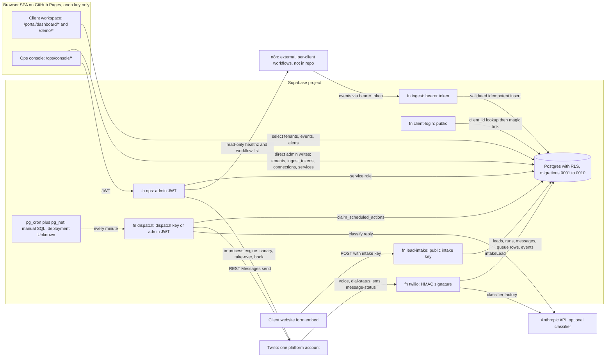

# ARC-000 — Repository Architecture Audit and Gap Map

> **Handling notice.** This document is a threat-model-grade description of the
> Arc portal, the ops console and the Lead Recovery execution layer, including
> unfixed defects. The repository's `origin` is a **public** GitHub repository,
> and `.gitignore` already keeps `PORTAL_CONTEXT.md` and `ARC_FIX_CHECKLIST.md`
> out of git for exactly this reason. This file's path is **not** ignored.
> Decide where it lives before it is committed.

---

## 1. Audit metadata

| Item | Value |
|---|---|
| Audit date | 2026-09-21 |
| Branch | `main` |
| Commit | `cab92eb1b92bf1c307cca42f057c48163c34f622` ("Build ARC Lead Recovery, the first execution layer") |
| `package.json` version | `1.17.0` |
| Worktree dirty before audit | **Yes.** Modified: `CHANGELOG.md`, `src/components/PortalFilm.css`, `src/components/PortalFilm.jsx`, `vite.config.js`. Untracked: `public/`. None were read for conclusions beyond confirming they are marketing-site files; none were modified. |
| Remote | `origin` → `github.com/bennettc1213/Arc-Automations` (public) |
| Runtime observed | Node `v24.12.0`, npm `11.6.2` (CI pins Node 22, `.github/workflows/deploy.yml`) |

**Scope inspected**

- Every instruction and architecture doc at the root: `CLAUDE.md`,
  `README.md`, `DEPLOYMENT.md`, `EVENT_CONTRACT.md`, `PORTAL_CONTEXT.md` (read in
  full, local and gitignored), the section headings and open items of
  `ARC_FIX_CHECKLIST.md` (local and gitignored), plus the second contract copy at
  `supabase/functions/ingest/EVENT_CONTRACT.md`. There is no `AGENTS.md` and no
  contributing guide.
- All ten migrations, `supabase/migrations/0001`–`0010`, read in full.
- All edge functions: `ingest`, `client-login`, `ops` (+ `ops/lead-recovery.ts`),
  `twilio`, `lead-intake` and `dispatch`, plus everything in `_shared/` and
  `_shared/engine/`.
- The portal libraries in `src/portal/lib/*`, the ops and dashboard pages, and
  the components that write or call functions.
- `tests/*.test.js`, `scripts/*.mjs`, `.github/workflows/deploy.yml`,
  `vite.config.js` and `package.json`.

**Important limitations**

- No database, Supabase project, Twilio account, n8n instance or Anthropic API
  was contacted. Every statement about RLS comes from reading the migration
  SQL; none was verified against a live Postgres.
- `.env.local` and `src/portal/n8n.env/` exist locally and were **not read**.
  `git log --all` shows neither has ever been committed.
- Supabase project settings (auth MFA, JWT expiry, `pg_cron` jobs, function
  secrets, deployed function versions) live outside the repo and are
  **Unknown**.
- `npm run build` and `npm run smoke` were **not run**. `prebuild` regenerates
  `src/portal/demo/demo-data.json` and `build` writes `dist/`, which would
  modify generated files. `smoke` also needs `playwright-core`, which is not
  installed, and installing it is out of scope.
- No Markdown or Mermaid linter is installed, and installing one is out of
  scope. The Mermaid diagram was checked by hand.

**Commands used (all read-only)**

```text
pwd; git rev-parse --show-toplevel; git branch --show-current; git rev-parse HEAD
git status --short; git diff --stat; git ls-files; git remote -v
git log --all --oneline --name-only -- <secret/threat-doc paths>   (history presence only)
git check-ignore -v docs/architecture/ARC_N8N_REPOSITORY_AUDIT.md
git grep / grep / sed / wc / cat over tracked source, migrations, tests, docs
node --version; npm --version
npm test        → node --test "tests/**/*.test.js"  (in-process, no network, no fs writes)
```

`npm test` result: **252 tests, 44 suites, 252 pass, 0 fail**, in about 263 ms.
`git status --short` was identical before and after.

---

## 2. Executive verdict

**What ARC is today.** A Vite and React SPA on GitHub Pages over one Supabase
project. It has three parts:

1. An **evidence-and-reporting portal**. Every client-facing figure is derived
   in the browser from an append-only `events` table, and external automations
   (assumed to be n8n) write to it through a hashed per-tenant bearer token.
2. An **operator console**. It is gated on `arc_admins` and edits tenants,
   tokens, connections and build checklists, partly straight from the browser
   under admin RLS and partly through an `ops` edge function.
3. As of commit `cab92eb` (2026-09-19), a **native execution engine for one
   module, Lead Recovery**. It has its own operational tables, a durable
   Postgres queue, Twilio webhooks, a web-form intake, a dispatcher and an
   eleven-step activation gate. It has **never been run against a live Twilio
   account** (`DEPLOYMENT.md` §9).

**What is already strong**

- Tenancy on every row, composite `(id, tenant_id)` foreign keys between
  operational tables, and client-side RLS that is select-only.
- A single validated event boundary (`_shared/event-validation.ts`) shared by
  external ingest and internal emission.
- Idempotent event writes on `(tenant_id, event_key)`.
- Hashed ingest tokens.
- Deterministic safety rules that a model can only add to.
- Templates only. No model-written customer text.
- A validated, credential-refusing tenant config (`module_configs`).
- A fail-closed activation checklist.
- `for update skip locked` claiming.
- An unusually honest derivation layer: `—` rather than `0`, and `unverified`
  rather than `healthy`.
- A 252-test zero-dependency suite.

**Partially implemented**

- Durable execution. The queue, retries and handoff-on-exhaustion exist.
  Send-once is not guaranteed, and there is no reconciler.
- Module model. `lead_recovery` is configurable and gated. The other four
  modules are observation-only, keyed by a separate module vocabulary
  (`tenants.modules`).
- Onboarding. The UI works, but it is not transactional or audited, and some
  steps need SQL.
- Config versioning. There is a counter but no history, and it is not enforced
  at execution.

**Demo-only.** `/demo/*` runs the real derivation code over generated data
(`src/portal/demo/generate.js`). It is not a mock of the derivations, but no
real client data sits behind it.

**Missing**

- A module registry.
- A connector framework and OAuth.
- An `AutomationRunner` abstraction.
- Any n8n dispatch or callback, workflow registry or manifest.
- An alert poller or detector.
- Config history.
- CI tests.
- Database-level (real Postgres) RLS tests.

**Ready for n8n integration?** **No.** No runner interface, signed dispatch,
result callback, workflow binding or workflow versioning exists. The only n8n
code is a read-only status probe (`supabase/functions/ops/index.ts` around
lines 420–560) plus n8n posting events to `/ingest`. The existing connection
and integration model assumes a **per-client n8n instance, credentials and
workflow IDs** (`src/portal/lib/integrations.js`,
`src/portal/components/ConnectionForm.jsx`). That contradicts "a client is
configuration".

**Ready for a real Lead Recovery client?** **No.** Four defects could each cause
duplicate or lost customer messages, or messages sent for a deboarded client.
They are listed in §12 "Critical".

**Most important prerequisite.** Make the existing native Lead Recovery queue
provably send-once and tenant-contained before anything is layered on it,
including n8n:

- Scope or remove the canary's global queue drain.
- Fence completion on the lease holder.
- Record the provider attempt before re-sending.
- Make intake atomic.
- Make archival stop execution.

The architecture decision (ARC-010) should also say explicitly whether n8n
belongs in Lead Recovery's path at all. The repository already runs that module
without n8n.

---

## 3. Current architecture

This diagram shows only what the repository proves exists. The `pg_cron` job is
documented SQL (`DEPLOYMENT.md` §5) and is not in a migration, so whether it is
deployed is **Unknown**.



**Responsibilities as built**

- **Browser.** It does every derivation (`src/portal/lib/*`). Clients only read.
  Operators both read and write through admin RLS: tenant create, update and
  reissue, token mint and revoke, connection CRUD, and service checklist edits.
  See `src/portal/lib/ops.js:365–580` and `src/portal/lib/builds.js`.
- **Edge functions.** They hold every secret: the service role, Twilio, the
  Anthropic key, the n8n API key and the dispatch key. They perform every
  execution-side mutation.
- **Postgres.** It holds all state. The only `security definer` functions are
  `is_tenant_member`, `is_arc_admin`, `deboard_tenant`, `restore_tenant` and
  `claim_scheduled_actions`.
- **n8n.** It sits outside the repo. Nothing in the repo dispatches to n8n or
  receives results from it.

**Duplicated or conflicting patterns**

- **Two module vocabularies.** `tenants.modules` / `lib/modules.js` use
  `lead_capture`, `estimates`, `reviews`, `memberships` and `installs`.
  `module_configs.module_key` and the engine use `lead_recovery`. A tenant can
  have `lead_recovery` enabled without `lead_capture` declared, which is
  harmless only because `lead_capture` is "always on".
- **Two operator write paths.** Direct browser writes under RLS are unaudited;
  `ops` function writes are audited.
- **Two event-contract documents.** `EVENT_CONTRACT.md` and
  `supabase/functions/ingest/EVENT_CONTRACT.md` have diverged. See §14.
- **Two integration models.** A declarative `connections` row (per-client
  endpoint, `workflow_id`, credential hint) versus Lead Recovery's
  `module_configs.config.twilio` (shared platform credential with per-tenant
  identifiers).

---

## 4. Repository and technology inventory

| Area | Technology or implementation | Status | Evidence | Notes or risks |
|---|---|---|---|---|
| Frontend | React 18.3, Vite 6, `react-router-dom` 7.18 | Implemented | `package.json`; `src/App.jsx:67–91` | SPA; `scripts/spa-fallback.mjs` handles GitHub Pages deep links |
| Routing | `BrowserRouter` routes `/`, `/portal`, `/portal/dashboard/*`, `/login`, `/demo/*`, `/auth/callback`, `/ops`, `/ops/console/*` | Implemented | `src/App.jsx:77–91` | Console sub-routes live in `OpsWorkspace.jsx` / `ops-nav.js` |
| Hosting | GitHub Pages via Actions; nightly rebuild at 09:00 UTC | Implemented | `.github/workflows/deploy.yml` | CI runs `npm ci && npm run build` only. **No tests in CI** |
| Backend | Supabase Postgres and Deno edge functions | Implemented | `supabase/functions/*`, `supabase/migrations/*` | No `supabase/config.toml`; function deploy flags are only in docs (`DEPLOYMENT.md` §3) |
| Supabase client | `@supabase/supabase-js` 2.x in the browser; `jsr:@supabase/supabase-js@2` in functions | Implemented | `src/portal/lib/supabase.js`; each `functions/*/index.ts` | `_shared/**` deliberately imports no `jsr:` so Node can test it |
| Client auth | Client ID → `client-login` → `signInWithOtp({shouldCreateUser:false})` magic link | Implemented | `supabase/functions/client-login/index.ts:143–189` | Per-IP in-process limit; archived → 403 |
| Operator auth | Email and password (`signInWithPassword`) plus `arc_admins` row | Implemented | `src/portal/pages/OpsHome.jsx:196`; `0003:99–125` | **MFA not implemented** (`ARC_FIX_CHECKLIST.md` O5 open); first admin bootstrapped by manual SQL (`0003:234–249`) |
| Validation | Hand-written validators, no library | Implemented | `_shared/event-validation.ts`; `_shared/lead-recovery-config.ts:401` | Config validator rejects unknown keys and credential shapes |
| Shared types | JS lists mirrored in TS | Partial | `src/portal/lib/types.js:127`; `_shared/event-validation.ts` | Mirrored by hand; tests assert parity for some lists |
| Tests | `node --test`, zero dependencies, native TS stripping | Implemented | `package.json` `test`; `tests/*.test.js` | 252 tests; in-memory store only; no real DB |
| Smoke | Playwright-core over built `/demo/*` pages | Implemented, not run here | `scripts/smoke.mjs:34–46` | Exits 0 without `playwright-core`; `/ops/console` not covered |
| Durable queue | `scheduled_actions` with `claim_scheduled_actions()` | Partial | `0010:379–432, 542–578` | See §10 and gaps G-C1 to G-C4 |
| Scheduler | `pg_cron` → `pg_net` → `dispatch` | Documentation only / Unknown | `DEPLOYMENT.md` §5; `dispatch/index.ts` header | Not in any migration |
| Telephony | Twilio REST (no SDK), TwiML, HMAC-SHA1 verification | Implemented, not live-verified | `_shared/twilio.ts:77, 240–330`; `twilio/index.ts` | `DEPLOYMENT.md` §9: never exercised against real Twilio |
| AI | `AnthropicClassifier` (model default `claude-sonnet-5`, 8 s timeout), `FakeClassifier`, `UnavailableClassifier` | Implemented, not live-verified | `_shared/classifier.ts:283–330, 520` | Output parser is strict; model can only add caution |
| n8n | Read-only probe (`/healthz`, `GET /api/v1/workflows`) and events posted to `/ingest` | Partial (observe-only) | `supabase/functions/ops/index.ts:116–117, 420–560` | No dispatch, callback or workflow JSON in the repo |
| PDF reports | jsPDF with bundled fonts | Implemented | `src/portal/lib/report*.js` | Client-side generation |
| Secrets | Supabase function secrets; browser holds only the anon key | Implemented (by design) | `DEPLOYMENT.md` §4; `deploy.yml` env | Values not inspected; the n8n key sits in a local gitignored file (`.gitignore` comment) |
| Monitoring and alerts | `alerts` table, manual raise/ack/resolve via `ops` | Partial | `src/portal/pages/ops/Alerts.jsx`; `ops/index.ts` alert actions | **No automated detector ("poller")** exists; the page says so |
| Logging | `console.log` / `console.error` in functions | Partial | e.g. `dispatch/index.ts`, `twilio/index.ts` | No external error reporting or log drain configured in the repo |

---

## 5. Feature reality matrix

| Feature | Claimed behavior | Verified behavior | Status | Evidence | Missing work |
|---|---|---|---|---|---|
| Client ID sign-in | ID selects account; magic link to stored mailbox | As claimed | Implemented | `client-login/index.ts:143–189`; `src/portal/lib/client-id.js` | Distributed rate limiting |
| Client dashboard (12 pages) | Every figure derived from `events` | Reads `tenants`, `events`, `alerts` only; derivation in the browser | Implemented | `src/portal/lib/dashboard.js:76–141`; `dashboard-data.js:76` | Tenant selection is `.limit(1)` with no order (see S-L4) |
| `/demo/*` | Same code over generated data | `demo-data.json` built at `predev`/`prebuild` through `buildDashboardData` | Demo only (by design) | `scripts/build-demo-data.mjs`; `src/portal/demo/generate.js` | — |
| Lifecycle modules (estimates, reviews, memberships, installs) | Folded from events by `entity_id` | Pure derivations; no tables; no adapter code in the repo | Partial (reporting only) | `src/portal/lib/lifecycle.js`; `0009` | Every module needs an external adapter (n8n/CRM) that does not exist in the repo |
| Module availability | live / awaiting / unavailable; never `0` | As claimed | Implemented | `src/portal/lib/modules.js:108` | `tenants.modules` has no UI; SQL only |
| Module health | `healthy` needs verification evidence | As claimed, but evidence is whatever a token holder posts | Implemented | `src/portal/lib/health.js:41` | Arc-side canary scheduler for non-LR modules does not exist |
| Needs-attention queue | Derived, not stored | As claimed | Implemented | `src/portal/lib/attention.js:343` | — |
| Automated alerting | Implied by `alerts` and canary vocabulary | Manual only | Missing (detector) | `Alerts.jsx` banner; `PORTAL_CONTEXT.md` §6 | Poller or detector |
| Ops roster and pipeline verdict | Green only on evidence | `pipelineVerdict` over probe and event log | Implemented | `src/portal/lib/ops.js:767` | — |
| New client | Create account, link login, mint token, services | Four independent browser/fn calls; not transactional; tenant/token writes unaudited | Partial | `pages/ops/NewClient.jsx:130–372`; `lib/ops.js:365–470` | Transactional provisioning and audit |
| Deboard / restore | One-transaction archive | Revokes tokens, removes members, retires connections. **Does not stop Lead Recovery** | Partial | `0007:46–` (`deboard_tenant`) | Disable `module_configs`, revoke intake keys, cancel actions |
| Audit log | Every operator action recorded | Only actions through `ops`; direct browser writes are not | Partial | `0004`; `ops/index.ts:274`; no `tenant.created`/`token.minted` writer anywhere | Route all admin writes through audited functions |
| Supabase self-check panel | Probes tables, columns, functions | Browser-side probes plus `ops capabilities` | Implemented | `pages/ops/SupabasePanel.jsx` | Does not probe `pg_cron` or the dispatcher's last run |
| Lead Recovery engine | Missed call/form → lead → text → reply → route or handoff | Implemented end to end over `MemoryStore`; Postgres store present | Partial (not live-verified; defects) | `_shared/engine/runtime.ts`; `_shared/supabase-store.ts` | G-C1 to G-C4, G-P* |
| LR config and activation | Validated JSON, eleven-step fail-closed gate | As claimed; 9 of 11 steps required (docs say 8) | Implemented | `lead-recovery-config.ts:818–870`; `ops/lead-recovery.ts:223–330` | Config history; version enforcement |
| LR operator canary | Synthetic, cannot reach a handset | Cannot reach a handset, but **drains other due actions globally** with recording senders | Implemented, unsafe | `ops/lead-recovery.ts:120, 415–437`; `0010:542–574` | Scope the drain to the canary run (G-C1) |
| Web-form intake | Origin allowlist, honeypot, dwell, rate limits | As claimed; all are client-controlled or per-instance | Implemented, abusable | `lead-intake/index.ts:46–54, 210–303` | Server-verifiable anti-abuse (G-P3) |
| Twilio routing | Called number → tenant | As claimed; duplicate claim throws; no uniqueness constraint | Partial | `supabase-store.ts:213–226` | Unique claim at write time (G-P5) |
| Realtime ops view of runs | "Ops console watches a lead move" | `automation_runs` and `messages` are published; no browser subscribes | Documentation only | `0010:659–671`; only `ops.js:1335` opens a channel (probe) | UI or remove publication |
| Client-editable workflow settings | Not claimed (explicitly out of scope) | No client write path | Missing (by design) | `0010:589–593` | ARC-310 |

---

## 6. Tenant isolation and security assessment

### 6.1 Authentication

- **Clients.** Supabase magic link after client-ID lookup. `shouldCreateUser:false`
  means an unknown mailbox cannot create an account
  (`client-login/index.ts:179`). The redirect is built server-side.
- **Operators.** Password plus the `arc_admins` table. `is_arc_admin()` is the
  single predicate (`0003:110–118`). `getOpsSession()` fails closed
  (`src/portal/lib/ops.js:130`). There is no MFA; it is listed as open item O5
  in the local fix checklist, and project auth settings are Unknown.
- **Machine callers.**

| Caller | Authentication | Evidence |
|---|---|---|
| `ingest` | Bearer token, SHA-256 at rest, unknown and revoked tokens get the same 401 | `ingest/index.ts:74–96` |
| `twilio` | HMAC-SHA1 over a configured public URL, checked before the body is used | `twilio/index.ts:120–130`; `_shared/twilio.ts:77` |
| `dispatch` | Constant-time dispatch key or admin JWT | `dispatch/index.ts` |
| `lead-intake` | Public intake key plus origin allowlist | `lead-intake/index.ts` |

### 6.2 Roles

`tenant_members.role` ∈ `owner | staff` (`0001:39–40`), but **no code
distinguishes the two**. All client access is read-only in any case. Operator
is a single undifferentiated role.

### 6.3 RLS: per table

| Table | RLS | Client policy | Admin policy | Sufficient? |
|---|---|---|---|---|
| `tenants` | on | select own (`is_tenant_member`) | select, insert, update | Isolation yes. Client can read internal columns (`notes`, `plan`, `archive_*`). See S-M2 |
| `tenant_members` | on | select own rows | all | Yes |
| `arc_admins` | on | select self | select all | Yes. No write policy; bootstrap by SQL |
| `events` | on | select own tenant | select | Yes. Writes only by service role |
| `ingest_tokens` | on | none | all | Yes. Hash only |
| `alerts` | on | select own | select, update | Yes |
| `connections` | on | select own | all | Isolation yes. Client can read `notes`, `account_ref`, `credential_location`, billing and cost. See S-M2 |
| `admin_actions` | on | none | select | Yes. Append-only by absence of policies |
| `client_services`, `client_service_steps` | on | none | all | Yes |
| `module_configs`, `intake_keys`, `scheduled_actions`, `module_onboarding` | on | none | select | Yes |
| `leads`, `conversations`, `messages`, `automation_runs`, `handoffs`, `suppressions` | on | select own | select | Yes. **No UI reads them**, so they are exposed but unused client-side |

Sources: `0001:169–195`, `0003:106–232`, `0004:55–69`, `0008:115–126`,
`0010:595–653`.

### 6.4 Tenant propagation

- **Ingest.** `tenant_id` comes from the token row and never from the body
  (`ingest/index.ts:98`, `event-writer.ts` `writeEvents`).
- **Twilio.** `tenant_id` comes from the called number, or for status callbacks
  from the `messages` row. Never from a URL or header (`twilio/index.ts`).
- **Engine.** Every store call carries `tenantId`. Operational foreign keys are
  composite `(id, tenant_id)`, which makes cross-tenant links structurally
  impossible (`0010:282, 312, 365, 417, 462–463`).
- **Operator actions.** `tenant_id` comes from the request body, which is
  acceptable because the caller is an admin.

### 6.5 Findings by severity

**Critical**

- **S-C1: the operator canary executes other tenants' real queued work with
  fake senders.**
  - `lead-recovery-canary` calls `runDueActions(deps, {limit:10})`
    (`ops/lead-recovery.ts:437`) with `depsFor(…, {synthetic:true})`. That
    configuration puts a `RecordingSender` in both sender slots and uses a
    `FakeClassifier` (`ops/lead-recovery.ts:120–128`).
  - `claim_scheduled_actions` claims any due row across all tenants
    (`0010:554–563`).
  - `RecordingSender.send` returns `ok:true` with a synthetic SID
    (`_shared/twilio.ts:344–366`).
  - Result: any real customer's due first response or follow-up, for **any
    tenant**, claimed during a canary press is:
    - never delivered;
    - marked `done`;
    - advanced to `awaiting_reply`;
    - recorded as a successful `sms_sent` event with `is_canary:false`, which
      counts in client dashboards.
  - Real replies claimed at the same moment are classified by `FakeClassifier`.
  - Cross-tenant in effect, silent, and it produces false evidence.
  - Tests do not cover this: they run one engine instance over `MemoryStore`.
- **S-C2: the same customer text can be sent twice.**
  - `sendMessage` calls the provider before writing anything durable, and it
    does not check for an existing outbound message for the action
    (`runtime.ts:1004–1074`).
  - These paths re-send:
    - The 10 s client-side abort is classified as transient
      (`_shared/twilio.ts:249, 316–327`), so a request Twilio accepted but
      answered slowly is retried.
    - Any exception after the send (message insert, `emit`, which throws on DB
      error at `supabase-store.ts:736`, or queueing the follow-up) goes to
      `retryOrGiveUp` and re-sends (`runtime.ts:943–945`).
    - A lease expiry re-offers a claimed row (`0010:558–560`, 120 s lease)
      while the original worker may still be processing it. The cron fires
      every 60 s, and a batch runs sequentially (limit up to 100,
      `dispatch/index.ts`), with up to 10 s per send and 8 s per
      classification. `completeAction` and `rescheduleAction` are not fenced on
      `locked_by` (`supabase-store.ts:568–582`).
  - The sent event's key includes the attempt number, so the evidence does not
    deduplicate either.
  - The test titled "the idempotency key is what stops a second send" only
    asserts that *re-queueing* is a no-op (`tests/lead-recovery.test.js:1255–1278`).

**High**

- **S-H1: deboarded or archived clients keep running Lead Recovery.**
  - `deboard_tenant` (`0007:46`) predates 0010. It does not set
    `module_configs.enabled=false`, revoke `intake_keys` or cancel
    `scheduled_actions`.
  - The engine and routing never read `tenants.status`
    (`supabase-store.ts:213–226`; `runtime.ts` `loadConfig`).
  - Activation does not check tenant status (`ops/lead-recovery.ts:291–330`).
  - The console hides the Lead Recovery panel for archived clients
    (`pages/ops/ClientDetail.jsx:394`), so the pause control disappears too.
  - Tenant status `paused` likewise does not pause the module.
- **S-H2: non-atomic intake can strand a lead with no response.**
  - `intakeLead` performs about six separate writes: lead, conversation, run,
    events, state and queue (`runtime.ts:220–402`).
  - If anything fails after `createLead`, a Twilio redelivery finds the
    existing lead and returns "already recorded" having queued nothing
    (`runtime.ts:229–240`).
  - No sweeper looks for runs in `new` or `response_queued` without a pending
    action.
- **S-H3: the public web form can make Arc text any phone number.**
  - `lead-intake` accepts a phone number and ticked consent from any caller
    holding the published key.
  - Origin is only enforced by browsers, so a script can set any `Origin`.
  - The dwell time is a client-supplied timestamp (`lead-intake/index.ts:46`).
  - Limits are 60 per minute per key and 12 per minute per IP, in-process per
    instance (`:53–54`).
  - Consequences: SMS-pumping cost, messages to people who never asked, and
    consent attributable to a forged submission.
- **S-H4: a single-factor operator credential controls everything.**
  - Admin RLS lets a signed-in operator browser insert and update tenants,
    mint tokens, edit connections and, through `ops`, activate modules, run
    the engine and delete auth users.
  - Without MFA (unverified; O5 open) one phished password is full control
    over customer messaging. This requires verification in the Supabase
    dashboard.

**Medium**

- **S-M1: operator browser writes are unaudited.** `createClient`,
  `updateClient`, `reissueClientId`, `mintToken`, `revokeToken`,
  `saveConnection`, `deleteConnection` (`src/portal/lib/ops.js:365–580`) and
  service-step toggles (`lib/builds.js`) write directly under RLS. Nothing
  writes `tenant.created`, `token.minted` or `client_id.reissued`, although
  0004 documents those verbs (`0004:33–34`).
- **S-M2: clients can read operator-internal fields.** RLS lets a client select
  its own `tenants` row, including `notes` and `archive_note`, and its own
  `connections` rows, including `notes`, `account_ref`, `credential_location`,
  `cost_cents` and `paid_by`. The client UI does not display these, but a
  client's anon key and session can read them. There is no cross-tenant
  exposure.
- **S-M3: one Twilio number can be claimed by two tenants.** Uniqueness is not
  enforced at save time (`ops/lead-recovery.ts:223–262`) or in the database. A
  duplicate makes `findTenantByTwilioNumber` throw
  (`supabase-store.ts:224`), so the voice webhook returns 500 and both tenants'
  calls fail. `test-routing` only reports the conflict.
- **S-M4: the config-version pin is recorded but not enforced.**
  - `automation_runs.config_version` is stored (`runtime.ts:280`).
  - Every action reloads the **current** config (`runtime.ts:784`).
  - No config history is retained. The 0010 claim that "a config edited
    mid-sequence cannot retroactively change what a running sequence was
    allowed to do" (`0010:108–110`) is not true of the implementation.
- **S-M5: `twilio.subaccount_sid` is validated and stored but never used.**
  Sends always post to `Accounts/{platform SID}` (`_shared/twilio.ts:276`). If
  numbers or messaging services live in subaccounts, sends may fail. This needs
  verification against Twilio.

**Low**

- **S-L1: engine event keys can be pre-empted.** The `lr:` `event_key`
  namespace is not reserved at ingest. A tenant's own ingest-token holder can
  pre-write engine keys to suppress Arc's evidence for that tenant, or post
  verification events to earn `healthy`. This is limited to one tenant: the
  token is the trust boundary.
- **S-L2: lease re-offers ignore the attempt limit.** `claim_scheduled_actions`
  re-offers leased rows without checking `attempts < max_attempts`, and
  `executeAction` does not check either.
- **S-L3: `module_onboarding.done_by` is always null.** The stamp trigger uses
  `auth.uid()`, which is null under the service role (`0010:524–527`;
  `ops/index.ts:261`). The audit log still records the actor.
- **S-L4: the client dashboard picks a tenant arbitrarily.** It reads
  `tenants … limit(1)` with no order and fetches events without a tenant
  filter (`dashboard.js:88–113`). A multi-tenant member or an operator visiting
  `/portal` gets an arbitrary tenant. A JavaScript filter drops foreign events
  (`dashboard-data.js:86–95`).
- **S-L5: every rate limit is in-process per instance.** This affects
  `ingest`, `client-login` and `lead-intake`, and the code says so.

**Informational**

- The `ops` probe fetches `/healthz` on operator-entered HTTPS origins, which
  is an admin-only server-side fetch surface (`ops/index.ts:190–215, 495–515`).
  It does not follow redirects.
- The marketing pilot form posts to a public n8n production webhook URL
  committed in `src/data/site.js:316`. That is expected for a public form;
  validation on the n8n side is Unknown.
- `ops` and `dispatch` use CORS `*`. Acceptable, because they authenticate by
  header rather than cookie.

### 6.6 Service-role boundaries and secret exposure

- The service role exists only inside functions. The browser bundle gets only
  `VITE_SUPABASE_URL` and `VITE_SUPABASE_ANON_KEY` (`deploy.yml`).
  `scripts/issue-token.mjs` reads the service key from the environment.
- `module_configs` has a check constraint refusing secret-shaped strings
  (`0010:123–125`), and the validator refuses credential shapes
  (`lead-recovery-config.ts:145–190`).
- `connections.credential_hint` is limited to 4 characters (`0006`).
- The activity feed strips credential-shaped keys (`src/portal/lib/activity.js:35`).
- The classifier event carries metadata only (`runtime.ts:872`).
- `sms_sent` and `lead_received` payloads carry the customer phone number and a
  truncated message body. Clients read these for their own tenant, which is
  intended.
- The n8n API key sits in a local gitignored file. It has never been committed,
  per `git log`.

### 6.7 Existing security tests

The tests are in-memory and textual. They cover:

- signature verification, including Twilio's published vector
  (`tests/lead-recovery.test.js:407–460`);
- a cross-tenant suite over `MemoryStore` (`:1386`);
- secret-leak assertions (`:1704`);
- textual checks on the 0010 SQL (`:1766–1860`).

There are **no tests against a real Postgres**, so no test proves that an RLS
policy actually denies anything.

---

## 7. Current data model

"Evidence" means the append-only ledger. "Operational" means current state that
decisions read.

| Table | Purpose | Scope | RLS | Primary writers | Primary readers | Kind | Important gaps |
|---|---|---|---|---|---|---|---|
| `tenants` | Client account, `client_id`, status, `modules[]`, SLA | Tenant root | on | Operator browser (direct); `deboard_tenant`/`restore_tenant` | Client (own), console, `client-login` | Operational/config | No UI for `modules`/`response_sla_seconds`; `status` ignored by engine |
| `tenant_members` | Auth user → tenant | Tenant | on | `ops link-client`; admin RLS | RLS predicate | Operational | Roles unused |
| `arc_admins` | Operator list | Global | on | Manual SQL | `is_arc_admin()` | Config | No UI, no MFA |
| `events` | Append-only evidence; every figure | Tenant | on | `ingest`; engine `emit` | Portal, console, reports | **Evidence** | Service role could still update/delete (no trigger) |
| `ingest_tokens` | Hashed bearer tokens | Tenant | on | Operator browser | `ingest` | Credential (hashed) | Mint/revoke unaudited |
| `alerts` | Incident state | Tenant | on | `ops` | Portal, console | Operational | No automated writer |
| `connections` | Declared wiring and billing | Tenant | on | Operator browser | Console | Declarative | Client-readable internals; per-client n8n assumption |
| `admin_actions` | Audit log | Global | on | `ops` (service role) | Console | Evidence | Misses direct browser writes |
| `client_services`, `client_service_steps` | Sold services and build checklist | Tenant | on | Operator browser; `add_client_services` | Console | Operational | — |
| `module_configs` | Per-tenant LR config, `enabled`, `config_version` | Tenant | on | `ops` | Engine, console | Config | `module_key` limited to `lead_recovery`; no history |
| `intake_keys` | Public form key and origins | Tenant | on | `ops` | `lead-intake` | Config | Not revoked on deboard |
| `leads` | Narrow operational lead | Tenant | on | Engine | Engine, console (via `ops`) | Operational | — |
| `conversations`, `messages` | SMS thread; provider SID idempotency | Tenant | on | Engine | Engine; status callback routing | Operational | No "send attempt" record before the provider call |
| `automation_runs` | One state machine per lead | Tenant | on | Engine | Engine | Operational | Pinned version not enforced |
| `scheduled_actions` | Durable queue | Tenant | on | Engine, `ops` | Dispatcher | **Operational queue** | Lease not fenced; no dead-letter beyond `failed`; global claim |
| `handoffs` | Human escalation | Tenant | on | Engine, `ops` | Console | Operational | — |
| `suppressions` | Tenant-scoped do-not-message | Tenant | on | Engine, `ops` | Engine | Operational | — |
| `module_onboarding` | Activation checklist | Tenant | on | `ops` | `canActivate` | Operational | `done_by` null |

**The event ledger as a queue.** `events` is not used as a queue or as
decision state:

- The `EngineStore` interface exposes `emit` and no event read
  (`_shared/engine/store.ts:168–228`).
- Portal derivations never read operational tables (`src/portal/lib/*`: only
  `tenants`, `events`, `alerts`, `connections`, `ingest_tokens`,
  `admin_actions` and the service tables are read).

`events` is **unsafe as a durable execution queue** and should stay evidence
only:

- No claim or lease semantics.
- Writers choose the `event_key`, and an external token holder can write any
  type.
- Rows without a key are not deduplicated.
- `occurred_at` is caller-supplied.
- It is published to realtime.

Its `(tenant_id, event_key)` uniqueness plus `ON CONFLICT DO NOTHING`
(`0002`; `event-writer.ts`) makes it a sound idempotent evidence log.

---

## 8. Current onboarding trace

**Portal client (all modules)**

| # | UI action | Server action | Database effect | Auth effect | Audit effect | Manual step | Failure or retry |
|---|---|---|---|---|---|---|---|
| 0 | — | — | `insert into arc_admins` | Operator exists | none | **Manual SQL** (`0003:234–249`) | — |
| 1 | `/ops/console/clients/new`: name, slug, services, contact | Browser `createClient` (`lib/ops.js:365`) | `insert tenants` (client ID default or pre-generated; retries up to 3× on ID collision) | none | **none** | — | Slug duplicate blocked in UI (`NewClient.jsx:81`) and by unique index. **Not transactional** with step 2 |
| 2 | (same press) | Browser `addClientServices` → RPC `add_client_services` (`0008:145`) | `client_services` and steps; skips already-present services | none | **none** | — | Idempotent per `(tenant, service_key)`; failure is shown and retryable |
| 3 | "step one — let them in" | `ops link-client` | `tenant_members` upsert; `tenants.login_email` | Invite or find `auth.users` | `client.linked` | — | Idempotent by design |
| 4 | "step two — let the pipeline write" | Browser `mintToken` (`lib/ops.js:457`) | `ingest_tokens` insert (hash) | none | **none** | Raw token pasted into an **n8n credential** by hand | Re-mint creates another token |
| 5 | — | — | `tenants.modules`, `response_sla_seconds` | — | none | **Manual SQL** (no UI writes either; §5) | — |
| 6 | Build n8n workflows per service checklist | — | Steps ticked in `client_service_steps` | — | none | **Manual n8n build per client** (`lib/service-catalog.js` steps, e.g. "build … in arc's n8n", "ingest token in the n8n credential") | — |
| 7 | Connections form | Browser `saveConnection` | `connections` row with per-client `workflow_id` | — | **none** | Manual entry | — |

**Lead Recovery add-on** (`/ops/console/clients/:id`, `LeadRecoveryPanel.jsx`)

| # | UI action | Server action | Database effect | Audit | Manual step |
|---|---|---|---|---|---|
| a | Fill hand-built form (hours, zips, templates, forwarding, Twilio IDs, compliance) | `ops lead-recovery-save-config` | `module_configs` upsert; step `business_rules` auto-ticked | `lead_recovery.config_saved` | Operator types `compliance.status` (self-attested) |
| b | Buy number, configure webhooks | none | none | none | **Manual in the Twilio console** (by design, `DEPLOYMENT.md` §6) |
| c | Tick `tenant_created`, `staff_destination_verified`, `twilio_connected`, `routing_tested`, `templates_approved`, `consent_recorded`, `compliance_approved` | `lead-recovery-set-step` | `module_onboarding` | `lead_recovery.step_completed` | **All manual attestations.** `test-routing` does not auto-tick `routing_tested` |
| d | Issue intake key (optional) | `lead-recovery-issue-intake-key` | `intake_keys` | audited | Paste snippet into client site |
| e | Run canary | `lead-recovery-canary` | Synthetic lead/run; ticks `canary_passed` | `lead_recovery.canary_run` | **Unsafe drain, S-C1** |
| f | Activate | `lead-recovery-activate` | `module_configs.enabled=true`; ticks `module_activated` | `lead_recovery.activated` | Fails closed with all blockers listed |
| g | — | — | `cron.schedule(...)` | none | **Manual SQL, once per project** (`DEPLOYMENT.md` §5) |

**Safety of retries.** Tenant creation cannot be blindly retried: a second
submit creates a second tenant unless the slug collides, because the slug is
the only natural key. Services, linking and config saves are idempotent. No
step is wrapped in a transaction or saga.

---

## 9. Current module model

- **Representation.**
  - The portal has five hard-coded modules in `MODULE_META`
    (`src/portal/lib/modules.js:31`) and `MODULES` in `types.js:127`. Module
    membership is derived from `event_type`.
  - Lead Recovery is a second, separate concept: `module_key = 'lead_recovery'`,
    enforced by check constraints on `module_configs`, `automation_runs` and
    `module_onboarding` (`0010:88, 336, 509`).
  - There is no registry table, no module versions and no capability
    requirements.
- **Availability.** `computeModuleAvailability(tenant, events, now)` combines
  what is declared (`tenants.modules`) with what is observed (events in the
  window), and observation wins.
- **Health.** `computeModuleHealth` walks
  `unavailable → awaiting → failing → degraded → quiet → unverified → healthy`,
  and `healthy` requires verification events. The verification evidence is
  posted by whoever holds the tenant token; Arc schedules no canary for the
  four observed modules.
- **Per-tenant configuration.** Only `lead_recovery`
  (`module_configs.config`), plus `tenants.response_sla_seconds` for display.
- **Validation.** Yes for `lead_recovery`: whitelist of keys, closed
  placeholder list, credential refusal, validated again on read
  (`runtime.ts:143–160`).
- **Versioning.** `schema_version` (constant 1) and a `config_version` counter
  bumped by trigger (`0010:133–154`). No history and no rollback.
- **Activation state machine.** `enabled` is a boolean plus the checklist and
  `canActivate` (`lead-recovery-config.ts:849`). The states are unconfigured →
  configured → activated / paused, implicitly. There is no explicit
  `draft / validated / testing / shadow / active / paused / retired` state and
  no **shadow mode**.
- **What checkbox activation needs.**
  - A module registry that unifies `lead_capture` and `lead_recovery` naming
    and declares capabilities and required connections.
  - Generalizing `module_configs` beyond one `module_key` with schema-per-module
    validation.
  - Config history tables.
  - An explicit lifecycle state machine with a shadow state.
  - Replacing `tenants.modules` (SQL-only) with rows derived from that
    lifecycle.

---

## 10. Current execution and integration readiness

| Capability | State | Evidence |
|---|---|---|
| Durable jobs | **Partial.** Rows in `scheduled_actions` survive restarts | `0010:379–432` |
| Scheduling | **Partial.** Future `run_at`; driven by manual `pg_cron` SQL (Unknown if deployed); no webhook-triggered dispatch | `DEPLOYMENT.md` §5; `twilio/index.ts` (no `runDueActions` call) |
| Retries and backoff | **Implemented.** 60 s doubling to a 1800 s ceiling, up to 5 attempts, then handoff plus `task_opened` | `runtime.ts:69–74, 955–1000` |
| Leases | **Partial.** 120 s lease; completion not fenced; attempt cap not checked on re-offer | `0010:542–574`; `supabase-store.ts:568–582` |
| Dead-letter | **Partial.** `status='failed'` plus a handoff; operator retry resets attempts | `ops/lead-recovery.ts` retry-action; `supabase-store.ts:606` |
| Idempotent claims | **Implemented** (`skip locked`) | `0010:554–572` |
| Idempotent sends | **Missing** (S-C2) | `runtime.ts:1004–1074` |
| Cancellation | **Implemented** for pending rows on reply, STOP, take-over, booking and pause | `runtime.ts:521, 548, 1187, 1345, 1424`; `ops/lead-recovery.ts:332–` |
| Stale-run recovery | **Missing.** No sweeper for runs without actions (S-H2) | — |
| Durable waiting | **Implemented** as future rows (follow-up at 60 min, close at 72 h) | `runtime.ts:62–65, 834–837` |
| Human-takeover cancellation | **Implemented** (cancel, then transition) | `runtime.ts:1335` |
| Version-pinned execution | **Recorded, not enforced** (S-M4) | `runtime.ts:280, 784` |
| Webhooks | **Implemented** for Twilio (signed) and the web form | `twilio/index.ts`; `lead-intake/index.ts` |
| Provider connectors | **Partial.** Twilio is hard-wired; no connector interface beyond `TwilioSender`/`Classifier` | `_shared/twilio.ts:222`; `_shared/classifier.ts` |
| OAuth | **Missing** | none anywhere |
| n8n dispatch or callback | **Missing** | none |
| Workflow versioning | **Missing** | none |
| Provider reconciliation | **Missing.** Only delivery callbacks; no polling of Twilio for lost callbacks or unknown sends | — |
| Monitoring | **Partial.** Derived health, a manual alerts page, a live probe; no detector, no dispatcher heartbeat | `health.js`; `Alerts.jsx`; `ops probe-pipelines` |

**Runner equivalents already present.** `runtime.ts` plus `dispatch` is in
effect a `DirectArcWorker`. `MemoryStore` with `RecordingSender` and
`FakeClassifier` is in effect a `FakeTestRunner`. Neither sits behind an
`AutomationRunner` interface.

---

## 11. ARC-to-n8n readiness matrix

| Required capability | Current implementation | Status | Reusable as-is | Required change | Owner |
|---|---|---|---|---|---|
| Module selection | `tenants.modules` text[] (SQL only); `module_configs` row for LR | Partial | No | Registry plus a tenant-module lifecycle table; UI checkboxes | ARC |
| Versioned configuration | `config_version` counter; no history; not enforced | Partial | Validator yes | History table; pin and load by version at execution | ARC |
| Workflow binding | `connections.workflow_id` per client (declarative) | Documentation/declarative only | No; encourages per-tenant workflows | Module-version → shared workflow manifest binding | ARC |
| Job creation | `scheduled_actions` rows from engine | Partial | Yes, with fixes | Generalize `action_type`/`module_key` checks | ARC |
| Job dispatch | In-process `runDueActions` | Partial | Yes, as the direct runner | `AutomationRunner` interface; n8n runner implementation | ARC |
| n8n authentication | None to n8n; n8n → ingest by per-tenant token | Missing (outbound) | Ingest token model reusable for callbacks | Signed dispatch (HMAC, timestamp, nonce); per-environment secret | ARC + n8n |
| Provider credentials | Platform Twilio and Anthropic secrets in function env; "n8n credentials" per client (`integrations.js` `keyStore`) | Partial / conflicting | Twilio platform model yes; per-client n8n credential model no | Credential vault and connection model; n8n must not hold tenant secrets | Connector |
| Result callback | None (n8n can only post evidence events) | Missing | Validator reusable | Signed callback endpoint that updates operational state idempotently | ARC |
| Idempotency | Event keys; action keys; provider-SID message dedupe | Partial | Yes | Send-attempt record before provider call; key passed to runner | ARC |
| Cancellation | Pending-row cancel | Partial | Yes (native) | Cancel propagated to runner executions | ARC + n8n |
| Retry | Engine backoff | Implemented (native) | Yes | Define who retries: ARC, not n8n | ARC |
| Dead-letter | `failed` plus handoff | Partial | Yes | Visible DLQ view; replay tooling | ARC |
| Event evidence | Single validated door | Implemented | **Yes. Preserve.** | Reserve `lr:`/runner key namespaces | ARC |
| Health monitoring | Derived health; n8n `/healthz` and workflow probe | Partial | Probe reusable | Runner heartbeat; per-execution correlation | ARC + n8n |
| Workflow rollout | None | Missing | — | Manifest, versioning, sync, staged rollout | ARC + n8n |
| Tenant isolation | RLS and composite FKs; the canary breaks containment (S-C1) | Partial | Yes, with fixes | Tenant-scoped claims for tests; tenant context in dispatch payloads | ARC |

**Is the existing n8n implementation suitable?** **No.**

- It is observe-only.
- `src/portal/lib/integrations.js` tells operators to store provider
  credentials "in n8n credentials" (`keyStore` on nearly every provider), with
  an endpoint hint of a per-client instance (`https://client.app.n8n.cloud`).
- `ConnectionForm.jsx` makes a per-client `workflow_id` "the one field that
  matters".
- `lib/service-catalog.js` includes per-client custom n8n workflow builds.

All of these push toward one workflow, credential set and possibly instance per
tenant, and toward n8n holding tenant secrets. No hard-coded client filters,
credentials or client-specific webhook URLs were found in the repo. The
marketing site's own pilot intake webhook (`site.js:316`) is Arc's sales form,
not a tenant workflow.

---

## 12. Gap map

### Critical before any production execution

| ID | Description | Evidence | Risk | Dependency | Stage |
|---|---|---|---|---|---|
| G-C1 | Canary drains the global queue with fake senders | `ops/lead-recovery.ts:120, 437`; `0010:554`; `twilio.ts:344` | Real texts silently dropped across tenants; false `sms_sent` | none | **ARC-015 (new)**, then ARC-210 |
| G-C2 | Send is not once-only: lease race, timeout-as-transient, retry after a post-send exception; unfenced completion | `runtime.ts:943–945, 1004–1074`; `twilio.ts:249, 316–327`; `supabase-store.ts:568–582`; `0010:558–560` | Duplicate customer texts | none | ARC-015, then ARC-200 |
| G-C3 | Archive or pause does not stop Lead Recovery; pause UI hidden once archived | `0007:46`; `supabase-store.ts:213`; `ClientDetail.jsx:394` | Messaging for a deboarded client | none | ARC-015, then ARC-120 |
| G-C4 | Non-atomic intake with no reconciler | `runtime.ts:220–402, 229–240` | Missed call never answered, silently | none | ARC-015 (transactional RPC or sweeper), then ARC-200 |
| G-C5 | Web form can trigger texts to arbitrary numbers | `lead-intake/index.ts:46–54, 210–303` | Abuse, cost, consent exposure | Human decision on anti-abuse | ARC-015 or ARC-LR-4xx before any form goes live |
| G-C6 | No MFA on operator accounts (unverified) | `OpsHome.jsx:196`; checklist O5 | Account takeover means full control of messaging | Supabase settings | ARC-020 / ARC-130 |

### Required before the first Lead Recovery pilot

| ID | Description | Evidence | Risk | Dependency | Stage |
|---|---|---|---|---|---|
| G-P1 | Never exercised against live Twilio or Anthropic | `DEPLOYMENT.md` §9 | Unknown production behavior | Twilio account, A2P approval | ARC-QA-500 / ARC-PILOT |
| G-P2 | Scheduler is manual SQL; no dispatcher heartbeat or alert | `DEPLOYMENT.md` §5 | Queue silently stops | G-C2 | ARC-200 |
| G-P3 | No automated alerting | `Alerts.jsx`; `PORTAL_CONTEXT.md` §6 | Failures noticed by humans only | — | ARC-200 / ARC-240 |
| G-P4 | First response waits for the cron (up to about 60 s plus processing); docs claim webhook dispatch | `twilio/index.ts` (no dispatch); `DEPLOYMENT.md` §5 | Slower speed-to-lead than sold | G-C2 | ARC-LR-4xx |
| G-P5 | Number uniqueness not enforced at write time | `ops/lead-recovery.ts:223`; `supabase-store.ts:224` | Dropped calls for two tenants | — | ARC-110 |
| G-P6 | Config version not enforced; no history | `runtime.ts:784`; `0010:108` | Mid-sequence behavior change; no forensics | — | ARC-110 |
| G-P7 | Subaccount SID unused | `twilio.ts:276`; `lead-recovery-config.ts:757` | Sends fail if numbers live in subaccounts | Phone-routing decision | ARC-130 |
| G-P8 | No real-DB RLS or integration tests; no tests in CI | `deploy.yml`; `tests/*` | Policy regressions undetected | — | ARC-QA-500 |
| G-P9 | No provider reconciliation (lost status callbacks) | — | Delivery state wrong | — | ARC-200 |

### Required before repeatable onboarding

| ID | Description | Evidence | Risk | Dependency | Stage |
|---|---|---|---|---|---|
| G-O1 | Tenant provisioning is not transactional or audited | `lib/ops.js:365–470`; `NewClient.jsx` | Orphans; no forensics | — | ARC-300 |
| G-O2 | `tenants.modules`, SLA and first admin are SQL-only | §8 | Manual DB work | ARC-100/120 | ARC-300 |
| G-O3 | No module registry; two module vocabularies | `modules.js:31`; `0010:88` | Drift | — | ARC-100 |
| G-O4 | No connector or connection framework; per-client n8n credential assumption | `integrations.js`; `ConnectionForm.jsx` | Per-tenant snowflakes | ARC-010 | ARC-130 |
| G-O5 | No shadow mode or explicit lifecycle states | `lead-recovery-config.ts:849` | Binary go-live | ARC-110 | ARC-120 |
| G-O6 | Config UI is hand-built for one module | `LeadRecoveryPanel.jsx` | New module means new UI code | ARC-110 | ARC-310 |
| G-O7 | Checklist steps are attestations (7 of 9 required steps are manual ticks) | `ONBOARDING_STEPS`; §8 | Human error | Connectors | ARC-320 |
| G-O8 | Client-readable internal columns | §6 S-M2 | Information disclosure | — | ARC-100 (schema split) |

### Later scalability improvements

| ID | Description | Evidence | Stage |
|---|---|---|---|
| G-L1 | Global rather than per-tenant fair claiming; sequential batch | `0010:554`; `runtime.ts:723` | ARC-200 later |
| G-L2 | In-process rate limits only | S-L5 | Later |
| G-L3 | Browser derivation over up to 80k/150k events per load | `dashboard.js`; `report-data.js` | Later (server rollups) |
| G-L4 | Realtime publication unused | `0010:659–671` | Later |
| G-L5 | Owner/staff roles unused | `0001:39` | Later |
| G-L6 | Reserve internal `event_key` namespaces | S-L1 | ARC-230 |

---

## 13. Existing assets to preserve

- **Single event door.** `_shared/event-validation.ts` shared by `ingest` and
  engine `emit` (`supabase-store.ts:720–738`); `ingest/validate.ts` re-exports.
- **Idempotent evidence.** `events_tenant_event_key_uniq` (`0002`) plus
  `ON CONFLICT DO NOTHING` (`event-writer.ts`); deterministic engine keys
  (`eventKey`, `deterministicUuid` in `runtime.ts:117`).
- **Tenancy structure.** `tenant_id` on every row; composite
  `(id, tenant_id)` FKs (`0008`, `0010`); the tenant predicate first in every
  admin-widened policy (`0003:166–188`).
- **No client write path**, and operational tables with no write policies
  (`0010:650–653`).
- **Hashed ingest tokens** and the same response for unknown and revoked
  tokens (`ingest/index.ts:77–96`).
- **Append-only audit** by absent policies (`0004:55–69`).
- **Safety fence.** `assessSafety` (`rules.ts:134`) before any model;
  `applyClassification` OR-merge (`classifier.ts:417`); no key means handoff
  (`classifierFor`, `classifier.ts:520`).
- **Templates only**, with the engine-appended opt-out (`templates.ts:62`).
- **Re-check before send** (`runtime.ts:754–800`): terminal, suppression,
  reply, handoff and module-off.
- **Explicit state machine** that throws on invalid transitions, with a test
  asserting parity with the DB check (`state-machine.ts`).
- **`skip locked` claim** (`0010:542–578`), revoked from browser roles.
- **Fail-closed activation**, with no override (`canActivate`).
- **Config validator** that refuses unknown keys and credential shapes, plus
  the DB check constraint (`0010:123–125`).
- **Canary isolation at lead level** (`senderFor`, `runtime.ts:163`). The fix
  for S-C1 must keep this, not replace it.
- **Honest derivations.** `modules.js` (never `0`), `health.js` (`unverified`),
  `pipelineVerdict`, `buildProgress`, "recovered needs four links"
  (`lifecycle.js:402`), `safeMeta`.
- **`MemoryStore` as a real second implementation**, and the 252-test
  zero-dependency suite.
- **Deboarding** as one locked transaction (`0007:46`). Extend it; do not
  bypass it.
- **Shared shell.** `Sidebar`, `Topbar`, `CommandPalette`, `RecordTable` and
  `ModuleUI`.

---

## 14. Conflicts and stale documentation

For every discrepancy below, **code and migrations are authoritative**.
`EVENT_CONTRACT.md` says so itself. `PORTAL_CONTEXT.md` and `DEPLOYMENT.md`
were updated for 0010 but carry stale fragments.

| # | Discrepancy | Sources | Authoritative | Why |
|---|---|---|---|---|
| 1 | "Eleven steps, **eight** required" | `DEPLOYMENT.md` §7; `PORTAL_CONTEXT.md` §3b | Code: **nine** required (`lead-recovery-config.ts:818–832`, `REQUIRED_STEPS`) | Enforced by `canActivate` |
| 2 | "First response is normally sent by the webhook's own dispatch call" | `DEPLOYMENT.md` §5; `dispatch/index.ts` header | Code: `twilio/index.ts` never dispatches | Only the `ops` canary calls `runDueActions` in-process |
| 3 | "Idempotency key is what stops the re-offer from sending twice" | `PORTAL_CONTEXT.md` §3b, §10; `0010:540–541`; test title `tests/lead-recovery.test.js:1255` | Code: no send-once guard (S-C2) | The test asserts queue dedupe only |
| 4 | "A config edited mid-sequence cannot retroactively change what a running sequence was allowed to do" | `0010:108–110`; `PORTAL_CONTEXT.md` §3b | Code: current config loaded per action (`runtime.ts:784`) | Pin is recorded, not read |
| 5 | "No client write path … every mutation goes through an edge function under the service role" | `PORTAL_CONTEXT.md` §3, §10 | Code: true for clients; **operators** write directly under admin RLS (`lib/ops.js`) | The claim holds for clients only |
| 6 | Audit verbs `tenant.created`, `token.minted`, `client_id.reissued` | `0004:33–34`; `PORTAL_CONTEXT.md` §3 | Code: never written | No writer exists |
| 7 | Event vocabulary "35 values" | `PORTAL_CONTEXT.md` §4, §5 | Code: **41** (`event-validation.ts`); `EVENT_CONTRACT.md` says 41 | Validator |
| 8 | Second contract copy without the 0010 types | `supabase/functions/ingest/EVENT_CONTRACT.md` (last changed `c61cc5c`) vs `EVENT_CONTRACT.md` (`cab92eb`) | Root `EVENT_CONTRACT.md` | Newer, and matches code |
| 9 | "The ops console watches a lead move through the engine" (realtime) | `0010:659–660` | Code: no subscriber | Only a probe channel exists (`ops.js:1335`) |
| 10 | `demo-data.json` "currently checked in" | `PORTAL_CONTEXT.md` §12 | Git: gitignored, untracked | `.gitignore`; `git ls-files` |
| 11 | Workspace "routes for all 8 dashboard pages" | `PORTAL_CONTEXT.md` §7 | 12 pages (same doc §2; `smoke.mjs`) | Route table |
| 12 | Schema section header "state after migrations 0001–0009" while 0010 exists | `PORTAL_CONTEXT.md` §3 | Migrations | Structural staleness, partly mitigated by §3b |
| 13 | Tenant "subaccount SID … lives in `module_configs.config.twilio`" implies use | `DEPLOYMENT.md` §4 | Code: stored, unused (`twilio.ts:276`) | Sender |
| 14 | Integrations model "client's n8n", credentials "in n8n" vs Lead Recovery's "one platform credential, never a second key" | `integrations.js` vs `DEPLOYMENT.md` §4 | Neither settles the future: needs ADR (ARC-010) | Old observe-only vs new execution assumptions |
| 15 | "No environment variables, no server" for the marketing site | `README.md` | Code: the pilot form posts to an n8n webhook (`site.js:316`) | Minor |

---

## 15. Human decisions still required

**Blocking (before ARC-200 through ARC-240 or the pilot)**

1. **Is n8n in Lead Recovery's execution path at all?** The engine already runs
   natively. Options: keep Lead Recovery native and use n8n only for adapters
   and later modules, or move steps into shared n8n workflows.
2. **n8n Cloud versus self-hosted**, the environments (dev, staging, prod), and
   commercial or licensing terms for embedding n8n as a hidden runner.
3. **Phone-routing method.** Arc-owned numbers with forwarding (as built),
   ported numbers, or conditional forwarding from the contractor's carrier.
   Also whether numbers live in Twilio subaccounts per tenant (affects S-M5).
4. **Credential vault.** Supabase Vault, an external KMS or secrets manager,
   or provider-held tokens.
5. **Web-form anti-abuse posture.** CAPTCHA or Turnstile, phone verification,
   per-destination throttles, or leaving the form out of the pilot.
6. **Acceptable operator work for the first clients.** Which manual steps (§8)
   are acceptable for the pilot.
7. **Operator MFA and who else gets `arc_admins`.**

**Later**

- First CRM/FSM connector (ServiceTitan, Jobber, Housecall Pro or GoHighLevel;
  all four are in `SOURCE_SYSTEMS`).
- Initial calendar connector.
- Whether clients ever edit settings themselves (currently explicitly out of
  scope, `0010:589–591`).
- Where this audit and the threat-model docs are stored, given the public repo.
- Retention policy for message bodies and phone numbers in `events` payloads.

---

## 16. Recommended implementation order

The evidence supports the planned sequence with **one insertion and two
re-scopings**.

1. `ARC-010` — ARC–n8n Execution Boundary ADR. **Keep first.** It is cheap and
   must settle decision 1 in §15. Evidence: the native engine exists, and the
   per-client n8n model in `integrations.js` conflicts with "client is
   configuration".
2. **`ARC-015` — Lead Recovery execution-safety fixes (new).** Close G-C1 to
   G-C4, and G-C5 if the form is in pilot scope:
   - tenant- and run-scoped canary dispatch;
   - lease-fenced completion;
   - a send-attempt record plus a pre-send check;
   - timeout treated as "unknown, do not blindly resend";
   - atomic intake (RPC) or a reconciler;
   - archive and pause stopping execution.

   These are bugs in shipped code that do not depend on any architecture
   decision, and every later step would inherit them.
3. `ARC-020` — n8n environments, security and deployment blueprint. Add
   operator MFA (G-C6), `pg_cron` as a migration or documented deployment
   check, and CI running `npm test`.
4. `ARC-100` — module and connector registry. Unify `lead_capture` and
   `lead_recovery`, and split client-readable versus internal tenant and
   connection columns.
5. `ARC-110` — versioned tenant configuration. **Re-scoped as generalizing the
   existing `module_configs`**: history table, enforcement at execution, number
   uniqueness.
6. `ARC-120` — tenant module lifecycle. Replace `enabled` plus the checklist
   with explicit states, including shadow, and tie them to tenant archive and
   pause.
7. `ARC-130` — secure provider connections and OAuth. Resolve the subaccount
   question.
8. `ARC-200` — durable actions. **Re-scoped from "build" to "generalize and
   harden"** the existing `scheduled_actions`: per-module action types, DLQ
   view, heartbeat, reconciliation.
9. `ARC-210` — `AutomationRunner`. Extract the interface around the existing
   `runtime.ts` (direct runner) and `MemoryStore` plus `RecordingSender`
   (fake runner).
10. `ARC-220` through `ARC-240` — n8n bridge, manifest and core workflows. Only
    if ARC-010 puts n8n in an execution path.
11. `ARC-300` through `ARC-320` — tenant creation, schema-driven settings,
    connections and activation UI. ARC-300 must make provisioning
    transactional and audited (G-O1).
12. `ARC-LR-400` through `ARC-LR-450`, then `ARC-QA-500` through
    `ARC-PILOT-530`. QA must add real-Postgres RLS tests and a live Twilio
    verification (G-P1, G-P8).

If ARC-010 decides that Lead Recovery stays native for the pilot, items 9–10
can move after the pilot. The critical path to a design partner then becomes
010 → 015 → 020 → 110 → 120 → 200 (hardening parts) → LR → QA/pilot.

---

## 17. Source-evidence index

| Path | Why it matters |
|---|---|
| `CLAUDE.md` | Project rules: one derivation chain, Lead Recovery invariants |
| `PORTAL_CONTEXT.md` (local, gitignored) | Most complete "what exists" reference; stale in places (§14) |
| `EVENT_CONTRACT.md` | Authoritative event contract (41 types) |
| `supabase/functions/ingest/EVENT_CONTRACT.md` | Stale divergent copy |
| `DEPLOYMENT.md` | Secrets, function flags, cron SQL, Twilio setup, unverified-live list |
| `ARC_FIX_CHECKLIST.md` (local, gitignored) | MFA (O5) still open |
| `src/App.jsx` | Route entry points |
| `src/portal/lib/dashboard.js`, `dashboard-data.js` | Client read path and tenant filter |
| `src/portal/lib/ops.js` | Operator browser writes, `pipelineVerdict`, `callOps` |
| `src/portal/lib/modules.js`, `health.js`, `lifecycle.js`, `attention.js`, `types.js` | Module model and derivations |
| `src/portal/lib/integrations.js`, `components/ConnectionForm.jsx`, `lib/service-catalog.js` | Per-client n8n assumptions |
| `src/portal/pages/ops/NewClient.jsx`, `ClientDetail.jsx`, `components/LeadRecoveryPanel.jsx` | Onboarding and Lead Recovery UI |
| `supabase/migrations/0001_init.sql` | Core tables, `is_tenant_member`, events |
| `supabase/migrations/0002_event_key_conflict_target.sql` | Idempotency index |
| `supabase/migrations/0003_client_ids_and_ops.sql` | `arc_admins`, admin policies, connections, client ID |
| `supabase/migrations/0004_audit_log.sql` | Append-only audit |
| `supabase/migrations/0007_client_offboarding.sql` | `deboard_tenant` (misses 0010 tables) |
| `supabase/migrations/0008_client_services.sql` | Composite-FK pattern, stamp trigger |
| `supabase/migrations/0009_lifecycle_modules.sql` | `tenants.modules`, lifecycle columns |
| `supabase/migrations/0010_lead_recovery.sql` | All operational tables, queue, claim, RLS |
| `supabase/functions/_shared/event-validation.ts`, `event-writer.ts` | The one event door |
| `supabase/functions/_shared/engine/runtime.ts` | Intake, dispatcher, send, retry (defects S-C2, S-H2, S-M4) |
| `supabase/functions/_shared/engine/store.ts`, `supabase-store.ts` | Store contract; claim, complete, emit |
| `supabase/functions/_shared/engine/state-machine.ts`, `rules.ts`, `templates.ts`, `hours.ts` | Safety invariants to preserve |
| `supabase/functions/_shared/lead-recovery-config.ts` | Config schema, `ONBOARDING_STEPS`, `canActivate` |
| `supabase/functions/_shared/twilio.ts`, `classifier.ts` | Provider adapters |
| `supabase/functions/ingest/index.ts` | External boundary, token auth |
| `supabase/functions/twilio/index.ts` | Signed webhooks, number routing |
| `supabase/functions/lead-intake/index.ts` | Public form (S-H3) |
| `supabase/functions/dispatch/index.ts` | Worker entry and auth |
| `supabase/functions/ops/index.ts`, `ops/lead-recovery.ts` | Operator actions, audit, canary (S-C1), n8n probe |
| `tests/lead-recovery.test.js` (130), `tests/lifecycle.test.js` (57), `tests/portal.test.js` (65) | Invariant coverage (in-memory only) |
| `scripts/smoke.mjs`, `scripts/build-demo-data.mjs`, `scripts/issue-token.mjs` | Smoke scope, demo generation, service-role CLI |
| `.github/workflows/deploy.yml` | Build-only CI; no tests |

---

## 18. Bottom-line readiness decision

1. **Can ARC currently onboard a supported client without manual database
   work?** **Partially.**
   - Tenant, services, login link and token are done from the UI.
   - `tenants.modules`, `response_sla_seconds`, the first operator, and the
     `pg_cron` job need SQL.
   - Per-client n8n workflow builds are manual.

   Evidence: §8; `lib/ops.js:365`; `0003:234–249`; `DEPLOYMENT.md` §5.
2. **Can ARC currently activate modules through configuration alone?**
   **Partially.** Lead Recovery yes, through validated `module_configs` and a
   fail-closed checklist (`ops/lead-recovery.ts:291`). The four observed
   modules need an external adapter plus SQL (`modules.js`; §9).
3. **Can clients currently edit workflow behavior safely through ARC?** **No.**
   There is no client write path by design (`0010:589–593`).
4. **Does ARC currently have a durable production execution engine?**
   **Partially.**
   - It has a durable queue, `skip locked` claims, retries and handoff
     (`0010:379–578`; `runtime.ts:712–1000`).
   - It has no send-once guarantee (S-C2), a canary that breaks containment
     (S-C1), no reconciler (S-H2), and it has never been run live.
5. **Does ARC currently have a reusable connector framework?** **No.** Twilio
   and Anthropic are hard-wired adapters. `connections` is a declarative
   record. There is no OAuth.
6. **Does ARC currently have a safe n8n integration?** **No.** It only has a
   read-only probe and ingest-token event posting, and the surrounding model
   assumes per-client n8n workflows and credentials (§11).
7. **Is Lead Recovery ready for a real customer?** **No.** See G-C1 to G-C6,
   and `DEPLOYMENT.md` §9 (no live verification).
8. **What is the single next implementation deliverable?** **Yes, it can be
   determined.** `ARC-010`, the boundary ADR, is the next prompt. It should
   require **`ARC-015` (Lead Recovery execution-safety fixes)** as the first
   code change.
9. **What must not be built until an earlier dependency is complete?** **Yes,
   it can be determined.**
   - No n8n runner bridge (ARC-220 to ARC-240) and no new module execution
     until ARC-015 makes the shared queue send-once and tenant-contained, and
     ARC-010 decides n8n's role.
   - No schema-driven settings UI (ARC-310) before versioned config (ARC-110).
   - No activation UI (ARC-320) before the lifecycle state machine (ARC-120).
   - No pilot before live Twilio verification and real-DB RLS tests.
10. **What evidence should be collected after the next implementation step?**
    **Yes, it can be determined.**
    - A test where a canary press with other tenants' due actions leaves those
      actions `pending` and untouched.
    - A test where a lease expires during a slow send and a second worker does
      not send.
    - A test where a send succeeds and the event write then fails, and there is
      no second provider call.
    - A test where a crash after `createLead` is repaired by a redelivery or a
      sweeper.
    - A test where deboarding sets `enabled=false`, revokes intake keys and
      cancels pending actions.
    - A run of all of the above against a real local Postgres (Supabase CLI),
      not only `MemoryStore`.
    - `npm test` green in CI.
