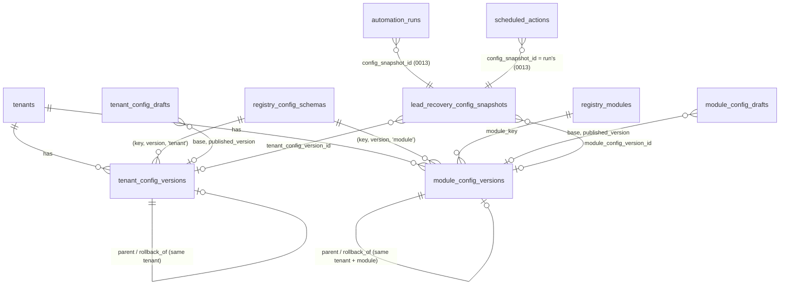
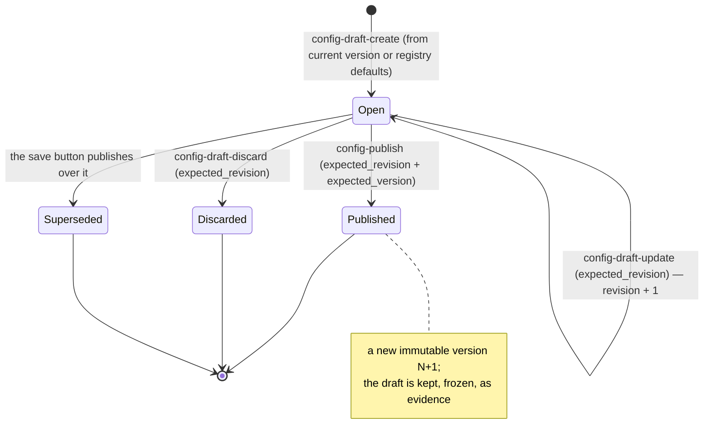

# ARC-110 — Versioned tenant configuration engine

> **Handling notice.** `origin` is a **public** repository and `docs/architecture/` is
> not gitignored. This document describes configuration machinery, not unfixed defects,
> but decide where the set of architecture documents lives before any is committed.

## 1. What changed, in one paragraph

Until ARC-110 a tenant's configuration was one mutable row per module
(`module_configs.config`, `0010`) with a counter and no history. ARC-015 froze what each
*run* used into a snapshot, but nothing recorded what the tenant's configuration *was*
between runs, who changed it, or what it replaced. ARC-110 gives configuration a
lifecycle: **drafts** that are mutable and never executed, **published versions** that are
immutable and numbered, **publication** and **rollback** as single operator-only database
transactions, one **canonical resolver** that composes the current published versions
into the effective configuration, and **snapshots** that record exactly which versions a
run began under. Migration `0014_versioned_configuration.sql`; code under
`supabase/functions/_shared/config/`.

The governing rule is unchanged: **a client is configuration, not an n8n workflow.** No
per-tenant code, schema, branch or workflow was added; a tenant differs only in the
content of its published versions.

## 2. Architectural authority

| Concern | Authority | Why |
|---|---|---|
| What a document may contain, field permissions, change consequences | The typed registry (`registry/schemas.ts`) | ARC-100 §2: executable, reviewed, testable. The validators are not reimplemented anywhere |
| Numbering, lineage, immutability, tenant/module containment, one open draft, secret refusal, publish atomicity | `0014` constraints, triggers and functions | Holds even if application code is wrong, and binds the service role |
| Which schemas exist, at which scope | `registry_config_schemas` (0014), drift-tested against `CONFIG_SCHEMAS` | Relational identity a version row can point at |
| The effective configuration of a run | The snapshot the run is pinned to (0011/0013), which now names its source versions | ARC-015's rule, preserved |

The database cannot run the registry's validators and this repository will not load
executable code from a row (ARC-100 §2). So validation is TypeScript's, at the trusted
server boundary (the `ops` edge function under the service role), and the database proves
the rest: that the content published is the content that was validated (the draft
revision), that nobody published in between (the expected version under a scope lock),
and every structural invariant below.

## 3. Two scopes

| Scope | Schema | Holds | Stored in |
|---|---|---|---|
| **tenant** | `tenant_settings@1` | `company_name`, `timezone` — facts every module of a tenant must agree on | `tenant_config_versions`, `tenant_config_drafts` |
| **module** | `lead_recovery_config@1` | everything else Lead Recovery means: hours, services, area, forwarding, alerts, templates, safety, AI, compliance, Twilio references | `module_config_versions`, `module_config_drafts` |

**Merge precedence: there is none, by construction.** Every field is owned by exactly one
scope, declared in the registry (`FieldMetadata.ownerScope: 'tenant'` on the Lead
Recovery fields that live in tenant settings). The effective configuration is the
**disjoint union** of the two documents. A module document that carries a tenant field,
or a tenant document that carries a module field, is refused — at draft write, at
publication, and again at resolution — rather than resolved by a rule somebody could get
backwards. `validateConfigSchemas()` asserts the shared field metadata is identical from
both sides, so a change to `timezone` is judged the same whichever scope it is seen from.

`lead_recovery_config@1` still describes the **effective** Lead Recovery configuration and
`validateLeadRecoveryConfig` is unchanged; the module document is that configuration minus
the tenant-owned keys.

## 4. Data model

A **version** row: `id`, `tenant_id`, (`module_key`), `version` (1, 2, 3… per scope),
`schema_key` + `schema_version` + a constant `schema_scope` (one composite FK to
`registry_config_schemas`, so a tenant version cannot name a module schema), `config`
(the complete normalised document), `config_hash` (SHA-256 of its canonical form),
`parent_version_id` (the version it replaced; null only for version 1), `source`
(`draft` | `rollback`), `published_from_draft_id` or `rollback_of_version_id`,
`provenance` (e.g. the legacy row), `change_impact` (audit-safe: paths and flags only),
`created_by`, `published_by`, `published_at`, `note`.

A **draft** row: the same identity columns, `base_version_id`/`base_version` (the head it
was written against; 0/null for none), `config`, `revision` (the concurrency token),
`status` (`open` | `published` | `discarded` | `superseded`), `published_version_id`,
`origin`, editor and timestamps.

**The current version is the highest number.** There is no pointer to fall out of step,
no "active" flag, and so no invalid or ambiguous pointer is possible. The two views
`tenant_config_heads` and `module_config_heads` derive it (`distinct on … order by
version desc`, `security_invoker`, so they show exactly what RLS lets the reader see).

Database constraints and triggers enforce:

| Invariant | Mechanism |
|---|---|
| No duplicate version number in a scope | `unique (tenant_id[, module_key], version)` |
| Versions are gap-free and name what they replace | `*_config_versions_guard`: `version = head + 1`, `parent_version_id = head` |
| Published versions never change or disappear | the same guard raises on `UPDATE` and `DELETE` — service role included |
| No cross-tenant or cross-module reference | composite FKs `(id, tenant_id[, module_key])` on parent, rollback source, draft, base, snapshot |
| A module version names the schema a selectable module version names | guard reads `registry_module_versions` (the registry is the vocabulary; no second list) |
| One open draft per scope | partial unique index `… where status = 'open'` |
| A draft starts on the current version | `config_drafts_guard` on `INSERT` |
| Revision is the database's | the guard sets it on insert and bumps it on every write |
| A closed draft is frozen; no draft is deleted | the same guard |
| No secret-shaped strings | the `0010` check-constraint pattern on every config and impact column |
| No browser write, no browser publication | no write policy anywhere; functions granted to `service_role` only |
| Each snapshot records its own versions | `lead_recovery_config_snapshots_guard_sources` + composite FKs + paired-columns check |

## 5. Lifecycle

| Operation | Who | Concurrency token | On a stale token |
|---|---|---|---|
| create draft | an actor with ≥1 writable field in the scope | the base is the current head, checked by the insert trigger | `draft_exists` / `stale_draft` |
| update draft | the registry's `editableFields()` for the actor | `expected_revision` in the `UPDATE … where revision = ?` | `draft_conflict`, nothing written |
| discard | as update | `expected_revision` | `draft_conflict` |
| publish | operator only | `expected_revision` **and** `expected_version` | `draft_conflict` / `publication_conflict` / `stale_draft` |
| rollback | operator only | `expected_version` | `publication_conflict` |

## 6. Publication — one transaction

`publish_config_draft(scope, tenant, module, draft, expected_revision, expected_version,
hash, impact, actor, note)`, service-role only, invoker rights, `search_path = public`:

1. `config_require_operator(actor)` — the actor is in `arc_admins`; a signed-in caller
   cannot name anyone but itself (`auth.uid()`).
2. `config_require_scope` — a tenant scope has no module; a module must have a selectable
   registry version.
3. `config_lock_scope` — a transaction advisory lock on (tenant, scope).
4. The draft, `for update`, of this tenant and scope; the current head.
5. Refuse unless the draft is open, at `expected_revision`; the head is
   `expected_version`; the draft's base is the head.
6. G-P5 for Lead Recovery: under a lock on the number, refuse a `twilio.phone_number`
   another tenant's current version holds.
7. Insert version `head + 1` with the **draft's own content**, the parent, the engine's
   hash and audit-safe impact. The version guard re-checks numbering and schema.
8. Close the draft as `published`; create the module's switch row in `module_configs`
   **switched off** if it does not exist (publication never activates anything — ARC-120).
9. Write `admin_actions` (`config.published`): scope, module, version, id, parent, schema,
   draft and revision, impact — no configuration values.

Before calling it, the engine (`publishDraft`) re-validates the draft in full against
today's schema — a module draft composed with the tenant's current settings, a tenant
draft composed with every module's current version — re-checks every changed field
against the **publisher's** permissions, and computes the change impact against the version
being replaced. A legacy draft whose content is not yet normalised is normalised as one
recorded draft revision first, so what is published is always what the draft holds.

**Two writers, one head.** Writer A and B both read version N. A publishes N+1. B's call
carries `expected_version = N` and is refused with `publication_conflict` — by the engine
first, and by the function under the lock regardless. Even without the lock, the unique
`(scope, version)` index admits exactly one N+1. A's version stands; no extra row, no
second head. Tested in memory (`config-engine.test.js`) and against real Postgres
(`config-db.test.js`).

## 7. Rollback — the next version, older content

`rollback_config_version(scope, tenant, module, source_version, expected_version, impact,
actor, note)` copies the source row's `config` and `config_hash` **itself** — the caller
supplies no content — into version `head + 1` with `source = 'rollback'`,
`rollback_of_version_id = source` and `parent_version_id = head`, and audits
`config.rolled_back`. The historical row is read, never touched; no intervening version is
deleted; no flag is moved.

The engine refuses first when the source is not this tenant's and this scope's
(`version_not_found`), when the head moved (`publication_conflict`), when the source is
the head (`no_change`), and — `rollback_incompatible` — when the source was written in a
schema this build does not run, fails today's validator, **or would be rewritten by
today's normaliser**. Old content that today's rules would change is never republished as
if it had been reviewed; the way forward is a draft. Impact is measured against the
version being replaced.

## 8. Resolution — one resolver

`resolveEffectiveConfig(store, tenant, module)` is the only way production code obtains a
tenant's configuration. It:

- resolves the module's schema through the registry (`module_not_found` otherwise);
- reads the **current published** tenant settings and module version — never a draft, never
  `module_configs.config` (`missing_published_configuration` when either is absent; there is
  no default, because a default is a plausible wrong answer);
- requires each version's schema to be the one this build runs for that scope
  (`schema_not_supported`), the two to belong to the tenant (`tenant_mismatch`) and the
  module version to be that module's;
- composes the disjoint union, refusing a key in the wrong document;
- validates the result with the registered schema, **every time** (a version published
  under an older validator cannot put the engine in a state today's refuses);
- returns the two version refs (id, number, schema), the effective configuration and its
  SHA-256.

It is pure over its two input rows: the same version ids always give the same document and
hash (`resolveVersions` reproduces a historical pair). Its consumers: `loadConfig` (intake
and the Twilio voice webhook), `lead-recovery-get`, `-activate`, `-test-routing`,
`config-resolve`, and number routing (`findTenantByTwilioNumber` reads
`module_config_heads`). Nothing else reads configuration content.

## 9. Validation and field authorisation

All writes validate through the registry: `schemaForScope()` → the registered schema →
its validator (`validateTenantSettings`, `validateLeadRecoveryConfig`). Unknown keys are
refused by name, types, lengths, enumerations and nested shapes are the validator's, and
defaults are applied only where the validator already defines them (no timezone default at
tenant scope). The validators' prose errors are lifted into `{ path, message }` field
errors by reading their leading path — the validators themselves are untouched. The
credential and executable-content scan is shared (`scanForForbidden`), not copied.

Field authorisation is the registry's three categories: `clientEditable`,
`operatorEditable`, `protected`. `editableFields(schema, audience)` decides; a patch naming
any field outside it is `edit_permission_denied`, checked before validity so a caller learns
only that it may not touch the field. **Every field is `clientEditable: false`** (ADR-010
§13/§36: no client write path), so a client actor can open no draft and edit nothing, and
there is no HTTP route that builds one — ARC-310 decides what opens up, as a metadata change.
Schema identity, tenant, module, base, origin and publication metadata are not document
fields at all; the draft guard freezes them.

## 10. Change impact — the registry's answer

`analyseChange(schema, before, after)` finds every changed leaf path
(`business_hours.mon[0].open`, `templates.first_response`), maps each to its top-level
field, and asks the registry: per field `changeImpact(schema, [field])`, aggregate
`changeImpact(schema, changedFields)` — so the per-field flags and the total cannot come
from two lists, and an unrecognised field is maximally consequential exactly as ARC-100
defined. A test enumerates every registry field and checks the report against its
metadata; another asserts `impact.ts` names no field. Tenant-scope reports list the modules
that read a changed tenant field (`affectedModules`). Values are shown only where the field
is not `sensitiveDisplay`; the audit copy (`auditSafeImpact`) carries paths and flags and no
values at all.

ARC-110 **reports** `requiresRetest` / `requiresShadow` / `requiresReactivation`. It does not
pause, retest or deactivate anything; that is ARC-120's lifecycle, which (since `0015`) each
publication and rollback hands its change to in the same code path
(`reconcileAfterPublication`), and which prices every version from exactly the impact recorded
here (ARC_TENANT_MODULE_LIFECYCLE.md §7). `PublishOutcome.lifecycle` reports the decision.

## 11. Legacy migration

**Inventory before 0014.** Table: `module_configs` (`config`, `config_version`,
`schema_version`, `enabled`). Writers: `lead-recovery-save-config` only (upsert of the
validated object). Readers: `loadConfig` (intake, Twilio voice), `authorizeLeadRecoveryEffect`
(the `enabled` switch only), `findTenantByTwilioNumber`, `lead-recovery-get`, `-activate`,
`-test-routing`. Routes: the ops console's Lead Recovery panel. Fixtures: the three Lead
Recovery test suites.

**What 0014 does.** Every non-empty `module_configs.config` becomes a pair of **open
drafts** — tenant fields into a tenant draft, the rest into a module draft — with
`origin.legacy` recording the row id, its counter, schema version, timestamp and the
migration. Nothing is published: SQL cannot run the validator, and an unvalidated row must
never become a version. A field missing from the legacy row stays missing. Then
`module_configs.config` is **frozen** (a trigger refuses any change, and a new row may only
be created empty); the row keeps the `enabled` switch.

**What the operator does.** `config-import-legacy` validates each pair through the
registry and publishes it as version 1 (tenant first, then module) with the legacy
provenance. A pair that fails is **quarantined**: left as open drafts, with its evidence,
reported with field errors, corrected through the ordinary draft path. Nothing is
defaulted, coerced or guessed; re-running changes nothing already imported.

**Effective behaviour is preserved exactly.** For a valid row the resolved configuration is
deep-equal to what `loadConfig` returned from it before (tested in memory and over a real
0013 database).

**No split brain.** After 0014 there is one write path (drafts → publish) and one read path
(the resolver). The frozen column is read by nothing; a test proves changing it does not
change resolution. The only compatibility layer is the panel's save button (§13).

**History is not rewritten.** Snapshots created before 0014 keep null version references —
their provenance cannot be proven, so it is not invented. Runs and actions keep their pins.

**Deploy order** (DEPLOYMENT.md §9): apply `0014` → deploy `ops`, `twilio`, `lead-intake`,
`dispatch` → run `config-import-legacy` → review quarantined tenants. Between deploying the
functions and running the import, a legacy tenant has no published configuration and fails
closed (leads recorded, no run; an inbound call hears "not configured").

## 12. Snapshots, runs and actions

For every new run, `intakeLead` → `loadConfig` → the resolver → `snapshotConfig`, which
writes (or reuses) the snapshot for **that pair of versions**, carrying
`tenant_config_version_id`, `module_config_version_id`, `config_version` = the module
version's number, `schema_version`, the effective configuration and its hash. The run is
created with `config_snapshot_id` (0013), and every action inherits it (0013's trigger and
composite key). So from any run or action: snapshot → both versions → both schemas → the
exact effective document.

Snapshot identity moved from content hash to version pair for versioned snapshots: a
rollback republishes older content as a new version, and its runs must record that version
rather than borrow the snapshot of the one it copied. Legacy snapshots keep one-per-hash.

The database guarantees it: once a tenant has any module version, an **unversioned
snapshot is refused** (`…_guard_sources`) and a **new run pinned to an unversioned
snapshot is refused** (`automation_runs_guard_snapshot`, redefined with that one check
added). A snapshot's `config_version`/`schema_version` must be its module version's, and
its version references are composite-FK'd to its own tenant and module.

Publishing never touches a running sequence: the run reads its snapshot (`loadPinnedConfig`),
never the current version. The next run gets the new versions.

## 13. The console's save button

The existing Lead Recovery panel edits the whole effective configuration at once.
`lead-recovery-save-config` now calls `publishEffectiveConfig`: validate the whole document,
split it, and for each scope whose content changed — tenant first — supersede any open draft
(kept, not deleted), open a draft on the current version, write it, and publish it through
the same function as everything else. The panel sends `expected: { tenant, module }` — the
versions its form was filled from, captured when the form was filled rather than on every
reload — and both are checked before anything is written, so a stale form publishes
nothing. This is the one compatibility path; ARC-310's schema-driven settings UI replaces
it with direct draft editing.

## 14. Live safety state still wins

Pinned configuration governs *what* a message says, never *whether* it goes (ADR-010 §17).
Unchanged by ARC-110: `authorizeLeadRecoveryEffect` re-reads, immediately before every
effect, tenant status (archived/paused), run state, the module switch (`module_configs.enabled`),
the lead's closure and booking, recorded consent, an open handoff (human takeover), a
customer reply, and suppression (STOP), then reserves the effect (send-once). Tested again
under versioning: a reply after a newer version is published still stops the follow-up.

## 15. RLS and permissions

| Object | Operator (`is_arc_admin()`) | Tenant member | anon | Any browser write |
|---|---|---|---|---|
| `tenant_/module_config_versions`, `…_drafts`, `…_heads` | read | **none** | none | none |
| `registry_config_schemas` | read | read | none | none |
| `publish_config_draft`, `rollback_config_version` | — | — | — | `permission denied` |

Configuration is operator material, exactly as `module_configs` was in 0010 (staff numbers,
alert recipients, provider references): tenant members can read none of it, their own
tenant's included — the existing product rule. Cross-tenant access is therefore denied
twice: by RLS for browsers, and by the store's tenant scoping plus composite FKs for the
service role. Audit identity is the actor from the verified JWT (`ops`), re-checked against
`arc_admins` inside the publish function; nothing in a request body names an actor.

## 16. Tests

| Suite | What it proves | Runs |
|---|---|---|
| `tests/config-engine.test.js` (85) | drafts, permissions, validation, publication, concurrency, rollback, resolution, impact, legacy import, runtime pinning, save button, ops responses — against `MemoryStore`, which mirrors every 0014 rule | always |
| `tests/config-adapter.test.js` (17) | the exact snake_case payloads, filters and RPC arguments the production adapter sends; error mapping; intake through the adapter recording both version ids; memory/production resolution parity | always |
| `tests/config-db.test.js` — text (7) | 0014 as written: no browser write policy or grant, invoker rights, pinned `search_path`, forward-only, drafts-only legacy import, schema seed drift | always |
| `tests/config-db.test.js` — database (38) | 0001–0014 **applied** in PGlite: every invariant by statement, RLS as `anon`/member/operator, both functions and their refusals, G-P5, snapshot and run guards, legacy import over a real 0013 database, re-applying 0014, the production adapter end to end, a **synthetic canary reaching `awaiting_reply`** with zero live sends, a same-script parity run of both stores, and the real `ops` Lead Recovery actions — get, save (and its stale-form 409), routing test, **the `lead-recovery-canary` action itself** (passes, versioned pins, `canary_passed` ticked), activation refusing on missing steps | when PGlite is available; otherwise reported `# SKIP` |
| `tests/registry.test.js` (+7) | the tenant schema, `ownerScope` metadata agreement, no shared keys, SQL seed drift | always |

Run the database suites with `ARC_PGLITE_DIR=<dir holding @electric-sql/pglite> npm test`
(see `tests/pglite-harness.js`). It is deliberately not installed with `npm i --no-save`
into this checkout: that would prune the other no-save tools (`playwright-core`).

**Mutation-tested: 14/14**, on a scratch copy with the baseline confirmed green first:
the adapter dropping a snapshot version column, the expected version from publish, or the
revision guard on draft writes; the runtime not recording versions; the store skipping the
operator check; the engine skipping field permissions or letting a client publish; the
resolver accepting a tenant key in a module document; the impact code keeping its own flag
for one field; and in SQL, publish ignoring the expected version, versions becoming
updatable, the snapshot guard allowing unversioned snapshots, publish granted to
`authenticated`, and RLS letting members read versions. All caught. On the first real run
two were **missed** — the engine's client check and the publish grant — because a second
layer refused anyway (the store's `arc_admins` check; the revoked helper functions). The
tests now isolate each layer, and both are caught.

## 17. Boundaries and known limitations

- **ARC-120** owns activation (done, `0015`): nothing here reads or sets `enabled` except
  creating the switch row, which now takes the lifecycle's value; the lifecycle acts on the
  `requires*` flags. `module_configs` (with its `lead_recovery`-only check) is a mirror of
  `tenant_modules.state`; a second module's lifecycle simply has no switch row.
- **ARC-310** owns the settings UI and any client write path. The engine already enforces
  per-field client permissions; every field is closed today.
- **ARC-130** owns provider credentials; none are in any version (validator + constraints).
- Only Lead Recovery has a selectable schema. `tenant_settings@1` holds two fields; a module
  that needs another shared fact adds it there, with metadata, through the registry.
- `0014` has not been applied to the Supabase project. It has been applied to real Postgres
  (PGlite, Postgres 18.3) by `config-db.test.js`, alongside 0001–0013.
- G-P5 is enforced at publication, not as a unique index (the number lives inside the
  document). A number already shared by two legacy rows is not rewritten: the second
  tenant's import reports `failed` with `number_claimed` — its tenant settings publish,
  its Lead Recovery draft stays open until an operator gives it its own number.
- `tenants.timezone` (0001, portal bucketing) and `tenant_settings.timezone` are separate,
  as `tenants.timezone` and the Lead Recovery timezone always were. Reconciling them is not
  in scope.
